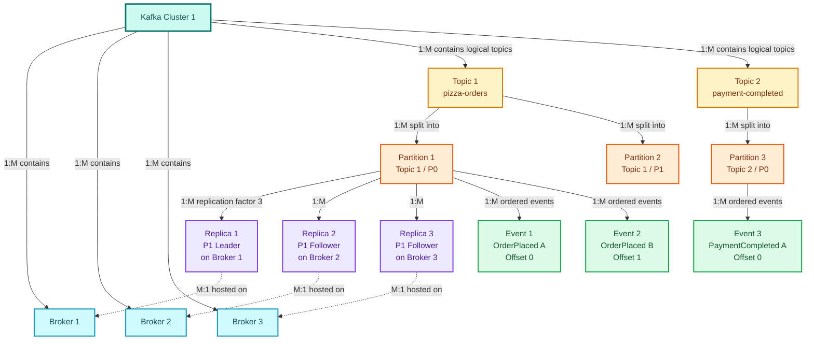
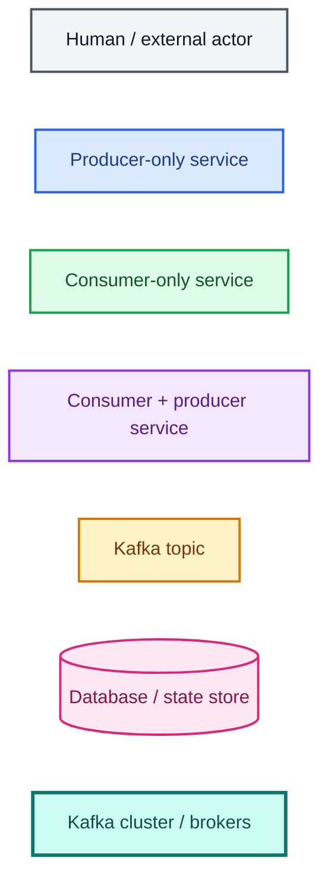
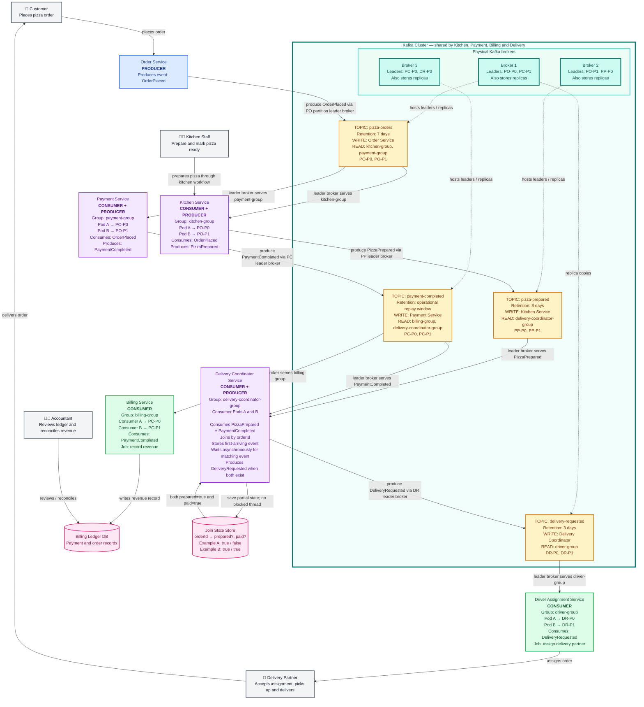
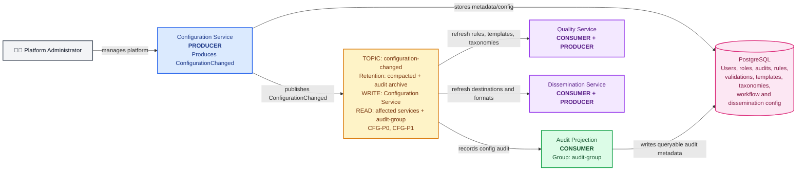
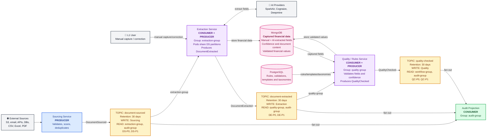

# Kafka Architect Interview Questions

This guide explains Kafka concepts in simple language and relates each concept to the Data Collection Platform (DCP).

DCP receives financial documents from S3, email, APIs and other sources. It extracts data using AI providers, validates the result, routes uncertain documents for L1/L2 review and disseminates approved data to downstream systems.

## Table of Contents

- [Start here: Kafka components working together](#start-here-how-do-kafka-producers-topics-partitions-and-consumers-work-together)
  - [General Kafka containment and cardinality](#general-kafka-containment-and-cardinality)
  - [Pizza-store example](#diagram-legend)
  - [DCP example](#the-same-kafka-concepts-applied-to-dcp)

1. [Why does DCP use Kafka?](#1-why-does-dcp-use-kafka)
2. [What are brokers, topics, partitions and records?](#2-what-are-brokers-topics-partitions-and-records)
3. [What does a Kafka producer do?](#3-what-does-a-kafka-producer-do)
4. [What does a Kafka consumer do?](#4-what-does-a-kafka-consumer-do)
5. [What is a consumer group?](#5-what-is-a-consumer-group)
6. [Why are partitions important?](#6-why-are-partitions-important)
7. [How does Kafka preserve ordering?](#7-how-does-kafka-preserve-ordering)
8. [How should DCP choose a partition key?](#8-how-should-dcp-choose-a-partition-key)
9. [How many partitions should a topic have?](#9-how-many-partitions-should-a-topic-have)
10. [What is an offset?](#10-what-is-an-offset)
11. [When should a consumer commit its offset?](#11-when-should-a-consumer-commit-its-offset)
12. [What are Kafka delivery guarantees?](#12-what-are-kafka-delivery-guarantees)
13. [What does Kafka exactly-once really mean?](#13-what-does-kafka-exactly-once-really-mean)
14. [How does DCP prevent duplicate processing?](#14-how-does-dcp-prevent-duplicate-processing)
15. [What is an idempotent producer?](#15-what-is-an-idempotent-producer)
16. [What do acknowledgements mean?](#16-what-do-acknowledgements-mean)
17. [What are replication, leader, follower and ISR?](#17-what-are-replication-leader-follower-and-isr)
18. [What happens when a Kafka broker fails?](#18-what-happens-when-a-kafka-broker-fails)
19. [What is consumer lag?](#19-what-is-consumer-lag)
20. [How does DCP handle backpressure and traffic spikes?](#20-how-does-dcp-handle-backpressure-and-traffic-spikes)
21. [What is a consumer rebalance?](#21-what-is-a-consumer-rebalance)
22. [How should Kafka retries be designed?](#22-how-should-kafka-retries-be-designed)
23. [What is a dead-letter topic?](#23-what-is-a-dead-letter-topic)
24. [What are retention and log compaction?](#24-what-are-retention-and-log-compaction)
25. [How should event schemas be versioned?](#25-how-should-event-schemas-be-versioned)
26. [What is the transactional outbox pattern?](#26-what-is-the-transactional-outbox-pattern)
27. [How does Kafka support choreography, Saga, CQRS and event sourcing?](#27-how-does-kafka-support-choreography-saga-cqrs-and-event-sourcing)
28. [What are Kafka Connect and Kafka Streams?](#28-what-are-kafka-connect-and-kafka-streams)
29. [How should Kafka be secured?](#29-how-should-kafka-be-secured)
30. [What should be monitored in production?](#30-what-should-be-monitored-in-production)
31. [How should Kafka disaster recovery be designed?](#31-how-should-kafka-disaster-recovery-be-designed)
32. [Kafka or RabbitMQ: how do you choose?](#32-kafka-or-rabbitmq-how-do-you-choose)
33. [Common Kafka failure scenarios in DCP](#33-common-kafka-failure-scenarios-in-dcp)
34. [Architect-level DCP Kafka design](#34-architect-level-dcp-kafka-design)
35. [Why are ordering and durability crucial in DCP?](#35-why-are-ordering-and-durability-crucial-in-dcp)
36. [Architect interview summary](#36-architect-interview-summary)

---

## Start here: How do Kafka producers, topics, partitions and consumers work together?

### General Kafka containment and cardinality

#### What has what?



#### Relationship summary

| From | To | Relationship | Meaning |
|---|---|---:|---|
| Cluster | Broker | **1:M** | One cluster contains many brokers |
| Broker | Cluster | **M:1** | Many brokers belong to one cluster |
| Cluster | Topic | **1:M** | One cluster hosts many logical topics |
| Topic | Partition | **1:M** | One topic is divided into many partitions |
| Partition | Topic | **M:1** | Many partitions belong to one topic |
| Partition | Replica | **1:M** | One partition has multiple replicas according to its replication factor |
| Replica | Partition | **M:1** | Every replica is a copy of one partition |
| Broker | Replica | **1:M** | One broker stores many replicas from many topics |
| Replica | Broker | **M:1** | One replica is physically hosted on one broker |
| Topic | Broker | **M:M** | A topic spans many brokers, and a broker stores replicas from many topics |
| Partition | Event | **1:M** | One partition contains many ordered events |
| Event | Partition | **M:1** | Each logical event belongs to one partition |
| Event | Replica | **M:M** overall | Every event is copied into each replica of its partition; every replica stores many events |

#### Important 1:1 relationship

At a particular moment:

```text
One partition
→ exactly one leader replica

One leader replica
→ leads exactly one partition
```

The partition may also have multiple follower replicas:

```text
Partition 1
├── Replica 1 = Leader
├── Replica 2 = Follower
└── Replica 3 = Follower
```

If the leader broker fails, one in-sync follower is promoted. The 1:1 leader relationship remains, but the broker hosting the leader changes.

#### One logical event, multiple physical copies

`Event 1` logically belongs to only `Partition 1`:

```text
Event 1 → Partition 1
```

Because Partition 1 has three replicas, Kafka stores a physical copy of Event 1 in all three replica logs:

```text
Event 1
├── Replica 1 on Broker 1
├── Replica 2 on Broker 2
└── Replica 3 on Broker 3
```

Consumers still see one logical event. Replication does not mean the consumer processes three events.

#### Short mental model

```text
Cluster 1
├── Broker 1
├── Broker 2
└── Broker 3

Topic 1
├── Partition 1
│   ├── Event 1
│   ├── Event 2
│   └── Replicas 1, 2, 3 spread across Brokers 1, 2, 3
└── Partition 2

Topic 2
└── Partition 3
```

### Diagram legend





The actual network path is:

```text
Producer service
→ broker that leads the selected topic partition
→ partition stored and replicated in the Kafka cluster
→ consumer reads from Kafka through the partition's broker
```

For Kitchen Service:

```text
Consume:
PO-P0 leader is Broker 1
Broker 1 → Kitchen Pod A

Produce:
Kitchen Pod A → PizzaPrepared
PP-P0 leader is Broker 2
Kitchen Pod A → Broker 2 → PP-P0
```

Kitchen Service is not permanently attached to Broker 1 or Broker 2. Kafka clients discover the current partition leaders and connect to the appropriate broker automatically.

### The same Kafka concepts applied to DCP

The original single DCP diagram was too large to read comfortably on GitHub. It is split below into one compact overview and three detailed diagrams.

#### DCP end-to-end overview

```mermaid
flowchart LR
    SOURCES["🌐 Sources"]:::actor
    SOURCE["Sourcing<br/><b>PRODUCER</b>"]:::producer
    T1["document-sourced"]:::topic
    EXTRACT["Extraction<br/><b>CONSUMER + PRODUCER</b>"]:::both
    T2["document-extracted"]:::topic
    QUALITY["Quality<br/><b>CONSUMER + PRODUCER</b>"]:::both
    T3["quality-checked"]:::topic
    REVIEW["Workflow / Approval<br/><b>CONSUMER + PRODUCER</b>"]:::both
    T4["document-approved"]:::topic
    DISSEM["Dissemination<br/><b>CONSUMER + PRODUCER</b>"]:::both
    T5["document-published"]:::topic
    TARGETS["🏢 Downstream"]:::actor
    KAFKA["DCP Kafka Cluster<br/><b>3 Brokers across failure zones</b><br/>Broker 1, Broker 2, Broker 3<br/>Partitions distributed + replicated"]:::cluster

    SOURCES --> SOURCE --> T1 --> EXTRACT --> T2 --> QUALITY --> T3 --> REVIEW --> T4 --> DISSEM --> T5
    DISSEM --> TARGETS
    KAFKA -.->|"stores all DCP topic partitions"| T1
    KAFKA -.-> T2
    KAFKA -.-> T3
    KAFKA -.-> T4
    KAFKA -.-> T5

    classDef actor fill:#F3F4F6,stroke:#4B5563,color:#111827,stroke-width:2px;
    classDef producer fill:#DBEAFE,stroke:#2563EB,color:#1E3A8A,stroke-width:2px;
    classDef consumer fill:#DCFCE7,stroke:#16A34A,color:#14532D,stroke-width:2px;
    classDef both fill:#F3E8FF,stroke:#9333EA,color:#581C87,stroke-width:2px;
    classDef topic fill:#FEF3C7,stroke:#D97706,color:#78350F,stroke-width:2px;
    classDef store fill:#FCE7F3,stroke:#DB2777,color:#831843,stroke-width:2px;
    classDef cluster fill:#CCFBF1,stroke:#0F766E,color:#134E4A,stroke-width:3px;
```



The yellow topic boxes are logical event streams. The blue cluster box is the physical Kafka infrastructure:

```text
Kafka cluster
├── Broker 1
├── Broker 2
└── Broker 3

Topic partitions
→ distributed across brokers
→ replicated for broker-failure recovery
```

For example, a replication factor of 3 could place copies like this:

```text
DS-P0 leader  → Broker 1
DS-P0 replica → Broker 2
DS-P0 replica → Broker 3

DS-P1 leader  → Broker 2
DS-P1 replica → Broker 3
DS-P1 replica → Broker 1
```

#### DCP diagram 1: Configuration and platform metadata



#### DCP diagram 2: Sourcing, extraction and quality



#### DCP diagram 3: Review, approval, dissemination and audit

```mermaid
flowchart LR
    L1["👤 L1 User<br/>Review and correction"]:::actor
    L2["👤 L2 User<br/>Approve, reject, rework"]:::actor
    TARGET["🏢 Downstream Consumers<br/>APIs, Kafka, S3, reports, email"]:::actor

    QC["TOPIC: quality-checked<br/>QC-P0, QC-P1"]:::topic
    REVIEW["Workflow / Approval Service<br/><b>CONSUMER + PRODUCER</b><br/>Group: workflow-group<br/>Tasks, timers, escalation, rework<br/>Produces DocumentApproved"]:::both
    PG[("PostgreSQL<br/>Users, roles, assignments,<br/>workflow state, decisions,<br/>audit metadata and delivery config")]:::store
    MONGO[("MongoDB<br/>Captured, corrected,<br/>validated and approved<br/>financial data")]:::store
    APPROVED["TOPIC: document-approved<br/>Retention: operational replay window, e.g. 30–90 days<br/>WRITE: Approval<br/>READ: dissemination-group, audit-group<br/>DA-P0, DA-P1"]:::topic
    DISSEM["Dissemination Service<br/><b>CONSUMER + PRODUCER</b><br/>Group: dissemination-group<br/>Produces DocumentPublished"]:::both
    PUBLISHED["TOPIC: document-published<br/>Retention: operational replay window, e.g. 30–90 days<br/>WRITE: Dissemination<br/>READ: audit-group, monitoring<br/>DP-P0, DP-P1"]:::topic
    AUDIT["Audit Projection Service<br/><b>CONSUMER</b><br/>Group: audit-group<br/>Consumes lifecycle events"]:::consumer
    SEARCH[("Search / Reporting Projection<br/>Fast audit and document queries")]:::store
    ARCHIVE[("Immutable Compliance Archive<br/>Optional WORM / Object Lock storage<br/>Long-term tamper-resistant evidence")]:::store

    QC -->|"workflow-group"| REVIEW
    L1 -->|"review/correct/submit"| REVIEW
    L2 -->|"approve/reject/rework"| REVIEW
    PG -->|"users, roles, workflow config"| REVIEW
    REVIEW -->|"workflow state + decision metadata"| PG
    REVIEW -->|"approved/corrected financial values"| MONGO
    REVIEW -->|"DocumentApproved"| APPROVED
    APPROVED -->|"dissemination-group"| DISSEM
    APPROVED -->|"fan-out"| AUDIT
    PG -->|"destination/schedule/format config"| DISSEM
    MONGO -->|"approved financial data"| DISSEM
    DISSEM -->|"deliver data"| TARGET
    DISSEM -->|"DocumentPublished"| PUBLISHED
    PUBLISHED -->|"audit-group"| AUDIT
    AUDIT -->|"audit metadata + lineage"| PG
    AUDIT -->|"fast query projection"| SEARCH
    AUDIT -->|"archive-outbox → immutable copy"| ARCHIVE

    classDef actor fill:#F3F4F6,stroke:#4B5563,color:#111827,stroke-width:2px;
    classDef producer fill:#DBEAFE,stroke:#2563EB,color:#1E3A8A,stroke-width:2px;
    classDef consumer fill:#DCFCE7,stroke:#16A34A,color:#14532D,stroke-width:2px;
    classDef both fill:#F3E8FF,stroke:#9333EA,color:#581C87,stroke-width:2px;
    classDef topic fill:#FEF3C7,stroke:#D97706,color:#78350F,stroke-width:2px;
    classDef store fill:#FCE7F3,stroke:#DB2777,color:#831843,stroke-width:2px;
```



#### DCP storage responsibility

| Store | What belongs there |
|---|---|
| **MongoDB** | All captured financial data from documents, whether manually entered, corrected by users or extracted by AI; confidence scores; semi-structured content; validated and approved financial values |
| **PostgreSQL** | System and platform metadata: users, roles, assignments, workflow state, audit metadata, rules, validations, templates, taxonomies, mappings, schedules and downstream dissemination configurations |

The two databases solve different problems:

```text
MongoDB
→ What financial data was captured from the document?

PostgreSQL
→ How is the platform configured, governed and operated?
```

Audit lifecycle events still travel through Kafka. The Audit Projection Service consumes them and writes queryable audit metadata and lineage into PostgreSQL.

The diagram demonstrates:

- A service may be a producer, consumer, or both.
- A topic represents a business event stream and owns its retention and permissions.
- Every topic has independent partitions and offsets.
- Different consumer groups receive the same event independently.
- Consumers inside one group divide the topic partitions.
- The Delivery Coordinator performs a stateful asynchronous join instead of blocking a thread.

---

## 1. Why does DCP use Kafka?

Without Kafka, Sourcing Service may call Extraction Service directly:

```text
Upload document
      ↓
Sourcing Service → Extraction Service
```

If Extraction Service is slow or unavailable, the upload may also become slow or fail.

With Kafka:

```text
Upload document
      ↓
Sourcing Service → Kafka → Extraction workers
```

Sourcing records the work in Kafka and returns. Extraction workers process it when capacity is available.

Kafka helps DCP with:

- **Decoupling:** Sourcing does not need Extraction to be available at that moment.
- **Buffering:** Kafka absorbs a large document spike.
- **Parallel processing:** Many extraction workers process different partitions.
- **Replay:** Events can be read again to rebuild a read model or reprocess data.
- **Fan-out:** Quality, audit and analytics consumers can read the same event independently.
- **Ordering:** Events for one document can remain ordered.
- **Durability:** Events are replicated across brokers.

Kafka does not make the business logic simpler automatically. DCP must still design idempotency, retries, schemas, monitoring and failure handling.

### Fan-out, ordering and durability in simple terms

#### Fan-out

Fan-out means one event can be used by several independent business jobs.

```text
DocumentExtracted
      ├── Quality group   → Validate the data
      ├── Audit group     → Record the history
      └── Analytics group → Calculate metrics
```

DCP publishes `DocumentExtracted` once. Kafka allows every interested consumer group to read it independently.

This is Kafka's pub/sub behavior:

```text
Across different consumer groups → fan-out
Within the same consumer group   → work sharing
```

It is broadcast-like across groups, but Kafka does not send the event to every consumer instance inside one group. The consumers in that group divide the work.

#### Ordering

Ordering means events inside one partition are read in the sequence in which Kafka stored them.

```text
DOC-123:
DocumentSourced
→ DocumentExtracted
→ QualityChecked
→ DocumentApproved
```

DCP uses `documentId` as the key so events for the same document go to the same partition.

Kafka does not guarantee a single order across all partitions. DCP normally needs per-document order, not an order between unrelated documents.

#### Durability

Durability means Kafka keeps an accepted event safely while consumers are unavailable or one broker fails.

```text
Sourcing publishes DocumentSourced
        ↓
Extraction Service is unavailable
        ↓
Kafka retains the event
        ↓
Extraction restarts and continues
```

Replication stores partition copies on multiple brokers. For important DCP events, durable producer acknowledgements and healthy in-sync replicas are also required.

```text
Fan-out   → One event, many independent business jobs
Ordering  → Events for one key remain in sequence
Durability → Events survive temporary failures
```

---

## 2. What are brokers, topics, partitions and records?

Use this simple mental model:

```text
Record    = One package
Topic     = Package category
Partition = Ordered shelf inside that category
Broker    = Warehouse building that stores shelves
Cluster   = Group of warehouse buildings working together
```

### Record: one event

A Kafka record is one message or event:

```json
{
  "eventId": "EV-1001",
  "documentId": "DOC-123",
  "eventType": "DocumentSourced",
  "timestamp": "2026-06-18T10:00:00Z"
}
```

In DCP, this record says:

```text
Document DOC-123 was accepted by Sourcing Service.
```

A record normally contains:

- **Key:** such as `documentId`
- **Value:** the event data
- **Timestamp**
- **Headers:** optional metadata such as correlation ID
- **Offset:** assigned after Kafka stores it in a partition

### Topic: a named event category

A topic is a named stream of related events:

```text
document-sourced
document-extracted
quality-checked
document-approved
document-published
```

For example:

```text
Topic: document-sourced
Contains: DocumentSourced events

Topic: document-approved
Contains: DocumentApproved events
```

A topic is a logical name. It is not one physical server or one file.

Different topics can have different:

- Retention periods
- Read/write permissions
- Partition counts
- Replication settings
- Business meanings

### Why topics and partitions are significant in microservices

A microservice normally owns a specific business capability or bounded context:

```text
Sourcing Service      → Accept and register documents
Extraction Service    → Capture financial data
Approval Service      → Approve or reject data
Dissemination Service → Publish approved data
```

Kafka topics become the asynchronous contracts between these domain services.

```text
Sourcing Service
→ publishes DocumentSourced
→ document-sourced topic

Extraction Service
→ consumes DocumentSourced
→ publishes DocumentExtracted
→ document-extracted topic
```

The topic tells other services:

> “A meaningful business fact occurred in this domain.”

#### Topic = domain event contract

A well-designed topic should have one clear business meaning:

```text
document-sourced
document-extracted
quality-checked
document-approved
document-published
```

This provides loose coupling:

- The producer does not need to know every consumer.
- New consumers can subscribe without changing the producer.
- Consumers depend on an event contract rather than the producer's database.
- Each service can deploy and scale independently.
- Topic permissions can enforce domain ownership.

Example:

```text
Only Approval Service may WRITE document-approved.

Dissemination Service and Audit Service may READ it.
```

The producer that owns the business fact should own its event schema and compatibility policy.

#### A topic is not automatically equal to one microservice

Do not apply this mechanical rule:

```text
One microservice = exactly one Kafka topic
```

One service may publish several meaningful event types:

```text
Approval Service
├── DocumentApproved
├── DocumentRejected
└── ReworkRequested
```

Several related event types may share a topic when they have the same:

- Business domain
- Consumers
- Security requirements
- Retention policy
- Ordering requirement
- Schema-governance policy

Use separate topics when these concerns differ materially.

For example:

```text
document-approved
→ restricted approval event
→ consumed by dissemination and audit

configuration-changed
→ administrative event
→ different permissions and compacted retention
```

#### Events should describe facts, not database changes

Prefer domain language:

```text
DocumentApproved
PaymentCompleted
FinancialDataValidated
```

Avoid exposing internal tables:

```text
ApprovalRowUpdated
MongoDocumentChanged
StatusColumnSetTo5
```

Domain events allow a service to change its internal database without breaking every consumer.

#### Partition = technical ordering and scaling boundary

A partition does not represent a domain or business capability.

Incorrect:

```text
Partition 0 = Sourcing
Partition 1 = Extraction
Partition 2 = Approval
```

Correct:

```text
Topic: document-sourced

DS-P0 → sourced-document events
DS-P1 → sourced-document events
DS-P2 → sourced-document events
```

Every partition contains the same kind of domain event. Partitions divide that event stream into parallel ordered lanes.

#### The partition key connects technical design to the domain

Choose the key from the business entity whose order must be preserved.

For DCP:

```text
Key = documentId
```

This means:

```text
All events for DOC-123 in a topic
→ same partition
→ processed in partition order

Events for DOC-456
→ may use another partition
→ process in parallel
```

The key therefore defines the unit of ordering and concurrency:

```text
Same document
→ ordered processing

Different documents
→ parallel processing
```

A poor key can damage scalability:

```text
Key = documentType

80% of documents are PDF
→ one hot partition
→ one consumer receives most work
```

#### Consumer group = business job reacting to the domain event

Topics represent business facts. Consumer groups represent independent jobs that react to those facts:

```text
document-extracted topic
├── quality-group → Validate captured financial data
├── audit-group   → Record lineage
└── analytics-group → Calculate operational metrics
```

Consumers inside one group scale the same job:

```text
quality-group
├── Quality Pod 1
├── Quality Pod 2
└── Quality Pod 3
```

#### DCP architect summary

```text
Microservice / bounded context
→ Owns a business capability

Kafka topic
→ Publishes meaningful facts from that capability

Topic contract
→ Decouples producer and consumers

Partition
→ Provides per-key ordering and parallelism

Partition key
→ Usually the domain entity ID, such as documentId

Consumer group
→ Represents one independent business reaction
```

Interview-ready answer:

> In microservices, Kafka topics should represent meaningful domain-event contracts, not technical tables or individual partitions. The service owning the business fact owns the event it publishes. Other services subscribe without accessing the producer's database, which preserves loose coupling and bounded-context ownership. Partitions are not separate domains; they are technical lanes for scaling and ordering. In DCP, I key document lifecycle events by `documentId`, preserving order for one document while allowing different documents to process in parallel.

### Partition: an ordered lane inside a topic

A topic is divided into partitions:

```text
document-sourced
├── Partition 0
├── Partition 1
├── Partition 2
└── Partition 3
```

Each partition is an ordered log:

```text
document-sourced, Partition 0:

Offset 0 → DOC-100 sourced
Offset 1 → DOC-104 sourced
Offset 2 → DOC-108 sourced
```

Partitions provide:

- Parallel storage and processing
- Per-partition ordering
- Work distribution across consumers and brokers

The same topic's partitions may be stored on different brokers.

### Broker: one Kafka server

A broker is a running Kafka server.

Its main job is to store partition data and serve Kafka clients:

```text
Producer → Broker: “Store this event”
Consumer → Broker: “Give me records from this partition”
Broker   → Disk: Store the records durably
Broker   → Other brokers: Replicate partition data
```

A broker performs four important jobs.

#### 1. Store records

The broker stores partition records on disk:

```text
Broker 1
└── document-sourced Partition 0
    ├── Offset 0
    ├── Offset 1
    └── Offset 2
```

#### 2. Accept producer writes

The producer discovers which broker is the leader for the target partition and sends the event there:

```text
Sourcing Service
      ↓ DocumentSourced
Broker 1 — leader for DS-P0
```

The producer does not normally send one event to every broker.

#### 3. Serve consumer reads

Consumers fetch records from the broker serving the partition:

```text
Broker 1: DS-P0
      ↓
Extraction Consumer
```

The broker does not run the extraction business logic. It only stores and delivers the event.

#### 4. Replicate data for failure recovery

Kafka keeps copies of a partition on multiple brokers:

```text
DS-P0
├── Broker 1: Leader
├── Broker 2: Follower replica
└── Broker 3: Follower replica
```

The leader handles normal reads and writes. Followers copy its records.

If Broker 1 fails:

```text
Broker 2 becomes the new leader
→ Producers and consumers reconnect
→ Processing continues
```

### Kafka cluster: brokers working together

A Kafka cluster is a group of brokers:

```text
Kafka cluster
├── Broker 1
├── Broker 2
└── Broker 3
```

Kafka distributes partition leaders and replicas across the cluster:

```text
Broker 1:
  Leader:  DS-P0
  Replica: DS-P1

Broker 2:
  Leader:  DS-P1
  Replica: DS-P0

Broker 3:
  Replica: DS-P0
  Replica: DS-P1
```

This provides:

- **Scalability:** Data and traffic are spread across brokers.
- **Durability:** Partition copies survive a broker failure.
- **Availability:** Another replica can become leader.

### Complete simple flow

```text
1. Sourcing Service produces DocumentSourced(DOC-123)

2. Kafka uses the key DOC-123 to select:
   Topic: document-sourced
   Partition: DS-P0

3. Broker 1 is the leader for DS-P0
   → Broker 1 stores the record

4. Broker 2 and Broker 3 copy the record

5. Extraction Consumer reads DS-P0 from Kafka
   → It processes DOC-123
```

### Important distinction

```text
Topic     = Logical event stream
Partition = Ordered part of that stream
Broker    = Physical Kafka server storing partitions
Cluster   = Collection of brokers
Record    = One event stored in a partition
```

A broker does not represent a business job. It is infrastructure that safely stores and delivers events.

### DCP example

```text
Topic: document-sourced
├── DS-P0 leader on Broker 1
├── DS-P1 leader on Broker 2
└── Replicas spread across all three brokers

Extraction consumer group
├── Pod A reads DS-P0
└── Pod B reads DS-P1
```

If Broker 1 fails, a follower copy of `DS-P0` on another broker becomes the leader. The extraction pods can continue after a short recovery pause.

---

## 3. What does a Kafka producer do?

A producer publishes events to Kafka:

```text
Sourcing Service
      ↓
DocumentSourced event
      ↓
Kafka topic
      ↓
Brokers store, replicate, and serve to consumers
```

The producer must make 4 critical decisions:

1. **Event Key** — Which partition should this record go to?
2. **Acknowledgement Wait** — How long to wait for broker confirmation?
3. **Retry Logic** — How many times and how often should we retry failures?
4. **Batching & Compression** — How to group and compress records before sending?

---

### **Decision 1: Event Key — Which Partition?**

Every record needs a key (or can be null). The key determines which partition the record goes to via hashing.

```text
Same key → Always same partition → Ordered updates
Null key → Random partition → No ordering guarantee
```

#### 🍕 Pizza Store Example

```python
producer.send(
    topic="orders",
    key="order-123",  # All updates for order-123 go to same partition
    value={"customer": "Alice", "item": "Large Margherita"}
)

Timeline:
OrderPlaced(order-123) → Partition 0
PaymentReceived(order-123) → Partition 0  (same partition!)
PizzaReady(order-123) → Partition 0  (same partition!)

Result: All 3 events processed in order for order-123 ✓
        No race conditions where payment is processed before order
```

#### 💾 DCP Example

```python
producer.send(
    topic="documents",
    key="doc-uuid-789",  # All processing steps for this doc in one partition
    value={"amount": 10000, "vendor": "Acme Corp"}
)

Timeline:
DocumentSourced(doc-789) → Partition 2
DataExtracted(doc-789) → Partition 2
ValidationPassed(doc-789) → Partition 2
DataPublished(doc-789) → Partition 2

Result: A $10,000 document is extracted once, validated once, 
        published once. No duplicate processing ✓
```

**Trade-off:**
- ✅ Same key → strong ordering for that entity
- ❌ Uneven partition load if one key dominates (1 customer = 10,000 orders)

---

### **Decision 2: Acknowledgement Wait — How long to wait for confirmation?**

When you send a record, how long does the producer wait for the broker to say "I received it"?

This is THE most critical decision for reliability.

#### Why Acks Matter: You're Blind Without Them

**Without acks (acks=0):**
```
Producer sends message
    ↓
Broker receives it
    ↓
But producer doesn't wait for confirmation
    ↓
Producer returns to app: "Sent successfully!"
    ↓
Broker disk crashes 1 second later → Data LOST ❌
    ↓
Producer has NO WAY to know the data was lost
App thinks it's safe. Broker lost it. Customer never gets it.
```

**With acks:**
```
Producer sends message
    ↓
Broker writes and confirms: "ack ✓"
    ↓
Producer receives ack and returns to app: "Sent successfully!"
    ↓
Producer KNOWS the data is safe
    ↓
Producer can retry if ack never comes
Producer can build reliable systems
```

#### Three Levels of Safety

| Setting | Meaning | Wait For | Latency | Risk |
|---------|---------|----------|---------|------|
| `acks=0` | Fire and forget | Nothing | ⚡ Fastest | Broker crashes = data lost |
| `acks=1` | Leader acknowledged | Leader writes to disk | ⏱️ Medium | Leader dies before replicating = data lost |
| `acks=all` | All replicas acknowledged | All in-sync replicas write | 🐢 Slowest | Safest — needs 2+ replicas to fail |

#### 🍕 Pizza Store: acks=1 (Speed-First)

```python
producer = KafkaProducer(
    acks=1,  # Wait for leader only
    request_timeout_ms=5000  # Max 5 seconds
)

try:
    producer.send(topic="orders", key="order-123", value=order)
    # App returns to customer: "Order accepted!"
except:
    # Ack never came → retry or show error to customer

Timeline:
t=0ms:    Message in flight
t=1ms:    Leader writes to disk
t=2ms:    Leader sends "ack" back
t=3ms:    Producer returns — app shows customer "Order placed!" ✓

Why acks=1?
- Pizza orders are low-stakes
- If one order is lost during leader failure, customer re-orders
- Speed matters more than absolute safety
- 5 second timeout is acceptable for a food order
```

#### 💾 DCP: acks=all (Safety-First)

```python
producer = KafkaProducer(
    acks="all",  # Wait for all replicas
    min_insync_replicas=2,  # At least 2 copies before acking
    request_timeout_ms=30000  # Max 30 seconds
)

try:
    producer.send(
        topic="documents",
        key="doc-uuid",
        value={"amount": 10000, "vendor": "Acme Corp"}
    )
    # App returns: "Invoice safely persisted!"
    log.info(f"Document {doc_uuid} durably stored")
except KafkaError as e:
    # Ack never came → CRITICAL ALERT
    log.critical(f"Failed to persist financial document {doc_uuid}")
    notify_finance_team()
    page_oncall()

Timeline:
t=0ms:    Message in flight
t=1ms:    Broker-1 (leader) writes to disk
t=2ms:    Broker-2 (follower) writes to disk
t=3ms:    Broker-3 (follower) writes to disk
t=4ms:    All brokers send "ack"
t=5ms:    Producer receives ack ✓ — data safe on 3 brokers

Why acks=all?
- Financial data is critical ($10,000 document)
- Losing data = audit failure + legal liability
- Losing 100ms for safety is worth it
- 30 second timeout acceptable for batch operations
- Even if 1 broker crashes, 2 copies survive
```

**What happens when ack fails?**
```python
future = producer.send(topic="orders", key="order-123", value=order)

try:
    record_metadata = future.get(timeout=5)
    # If we reach here, ack was received ✓
    print(f"Order sent to partition {record_metadata.partition}")
    
except KafkaError as e:
    # Ack never came = exception thrown
    print(f"Order failed: {e}")
    # Producer can decide:
    # - Retry with backoff
    # - Save to local queue for later
    # - Alert user: "Failed. Try again later."
    # - Page on-call (if critical)
```

---

### **Decision 3: Retry Logic — What if sending fails?**

If a record fails to send, how many times do we retry and how long do we wait between retries?

**Configuration:**
- `retries`: Number of attempts (0 = no retry, -1 = infinite)
- `retry.backoff.ms`: Wait time between retries

#### 🍕 Pizza Store: Fast Fail

```python
producer = KafkaProducer(
    retries=3,  # Try 3 times max
    retry_backoff_ms=100  # Wait 100ms between attempts
)

Scenario: Network glitch
├─ Attempt 1 (t=0ms): FAIL (broker not responding)
├─ Wait 100ms
├─ Attempt 2 (t=100ms): FAIL
├─ Wait 100ms
├─ Attempt 3 (t=200ms): SUCCESS ✓
│
└─ Total time: 200ms (still fast)

If all 3 fail:
  Exception thrown → App shows customer "Order failed. Try again."
  → Customer can manually retry

Why 3 retries?
- Most transient network issues resolve in milliseconds
- After 3 tries (200ms), likely a real problem not a blip
- Pizza shops tolerate failures (orders can be re-placed)
- Fast failure better than waiting 30 seconds
```

#### 💾 DCP: Keep Trying

```python
producer = KafkaProducer(
    retries=-1,  # Infinite retries
    retry_backoff_ms=500,  # Start with 500ms
    # Exponential backoff: 500, 1000, 2000, 4000, 8000...
    max_in_flight_requests=1  # Send one record, wait for ack, then next
)

Scenario: Data center connectivity issue (broker recovering)
├─ Attempt 1 (t=0ms): FAIL (broker not responding)
├─ Wait 500ms
├─ Attempt 2 (t=500ms): FAIL
├─ Wait 1000ms
├─ Attempt 3 (t=1500ms): FAIL
├─ Wait 2000ms
├─ Attempt 4 (t=3500ms): SUCCESS ✓
│
└─ Even if takes 10+ retries over minutes: OK

If after very long time still fails:
  Operator is paged (critical data loss risk)
  Manual intervention needed
  Cannot silently lose financial data

Why infinite retries?
- Financial documents are critical
- A $100,000 invoice cannot be dropped silently
- System is OK waiting hours for brokers to recover
- DCP is batch processing, not real-time
```

**Key Difference:**
```
🍕 Pizza: Fail fast, let user retry → retries=3
💾 DCP:   Fail slow, keep retrying → retries=-1
```

---

### **Decision 4: Batching & Compression — Group and compress before sending**

How many records should we batch together? What compression should we use?

**Why batch?**
- 1 record = 1 network call (slow)
- 100 records = 1 network call (fast, efficient)
- Trade-off: latency for throughput

**Compression options:** `none`, `gzip`, `snappy`, `lz4`, `zstd`

#### 🍕 Pizza Store: Small, Fast Batches

```python
producer = KafkaProducer(
    batch_size=16384,  # Send when 16KB of data accumulated
    linger_ms=100,     # OR wait max 100ms for more records
    compression_type='lz4'  # Fast compression
)

Timeline:
t=0ms:    order-001 arrives → batched (2KB)
t=20ms:   order-002 arrives → batched (2KB)
t=40ms:   order-003 arrives → batched (2KB)
t=60ms:   order-004 arrives → batched (2KB)
t=80ms:   order-005 arrives → batched (2KB) [total 10KB]
t=100ms:  linger timeout! 
          └─ Send batch of 5 orders
             (10KB raw → 7KB compressed with lz4)
             └─ 1 network call for 5 records ✓

Why lz4?
- Super fast compression (minimal CPU overhead)
- Reasonable compression (20-30% reduction)
- Pizza orders are small (1-2KB each)
- Speed matters more than maximum compression
```

#### 💾 DCP: Large, Highly-Compressed Batches

```python
producer = KafkaProducer(
    batch_size=65536,  # Wait for 64KB of data
    linger_ms=1000,    # OR wait max 1 second
    compression_type='snappy'  # Better compression, slightly slower
)

Timeline:
t=0ms:    doc-001 extracted (20KB) → batched
t=250ms:  doc-002 validated (15KB) → batched
t=500ms:  doc-003 reviewed (18KB) → batched
t=750ms:  doc-004 extracted (22KB) → batched [total 75KB]
t=1000ms: linger timeout!
          └─ Send batch of 4 documents
             (75KB raw → 20KB compressed with snappy)
             └─ 73% compression! (massive savings)
             └─ 1 network call instead of 4

Why snappy + large batch?
- DCP extracts rich data: OCR, ML scores, vendor matching, etc.
- Each document = 15-25KB of extracted data
- Snappy = better compression (70-80% reduction)
- Slightly slower CPU cost is fine; throughput matters more
- Network cost = $$$, compression ROI is high
- DCP is batch processing, can wait 1 second
```

**Batch behavior explained:**
```
linger_ms = 1000 means:
"Wait up to 1 second for more records to batch together,
 OR send immediately if batch_size limit is hit"

DCP behavior:
  If extraction is slow → hit linger timeout → good batching ✓
  If extraction is fast → hit batch_size limit → good batching ✓
  Either way → efficiency wins
```

---

### **Complete Configuration Examples**

#### 🍕 Pizza Store Producer (Speed-First)

```python
from kafka import KafkaProducer
import json

producer = KafkaProducer(
    bootstrap_servers=['kafka-1:9092', 'kafka-2:9092'],
    acks=1,                          # Wait for leader only
    retries=3,                       # Retry 3 times
    retry_backoff_ms=100,            # 100ms between retries
    request_timeout_ms=5000,         # Max 5 seconds
    batch_size=16384,                # 16KB batches
    linger_ms=100,                   # OR 100ms, whichever comes first
    compression_type='lz4',          # Fast compression
    max_in_flight_requests=5         # Parallel requests OK
)

# Send order
try:
    future = producer.send(
        topic='orders',
        key='order-123',
        value={'customer': 'Alice', 'pizza': 'Margherita'}
    )
    metadata = future.get(timeout=5)
    print(f"Order sent to partition {metadata.partition}")
except Exception as e:
    print(f"Order failed: {e}")
    # Customer can retry
```

#### 💾 DCP Producer (Safety-First)

```python
from kafka import KafkaProducer
import json

producer = KafkaProducer(
    bootstrap_servers=['kafka-1:9092', 'kafka-2:9092'],
    acks='all',                      # Wait for all replicas
    min_insync_replicas=2,           # At least 2 copies
    retries=-1,                      # Infinite retries
    retry_backoff_ms=500,            # Exponential backoff
    request_timeout_ms=30000,        # Max 30 seconds
    batch_size=65536,                # 64KB batches
    linger_ms=1000,                  # OR 1 second, whichever comes first
    compression_type='snappy',       # Good compression
    max_in_flight_requests=1,        # One request at a time (ordering)
    transactional_id='dcp-sourcing'  # Enables exactly-once
)

# Send financial document
try:
    future = producer.send(
        topic='documents',
        key='doc-uuid-789',
        value={'amount': 10000, 'vendor': 'Acme Corp'}
    )
    metadata = future.get(timeout=30)
    log.info(f"Document persisted to partition {metadata.partition}")
except KafkaError as e:
    log.critical(f"Failed to persist financial document: {e}")
    notify_finance_team()
    raise  # Fail loudly
```

---

### **Summary: 4 Producer Decisions**

| **Decision** | **Pizza Store** | **DCP** | **Why Different?** |
|---|---|---|---|
| **Event Key** | `order-123` | `doc-uuid` | Both need ordering within their entity |
| **Acks Wait** | `acks=1` (5s) | `acks=all` (30s) | Pizza: speed; DCP: safety |
| **Retries** | `retries=3, 100ms backoff` | `retries=-1, 500ms→exponential` | Pizza: transient only; DCP: must not lose |
| **Batching** | `batch=16KB, linger=100ms, lz4` | `batch=64KB, linger=1000ms, snappy` | DCP: larger payloads, network cost matters |

---

### DCP Example

```text
Producer: Sourcing Service
Topic: document-sourced
Key: doc-uuid-789
Value: {
  "vendor": "Acme Corp",
  "amount": 10000,
  "invoice_id": "INV-2025-005",
  "extracted_at": "2025-06-19T10:30:00Z"
}

Configuration:
- acks=all (safety)
- retries=-1 (never lose financial data)
- batch_size=65536 (efficient batching)
- compression_type=snappy (network cost savings)
```

---

## 4. What does a Kafka consumer do?

A consumer reads events and performs work:

```text
document-sourced topic
        ↓
Extraction Service consumer
        ↓
Call SparkAir
        ↓
Store extracted data
        ↓
Publish DocumentExtracted
```

The consumer tracks its progress using offsets.

Consumers should be:

- Idempotent
- Observable
- Safe to retry
- Careful about offset commits
- Able to distinguish temporary and permanent failures

---

## 5. What is a consumer group?

A consumer group is a team of consumers sharing work from a topic.

### Simple pizza-shop example

Think of a topic containing pizza orders:

```text
Topic: pizza-orders
```

The kitchen has several chefs doing the same job:

```text
Consumer group: kitchen-team
├── Chef A
├── Chef B
└── Chef C
```

Kafka divides the order partitions among the chefs. One order should be prepared by one chef, not by every chef.

Other departments perform different jobs:

```text
pizza-orders topic
├── kitchen-team  → Prepare pizza
├── billing-team  → Record revenue
└── delivery-team → Assign a driver
```

Every group receives all pizza-order events independently. Consumers inside one group divide those events.

### Relationship between partition, consumer group and consumer

Use this mental model:

```text
Partition      = Work lane
Consumer       = Worker
Consumer group = Team of workers doing the same job
```

Suppose the topic has four partitions and the kitchen group has two consumers:

```text
Kitchen Consumer A → Partition 0, Partition 1
Kitchen Consumer B → Partition 2, Partition 3
```

The main rule is:

> Within one consumer group, one partition is assigned to only one consumer at a time. One consumer may own several partitions.

Kafka enforces this because consumers in the same group represent the same business job. If two kitchen consumers processed the same partition simultaneously, they could prepare the same order twice and make ordered offset tracking unclear.

The same partition can be read by another consumer group:

```text
Partition 0
├── One consumer from kitchen-team
├── One consumer from billing-team
└── One consumer from delivery-team
```

This works because each group performs a different business job and stores its own offset.

### A partition is not a separate business job

All partitions in a topic contain the same kind of event:

```text
Topic: pizza-orders

Partition 0 → Order A, Order D
Partition 1 → Order B, Order E
Partition 2 → Order C, Order F
```

The partitions do not mean:

```text
Partition 0 = Cooking
Partition 1 = Billing
Partition 2 = Delivery
```

Business jobs are represented by consumer groups. Partitions are parallel lanes for those jobs.

### Relationship to Kubernetes pods

A common deployment is:

```text
Pod 1 → Consumer A
Pod 2 → Consumer B
Pod 3 → Consumer C
```

All application instances use the same Kafka `group.id`, so their consumers join the same group.

```text
Kubernetes Deployment: extraction-service

Pod 1 ─┐
Pod 2 ─┼→ Consumer group: extraction-workers
Pod 3 ─┘
```

A pod and a consumer are not the same concept. A pod is a Kubernetes runtime unit; a consumer is a Kafka client. One pod can technically run multiple consumer threads or listeners.

The simplest common design is one application instance per pod, contributing one consumer per listener to the group.

If a pod crashes, Kafka reassigns its partitions to healthy consumers. Kubernetes then starts a replacement pod, which joins the group and causes another assignment.

### Detailed Example: Pizza Store with Multiple Consumer Groups

**Scenario: Friday night at a busy pizza restaurant**

**The topic: `pizza-orders`**
```text
3 partitions, orders arriving continuously
P0: [Alice-order, Bob-order, Carol-order, Dave-order, Eve-order, Frank-order...]
P1: [Grace-order, Hank-order, Iris-order, Jack-order...]
P2: [Kelly-order, Liam-order, Mia-order...]
```

**Three independent consumer groups on the SAME topic:**

#### 🍳 Kitchen Group (3 workers)

```text
Kitchen Worker A → Partition 0
Kitchen Worker B → Partition 1
Kitchen Worker C → Partition 2

Current offsets (what they've processed):
P0: Offset 5 ✓ (prepared Alice through Frank)
P1: Offset 3 ✓ (prepared Grace through Jack)
P2: Offset 2 ✓ (prepared Kelly through Mia)
```

**Why fast?** Preparing pizza is simple: put dough on oven. No network calls.

#### 💰 Billing Group (2 workers)

```text
Billing Worker A → Partition 0, Partition 1
Billing Worker B → Partition 2

Current offsets:
P0: Offset 2 ⚠️ (only processed Alice, Bob, Carol)
P1: Offset 1 ⚠️ (only processed Grace)
P2: Offset 1 ⚠️ (only processed Kelly)

Consumer lag: Behind by ~6 orders per partition
```

**Why slower?** Writing to database is slower than kitchen work.

#### 🚚 Delivery Group (1 worker)

```text
Delivery Dispatcher → Partition 0, Partition 1, Partition 2
                     (one worker handling all 3 partitions!)

Current offsets:
P0: Offset 1 ❌ (only processed Alice)
P1: Offset 0 ❌ (hasn't started P1)
P2: Offset 0 ❌ (hasn't started P2)

Consumer lag: Way behind! Only 1 worker for 3 partitions
```

**Why slowest?** Finding drivers, notifying them, etc. Complex workflow.

#### Key Insight: All Groups Process the SAME Topic

```text
New order arrives: Order-Nathan (goes to P0 at offset 6)

Kitchen Group:   "I can immediately start at offset 6!" ✓
Billing Group:   "I'll get to it after I finish offset 2..." ⚠️
Delivery Group:  "I'll get to it after I finish offset 1..." ❌

Each group:
- Gets ALL messages
- Maintains OWN offsets
- Processes at OWN speed
- Doesn't block the others
```

#### What Happens When Delivery Worker Crashes?

```text
Before: 1 delivery dispatcher at offsets P0:1, P1:0, P2:0

Dispatcher dies!

Kafka automatically triggers rebalance:
  New dispatcher starts
  Kafka says: "Resume from your last committed offsets"
    P0: Start at offset 1
    P1: Start at offset 0
    P2: Start at offset 0
  
Messages 0-1 on P0 are NOT lost
No messages were skipped
Everything picks up where it left off
```

#### What Happens When You Add More Delivery Workers?

```text
Manager: "We're drowning in orders. Add 2 more delivery workers!"

Rebalance triggers:
  Old: 1 worker has [P0, P1, P2]
  New: 3 workers
    Worker A: P0 (from offset 1)
    Worker B: P1 (from offset 0)
    Worker C: P2 (from offset 0)

Result: Can process much faster now!
        3 workers in parallel instead of 1

Kitchen and Billing don't care
They're still processing independently
```

#### Offset Tracking: The Critical Difference

```
kitchen-group offsets:  P0→5, P1→3, P2→2
billing-group offsets:  P0→2, P1→1, P2→1
delivery-group offsets: P0→1, P1→0, P2→0

Three completely independent offset tracks!

Kitchen says: "I'm at offset 5 on P0"
Billing says: "I'm at offset 2 on P0"
           (Different message!)
Delivery says: "I'm at offset 1 on P0"
           (Yet another different message!)

When new message arrives at offset 6 on P0:
Kitchen: "Process offset 6!"
Billing: "I need to catch up from offset 3 first"
Delivery: "I need to catch up from offset 2 first"

No blocking, no waiting
All groups progress independently
```

---

### DCP example

```text
Consumer group: extraction-workers

Partition 0 → Extraction Pod A
Partition 1 → Extraction Pod B
Partition 2 → Extraction Pod C
Partition 3 → Extraction Pod D
```

Within one consumer group, a partition is assigned to only one consumer at a time.

If DCP runs 20 extraction pods but the topic has only 10 partitions:

```text
10 pods process partitions
10 pods remain idle for this topic
```

Different consumer groups receive the same events independently:

```text
document-extracted topic
├── quality-engine group       (validates data)
├── audit-projection group     (logs for compliance)
└── analytics group            (tracks metrics)
```

Each group has its own offsets:

```text
quality-engine offsets:   P0→120, P1→115, P2→118, P3→122
audit-projection offsets: P0→80,  P1→79,  P2→81,  P3→78
analytics offsets:        P0→150, P1→148, P2→152, P3→150
```

- **Quality group is slower:** Validation involves external ML calls
- **Audit group is slowest:** Writing to compliance database
- **Analytics group is fast:** Just counting metrics

All groups process the same topic independently!

**The Kafka advantage:** One extracted document reaches all three groups automatically. No need to copy messages three times or create three topics. One topic, three consumer groups, independent processing.

The complete color-coded component diagram is intentionally placed at the [top of this guide](#start-here-how-do-kafka-producers-topics-partitions-and-consumers-work-together) so it can be understood before the individual concepts below.

Yes, a service can act as both a consumer and a producer:

```text
Kitchen Service:
Consumes OrderPlaced event
→ Performs the kitchen business operation
→ Produces PizzaPrepared event

Payment Service:
Consumes OrderPlaced event
→ Performs the payment business operation
→ Produces PaymentCompleted event

Delivery Coordinator:
Consumes PizzaPrepared and PaymentCompleted events
→ Correlates them by orderId
→ Produces DeliveryRequested event
```

The terms describe the service's role for a particular interaction:

```text
Reads from a Kafka topic  → Consumer
Writes to a Kafka topic   → Producer
Does both                 → Consumer + Producer
```

### How does the Delivery Coordinator wait for two events?

`PizzaPrepared` and `PaymentCompleted` usually arrive at different times. The coordinator does not block a thread while waiting. It stores partial state by `orderId`.

#### Payment arrives first

```text
PaymentCompleted(orderId=A)
        ↓
Store:
A → PAID=true, PREPARED=false
        ↓
No output yet
```

Later:

```text
PizzaPrepared(orderId=A)
        ↓
Update:
A → PAID=true, PREPARED=true
        ↓
Both conditions satisfied
        ↓
Publish DeliveryRequested(orderId=A)
```

#### Pizza preparation arrives first

```text
PizzaPrepared(orderId=B)
        ↓
Store:
B → PAID=false, PREPARED=true
        ↓
No output yet

PaymentCompleted(orderId=B) arrives later
        ↓
B → PAID=true, PREPARED=true
        ↓
Publish DeliveryRequested(orderId=B)
```

This is a stateful event join, similar to a fork/join:

```text
OrderPlaced
   ├── Kitchen path → PizzaPrepared ───┐
   └── Payment path → PaymentCompleted ├── JOIN → DeliveryRequested
                                      ┘
```

It can be implemented with:

- Kafka Streams state stores and a stream/table join
- A coordinator service with PostgreSQL, Redis or another durable state store
- A workflow engine when the process also requires timers, cancellation and compensation

Production handling should also include:

- A unique `orderId` correlation key
- Idempotency so duplicate events do not trigger duplicate delivery
- A timeout, such as “payment completed but pizza not prepared within 30 minutes”
- Recovery or compensation, such as refunding a payment after permanent kitchen failure
- Cleanup of completed or expired join state

### Why does Billing Service have no outgoing Kafka event?

Billing's required business outcome in this example is to record revenue:

```text
PaymentCompleted event
        ↓
Billing Service
        ↓
Billing Ledger database
```

That can be a terminal consumer, so an outgoing Kafka event is not mandatory.

If another business process needs confirmation that the ledger was updated, Billing can also act as a producer:

```text
Billing Service
→ Write ledger database
→ Publish RevenueRecorded event
→ revenue-recorded topic
```

Do not publish an event merely to make every box symmetrical. Publish `RevenueRecorded` only when it is a meaningful fact required by another consumer, audit process or workflow.

The partition does not represent cooking, payment or delivery. Each topic still has partitions only for ordering and parallelism.

Every topic has its own independent partitions and offsets:

```text
PO-P0 = pizza-orders partition 0
PP-P0 = pizza-prepared partition 0
PC-P0 = payment-completed partition 0
DR-P0 = delivery-requested partition 0

PO-P0 offset 1
≠ PP-P0 offset 1
≠ PC-P0 offset 1
≠ DR-P0 offset 1
```

An offset is meaningful only with its topic and partition:

```text
Topic + Partition + Offset
```

Using the same `orderId` key can place an order in corresponding partitions when topics use the same partition count and partitioning strategy. This is useful for a Kafka Streams join. A normal multi-topic consumer group is not guaranteed to assign the same partition number from both topics to the same consumer, so its coordination state must be shared or partition-aware. Each topic is still an independent ordered log; Kafka does not provide cross-topic ordering.

```text
Topic          → Business event meaning and policy boundary
Partition      → Parallel ordered lane inside that topic
Consumer group → Business job that processes the topic
```

Create separate topics when events have different:

- **Business meanings:** `OrderPlaced`, `PaymentCompleted` and `DeliveryRequested`
- **Retention rules:** Temporary operational events versus seven-year financial records
- **Permissions:** Kitchen must not read restricted payment details
- **Processing flows:** Kitchen preparation, financial recording and driver assignment

Use multiple consumer groups on the same topic when several jobs need the same business event:

```text
payment-completed
├── billing-ledger group      → Record financial transaction
└── delivery-coordinator group → Confirm payment before delivery
```

```text
Producer       = Creates events
Topic          = Stores one kind of event stream
Partition      = Parallel ordered lane
Offset         = Record's position in that lane
Consumer       = Worker reading one or more lanes
Consumer group = Team performing the same business job
```

---

## 6. Why are partitions important?

Partitions provide three main benefits.

### Parallelism

Different partitions can be consumed at the same time:

```text
Partition 0 → Worker A
Partition 1 → Worker B
Partition 2 → Worker C
```

### Scalability

Kafka spreads partitions across brokers and consumers.

### Ordering

Kafka preserves order inside one partition.

The main trade-off is:

> More partitions provide more parallelism, but they also increase operational overhead and do not provide global ordering.

---

## 7. How does Kafka preserve ordering?

### The Core Rule

**Kafka guarantees order ONLY within a partition.**

```text
Partition 0:
Message 1 → Message 2 → Message 3 → Message 4
(Order guaranteed)

Partition 1:
Message A → Message B → Message C
(Order guaranteed)

But: No guarantee about order between P0 and P1
```

### The Parallelism vs Ordering Trade-off

This is the fundamental tension in Kafka design:

```text
More Partitions = More Parallelism (faster) BUT Less Ordering
Fewer Partitions = More Ordering (correct) BUT Less Parallelism (slower)

Choose your partition KEY carefully. It determines EVERYTHING.
```

---

### 🍕 Pizza Store: Why Ordering Matters

#### Scenario 1: Order → Payment → Preparation

```text
Customer Alice places order:
  1. OrderPlaced(order-123, "2 Large Pizzas", $50)
  2. PaymentReceived(order-123, $50, "APPROVED")
  3. PizzaReady(order-123, "2 Large Pizzas at counter")

These MUST happen in order!
```

**What if they arrive out of order?**

```text
If PaymentReceived comes before OrderPlaced:
  Kitchen system: "Payment received for unknown order!"
  →Confusion, possible double-charge or lost order

If PizzaReady comes before PaymentReceived:
  Delivery: "Pizza is ready but not paid yet!"
  → Do we give unpaid pizza to customer?
  → Breaks the business logic
```

#### Scenario 2: With Partition Key = order-123

```text
All events for order-123:
├── OrderPlaced(order-123, "2 Large Pizzas", $50)
├── PaymentReceived(order-123, $50, "APPROVED")
└── PizzaReady(order-123, "2 Large Pizzas at counter")

All go to SAME partition (e.g., Partition 5)

Kafka guarantees: Order preserved!
Processor sees: 1 → 2 → 3 (always in order)
Business logic: Works perfectly
```

#### Scenario 3: With Bad Partition Key = "USD" (currency type)

```text
All orders using USD currency:
├── OrderPlaced(order-456, "Pepperoni", $20)
├── OrderPlaced(order-123, "Margherita", $18)
├── PaymentReceived(order-123, $18, "APPROVED")
├── PaymentReceived(order-456, $20, "APPROVED")
├── PizzaReady(order-456, "Pepperoni")
└── PizzaReady(order-123, "Margherita")

All go to SAME partition because same currency

But: Events for different orders are MIXED!

Consumer receives:
  456-ordered → 123-ordered → 123-paid → 456-paid → ...

Now consumer must track state for multiple orders
If 456-ready arrives before 456-paid gets processed:
  → Kitchen makes pizza before payment confirmed
  → Business logic breaks!
```

**The lesson:** Partition key must be about the ENTITY that needs ordering, not a property of the event.

---

### 💾 DCP: Why Ordering Matters Even More

#### Scenario 1: Document Processing Pipeline

```text
Document: invoice-789.pdf ($10,000 from Acme Corp)

Events that MUST stay in order:
  1. DocumentSourced(doc-789, "acme-invoice-2024.pdf")
  2. DataExtracted(doc-789, {vendor: "Acme", amount: 10000})
  3. ValidationPassed(doc-789, "All fields valid")
  4. DataPublished(doc-789, "Sent to accounting system")

If out of order:
  DataExtracted before DocumentSourced: "Extracting nothing!"
  DataPublished before Validation: "Publishing unvalidated data!"
  → Financial system is corrupted
```

#### Scenario 2: With Partition Key = documentId (CORRECT)

```text
doc-789 key → Always routed to Partition 7

Pipeline:
  [P7] DocumentSourced(doc-789)
  [P7] DataExtracted(doc-789)
  [P7] ValidationPassed(doc-789)
  [P7] DataPublished(doc-789)

Kafka guarantees: Partition 7 keeps order
Extraction service: Sees events in correct order
Quality service: Sees extraction result before validating it
Dissemination: Only publishes validated data

Result: System works correctly ✓
```

#### Scenario 3: With Bad Partition Key = documentType (WRONG)

```text
All invoices have key "invoice"

Multiple documents routed to same partition:
  [P3] DocumentSourced(doc-789, invoice)
  [P3] DocumentSourced(doc-456, invoice)  ← Different document!
  [P3] DataExtracted(doc-789, invoice)
  [P3] DataExtracted(doc-456, invoice)
  [P3] ValidationPassed(doc-789, invoice)
  [P3] ValidationPassed(doc-456, invoice)

Now extraction service sees:
  doc-789 sourced
  doc-456 sourced
  doc-789 extracted
  doc-456 extracted ← But doc-456's extraction metadata is next!
  
When processing doc-456 extracted:
  System queries: "What was sourced for doc-456?"
  Finds: doc-456 was sourced ✓
  Finds: doc-789's extraction data ❌
  
Result: Cross-document contamination!
        doc-456 gets doc-789's extracted data
        Financial data is CORRUPTED
```

**The lesson:** In DCP, document lifecycle MUST use documentId as key. Using documentType creates hot partitions AND breaks ordering.

---

### The Parallelism vs Ordering Trade-off Explained

#### Maximum Parallelism (Bad Ordering)

```text
Partition key = NULL (random)

Events go to random partitions:
  P0: order-123 → payment received → order-456 → ...
  P1: order-789 → pizza ready → order-123 → ...
  P2: order-456 → order-789 → payment received → ...

Result:
  ✓ Perfect parallelism (events spread evenly)
  ✓ No bottleneck partition
  ✗ NO ordering guarantees
  ✗ Consumer must buffer and reconstruct state
  ✗ Complex, fragile logic

Use case: When you DON'T care about order
  Example: Page view analytics, sensor readings (if one is dropped, OK)
```

#### Perfect Ordering (Limited Parallelism)

```text
Partition key = order-123 (sticky to one partition)

Events for order-123 go ALWAYS to same partition:
  P5: order-123 ordered → payment received → ready → delivered

Result:
  ✓ Perfect ordering for order-123
  ✓ Simple consumer logic
  ✗ Only 1 consumer can process order-123 (no parallelism for that key)
  ✗ If partition 5 is slow, order-123 waits

Use case: When order MUST be preserved
  Example: Financial transactions, document lifecycle, order processing
```

#### Balanced (Partition Key = Entity ID)

```text
Partition key = order-123, order-456, order-789, ...

Orders distributed across partitions by hash:
  P0: order-123, order-789, order-456, ... (different orders)
  P1: order-234, order-567, order-901, ... (different orders)
  P2: order-345, order-678, order-012, ... (different orders)

Result for order-123:
  ✓ All order-123 events in P0 (ordering preserved)
  ✓ 3 consumers can process P0, P1, P2 in parallel
  ✓ If order-123 is slow, other orders in other partitions progress
  ✓ Load distributed (assuming keys are evenly distributed)

Result:
  ✓ Per-entity ordering (order-123 events ordered)
  ✓ Parallelism across entities (order-456 doesn't wait for 123)
  ✓ Optimal for most business systems

Use case: Most real systems (orders, documents, users)
```

---

### When Ordering Breaks: Real Failure Scenarios

#### Pizza Store: Lost Order Payment

```text
Scenario:
  Order-123 → Payment must be received before pizza starts

Bad key (key = "pizza-order"):
  Partition assignment (random):
    P0: Order-123-ordered
    P1: Order-123-payment-received
    P2: Order-123-pizza-start

Kitchen reads P2 first (it's ahead): "Start pizza for order-123!"
Billing reads P1: "Payment received for order-123"
Inventory reads P0: "Order placed for order-123"

Result: Pizza cooked, customer doesn't pay
Outcome: Lost $20, angry customer
Root cause: No ordering guarantee across partitions
```

#### DCP: Financial Document Corruption

```text
Scenario:
  doc-789 ($10,000 from Acme)
  doc-456 ($5,000 from CompanyB)

Bad key (key = "document"):
  P5: DocumentSourced(doc-789)
  P5: DocumentSourced(doc-456)
  P5: DataExtracted(doc-789)
  P5: DataExtracted(doc-456) ← extraction for which document?

Extraction service reads all from P5:
  Sees: doc-789 sourced, doc-456 sourced, extraction data, extraction data
  Doesn't know which extraction belongs to which doc
  
Possible result:
  doc-789 gets extracted as $5,000 (doc-456's amount)
  doc-456 gets extracted as $10,000 (doc-789's amount)
  
Accounting system: Wrong vendor payments!
Legal: Document traceability lost!
Outcome: Audit failure, legal liability
Root cause: No ordering, no per-document grouping
```

---

### How to Choose the Right Partition Key

#### The Golden Rule

```text
Partition key should be:
  1. The entity that needs ordering
  2. High-cardinality (many unique values)
  3. Stable (doesn't change)
```

#### Pizza Store

```text
Key = order-123 ✓
  - Entity needing order: individual order
  - Cardinality: millions of unique orders
  - Stable: never changes
  
Key = customer-name ✗
  - Multiple orders per customer go to same partition
  - If customer "John Smith" has 1000 orders, bottleneck!
  - "John Smith" vs "Smith, John" changes over time
  
Key = "pizza-order" ✗
  - All orders go to same partition!
  - No parallelism (only 1 partition)
  - Bottleneck
```

#### DCP

```text
Key = documentId ✓
  - Entity needing order: document lifecycle
  - Cardinality: millions of unique documents
  - Stable: UUID, never changes
  
Key = documentType ✗
  - "invoice", "receipt", "contract" (only ~10 types)
  - Hot partition: 80% of documents are PDFs
  - Breaks ordering (mixing different documents)
  
Key = tenantId ✗
  - Large tenant has 100,000 documents
  - All go to same partition
  - Bottleneck when tenant uploads documents
```

---

### Summary: Ordering vs Parallelism

| Design | Ordering | Parallelism | Complexity | Use Case |
|--------|----------|-------------|-----------|----------|
| **No key (random)** | ❌ None | ✅ Maximum | ⚠️ High (buffering) | Analytics, metrics |
| **Bad key** | ⚠️ Wrong scope | ❌ Limited | ❌ High (confusing) | Avoid! |
| **Entity key** | ✅ Per-entity | ✅ Good | ✓ Simple | Order processing, documents |
| **Global key** | ✅ Global | ❌ None | ✓ Simplest | Very few cases |

**Recommendation for DCP:** Use `documentId` as partition key.
- Preserves document lifecycle ordering
- Distributes load across partitions (millions of documents)
- Keeps consumer logic simple
- No cross-document contamination

---

## 8. How should DCP choose a partition key?

A good key should:

- Preserve the required business ordering
- Distribute traffic reasonably evenly
- Remain stable over the event lifecycle

For document lifecycle events:

```text
Key = documentId
```

This keeps all events for `DOC-123` together.

Avoid a low-cardinality key such as:

```text
Key = documentType
```

If most documents are PDFs, one partition may receive nearly all traffic. This is called a hot partition.

### How Partition Keys Work in Practice

#### Are Partition Key and Document ID the Same?

**YES, in DCP they are the same.**

```python
# Producer sends:
producer.send(
    topic="document-sourced",
    key="doc-789",  # This is the PARTITION KEY
    value={...}     # The actual document event
)

# Kafka does:
hash("doc-789") % num_partitions = partition_number
# Result: Message goes to the determined partition
```

The key serves **two purposes:**
1. **Partition key** (determines which partition the message goes to)
2. **Business entity ID** (the document we care about)

#### Can One Partition Hold Multiple Documents?

**YES! One partition holds many documents.**

```
Example: 10,000 documents, 10 partitions

Using hash(documentId) % 10:
  Partition 0: ~1000 documents (doc-123, doc-456, doc-789, ...)
  Partition 1: ~1000 documents (doc-234, doc-567, doc-890, ...)
  Partition 2: ~1000 documents (...)
  ...
  Partition 9: ~1000 documents (...)

Each partition is a LOG of events from MANY different documents
```

#### If Multiple Documents Are in Same Partition, How Is Interleaving Avoided?

**Answer: It's NOT avoided. Interleaving DOES happen. But it's HANDLED correctly.**

**Partition 5 log (actual sequence):**

```
Offset 0: DocumentSourced(doc-789) ← doc-789's 1st event
Offset 1: DocumentSourced(doc-456) ← doc-456's 1st event (INTERLEAVED!)
Offset 2: DataExtracted(doc-789)   ← doc-789's 2nd event
Offset 3: DataExtracted(doc-456)   ← doc-456's 2nd event (INTERLEAVED!)
Offset 4: ValidationPassed(doc-789) ← doc-789's 3rd event
Offset 5: ValidationPassed(doc-456) ← doc-456's 3rd event

Result: INTERLEAVED at partition level
        But each document's events are in correct order!
```

**How consumer handles interleaving:**

**Approach 1: Group by Document ID (Simple)**
```python
def process_partition(partition):
    messages = kafka.fetch_all(partition)
    
    # Group by document ID
    documents = {}
    for offset, message in messages:
        doc_id = message.key
        if doc_id not in documents:
            documents[doc_id] = []
        documents[doc_id].append(message)
    
    # Process each document in sequence
    for doc_id in documents:
        events = documents[doc_id]
        for event in events:  # Guaranteed in correct order!
            process_event(event)
```

**Result:**
```
doc-789 events: [Offset 0, Offset 2, Offset 4] ← In correct order!
doc-456 events: [Offset 1, Offset 3, Offset 5] ← In correct order!

Even though partition has them mixed up,
each document's events are still sequential!
```

**Approach 2: State Store per Document (Better)**
```python
def process_partition(partition):
    state = {}  # doc_id → state
    
    for offset, message in kafka.fetch(partition):
        doc_id = message.key
        event_type = message.type
        
        # Initialize state for this document
        if doc_id not in state:
            state[doc_id] = {
                "sourced": False,
                "extracted": False,
                "validated": False,
                "published": False
            }
        
        # Update state based on event
        if event_type == "DocumentSourced":
            state[doc_id]["sourced"] = True
        elif event_type == "DataExtracted":
            state[doc_id]["extracted"] = True
            assert state[doc_id]["sourced"]  # Must be sourced first!
        elif event_type == "ValidationPassed":
            state[doc_id]["validated"] = True
            assert state[doc_id]["extracted"]  # Must be extracted first!
        elif event_type == "DataPublished":
            state[doc_id]["published"] = True
            assert state[doc_id]["validated"]  # Must be validated first!
```

**Result:**
```
As messages arrive (interleaved), consumer updates state
doc-789 state: {sourced: T} → {extracted: T} → {validated: T} → {published: T}
doc-456 state: {sourced: T} → {extracted: T} → {validated: T} → {published: T}

Each document's state machine works correctly!
Even though they're interleaved in partition!
```

#### Key Insight: Ordering WITHIN Document, Not ACROSS Documents

```
Guarantee: All doc-789 events in same partition?        ✓ YES
Guarantee: doc-789 events in correct order?              ✓ YES
Guarantee: doc-789 and doc-456 separated?                ✗ NO
Guarantee: Consumer sees interleaving?                   ✓ YES
Guarantee: Consumer can handle interleaving?             ✓ YES (with grouping/state)
```

**The partition key (`documentId`) guarantees:**
- All events for one document go to the same partition
- Events within that document stay in order
- BUT other documents can be in the same partition
- Consumer must handle interleaving by grouping by document ID or using state store

**This is why idempotent consumers matter!** If processing fails partway through doc-456, then resumes, it might see events out of sequence if re-reading doc-789's events. The consumer must be idempotent and not break on out-of-order global reads.

---

### DCP choices

| Event stream | Possible key | Reason |
|---|---|---|
| Document lifecycle | `documentId` | Preserve per-document order (not per-type!) |
| Tenant usage events | `tenantId` | Preserve tenant sequence, but watch for large tenants |
| Dissemination jobs | `destinationId` or `documentId` | Choose based on required ordering |
| Audit events | `documentId` | Reconstruct one document's history |

**The architect must state what ordering is required before selecting the key.**

Key principle: **The partition key should be the entity that needs ordering, not a property of the event.**

---

## 9. How many partitions should a topic have?

There is no universal number.

Partition count depends on:

- Expected throughput
- Consumer processing speed
- Required parallelism
- Number of consumers
- Ordering requirements
- Future growth
- Broker capacity

A simple estimate:

```text
Required consumers
≈ Incoming events per second ÷ Events one consumer can process per second
```

Example:

```text
Incoming extraction jobs = 200/second
One worker handles       = 20/second

Minimum parallel workers = 10
```

The topic needs at least 10 partitions to keep 10 consumers active.

For DCP, AI extraction is slow, so the partition count may be driven more by concurrent extraction workers than by Kafka's raw throughput.

Important cautions:

- Increasing partitions later can change key-to-partition mapping.
- Too few partitions limit scaling.
- Too many partitions increase metadata, file handles, replication work and recovery time.
- A partition is the unit of consumer parallelism.

Choose with growth headroom, then validate using load tests.

### Relationship between partition and consumer counts

Partitions set the maximum active parallelism of one consumer group:

```text
Maximum active consumers in one group
= Number of partitions
```

#### More partitions than consumers

```text
12 partitions
4 consumers
```

Kafka assigns several partitions to each consumer:

```text
Consumer 1 → P0, P1, P2
Consumer 2 → P3, P4, P5
Consumer 3 → P6, P7, P8
Consumer 4 → P9, P10, P11
```

This is normal and leaves room to add consumers later.

#### Equal partitions and consumers

```text
12 partitions
12 consumers
```

Each consumer can own one partition. This is the maximum consumer parallelism for the group.

#### More consumers than partitions

```text
12 partitions
15 consumers
```

Only 12 consumers can actively consume:

```text
12 active consumers
3 idle consumers
```

Adding more consumers does not improve Kafka parallelism until the topic has more partitions.

### Practical sizing strategy

#### Step 1: Measure peak incoming rate

```text
Peak = 1,000 events/second
```

#### Step 2: Measure one real consumer

```text
One consumer = 100 events/second
```

Use load-test measurements rather than guesses.

#### Step 3: Calculate required consumers

```text
Required consumers
= Incoming rate ÷ Processing rate per consumer

= 1,000 ÷ 100
= 10 consumers
```

#### Step 4: Add growth and failure headroom

```text
10 required today
+ 20–30% headroom
= approximately 12–13 consumers
```

**What does "20-30% headroom" mean?**

Headroom covers two scenarios:

**Growth (planning for future):**
```text
Today:     100 documents/second → 10 consumers needed
6 months:  200 documents/second → 20 consumers needed (2× growth)
1 year:    300 documents/second → 30 consumers needed

Headroom calculation:
10 consumers today
× 1.3 (30% growth buffer)
= 13 consumers as safe initial capacity

This gives you 3 extra "slots" before maxing out
```

**Failure (one consumer crashes):**
```text
Running 10 consumers needed for target throughput
One consumer dies → 9 consumers still active
Lag starts accumulating while Kubernetes restarts the pod

With 13 partitions and 9 active consumers:
- 9 consumers get 1 partition each
- 4 partitions are idle, ready for replacement

Remaining 9 consumers still handle 90% of throughput
Not ideal, but system doesn't fall behind while recovering
```

**Why 20-30%?**

```text
20% = Covers mild growth (1.2× multiplier)
30% = Covers significant growth (1.3× multiplier)
   
Pick based on:
- How volatile is your traffic?
- How fast do you want to scale?
- How much buffer do you want before rebalancing?

DCP example:
- If documents are growing 40% year-over-year → use 30%
- If documents are stable → use 20%
- If unpredictable → use 30%
```

#### Step 5: Choose enough partitions

If the expected maximum is 20 active consumers:

```text
Partitions must be at least 20
```

It can be reasonable to start with 20–24 partitions while initially running fewer consumers.

#### Step 6: Check the real bottlenecks

More Kafka consumers do not help if another dependency is the limit:

```text
Kafka supports 100 consumers
SparkAir permits 50 concurrent calls
Database pool permits 40 writes
```

Useful concurrency may be capped at 40–50, not 100.

Check:

- External API concurrency and rate limits
- Database connections and write throughput
- CPU and memory
- Network bandwidth
- Object-storage limits
- Cost

#### Step 7: Check the business SLA

Suppose 10,000 documents arrive together and must finish within one hour:

```text
Required processing rate
= 10,000 ÷ 3,600
≈ 2.8 documents/second
```

If one extraction consumer handles one document every 10 seconds:

```text
One consumer = 0.1 documents/second
```

Required consumers:

```text
2.8 ÷ 0.1 = 28 consumers
```

The topic needs at least 28 partitions to keep all 28 consumers active.

#### Step 8: Validate key distribution

A poor key can create a hot partition:

```text
Key = documentType
80% of documents = PDF
→ One partition receives most traffic
```

For DCP, `documentId` usually distributes documents more evenly while preserving per-document ordering.

#### Step 9: Load-test and adjust

Measure:

- Per-partition lag
- Event processing rate
- Oldest-message age
- Rebalance frequency
- External-provider errors
- Database saturation

Do not create thousands of partitions “just in case.” Too many partitions increase broker metadata, open files, replication work, rebalance work and recovery time.

---

### Can You Increase Partitions at Runtime?

**Short answer: YES, but there are important caveats.**

#### How to Increase Partitions

```bash
# Add 10 more partitions to a topic (24 → 34)
kafka-topics --bootstrap-server broker:9092 \
  --alter \
  --topic document-sourced \
  --partitions 34
```

**This is a live operation.** Existing messages stay where they are; new messages go to the new partitions.

#### The Key Problem: Partition Key Hash Distribution

When you increase partitions, the key-to-partition mapping changes:

```text
Original setup (10 partitions):
Key “doc-123” → hash % 10 = Partition 3

After increase (24 partitions):
Key “doc-123” → hash % 24 = Partition 14

SAME KEY, DIFFERENT PARTITION!
```

**This breaks ordering guarantees for that key.**

#### 🍕 Pizza Store Example

```text
Original: 10 partitions
Orders for customer-123 → all in Partition 3

Timeline:
  Offset 100: OrderPlaced(customer-123)
  Offset 101: OrderPlaced(customer-456)
  Offset 102: PaymentCompleted(customer-123)
  Offset 103: OrderPlaced(customer-789)
  
Consumer sees: Order→Order→Payment (all customer-123 together)
```

**After increasing to 24 partitions:**

```text
Old messages (offset 0-1000): Still in original partitions
  customer-123 messages → Partition 3

New messages (offset 1001+): Distributed to all 24 partitions
  customer-123 messages → Now go to Partition 14!
  
Consumer reading partition 3: Sees ONLY old messages
                                No new customer-123 events
Consumer reading partition 14: Sees ONLY new messages
                                Missing the history

Result: Ordering is broken for customer-123
        Consumer processing customer-123 sees gaps
```

#### 💾 DCP Example

```text
Original: 12 partitions
Document doc-789 lifecycle:
  All processing in Partition 5:
    - DocumentSourced
    - DataExtracted
    - ValidationPassed
    - DataPublished

Increase to 32 partitions:

Old messages (1-10000): Partition 5 still has them
New messages (10001+): doc-789 goes to Partition 18!

Extraction service (reading P5):
  Sees: DocumentSourced, DataExtracted, ValidationPassed
  BUT: Missing DataPublished (it's in P18)
  
Quality service (reading P18):
  Sees: DataPublished first
  Missing the extraction data (it's in P5)
  
Result: Data pipeline breaks for new documents
```

#### When Increasing Partitions is Safe

You CAN increase partitions safely if:

```text
1. You don't rely on key ordering across the partition change
   Example: Random key, or key only matters within partition
   
2. You use a distributed stream processor (Kafka Streams, Flink)
   These handle repartitioning automatically
   
3. Your consumer is stateless and reprocesses everything
   Example: Analytics job that rebuilds from scratch
```

#### When Increasing Partitions is DANGEROUS

You MUST NOT increase partitions if:

```text
1. Key ordering matters (DCP!)
   DocumentId MUST stay in same partition
   Increasing partitions = breaking ordering

2. Your consumer groups are expecting old messages
   in their current assignment
   Rebalance happens, lag spikes
   
3. You have a compacted topic with key ordering
   Log compaction relies on partition boundaries
```

#### Safe Approach for DCP

**Never increase partitions on operational topics.**

Instead:

```
Step 1: Size correctly at creation (using sizing guide)
Step 2: If you miscalculated, create a new topic
Step 3: Migrate messages using a recopying job:
        
        Old topic (10 partitions) 
             ↓
        Recopy job (reads all, writes with new config)
             ↓
        New topic (24 partitions, reordered by doc ID)
        
Step 4: Switch consumers to new topic
Step 5: Deprecate old topic
```

**Cost:** ~1-2 hours of recopying work, but preserves ordering.

**Why not just increase?** Because reordering messages by key across all partitions is complex and error-prone without a recopying step.

#### Practical DCP Sizing Strategy

To avoid needing to increase partitions:

```text
Step 1: Measure current peak
        100 documents/second

Step 2: Estimate growth
        Expected 2× in 2 years = 200/second

Step 2b: Add buffer
         Future 2× + 50% safety margin
         = 3× = 300/second

Step 3: Calculate partitions needed
        300/second ÷ 5 docs/sec per consumer
        = 60 partitions minimum

Step 4: Round up and overprovision
        ~72 partitions (plenty of headroom)

Step 5: Validate with load test
        Run at 3× peak, confirm queue clears
        
Step 6: Done
        You won't need to increase for years
        All documents keep their partition assignment
```

**Cost-benefit:**

```text
Cost of oversizing:
  - ~30-50 more files per broker
  - ~50ms longer rebalance (one-time)
  - Minimal metadata overhead
  
Cost of increasing partitions later:
  - Document reordering breaks
  - Full data recopy required (~hours)
  - Possible SLA breach
  - Manual intervention

Verdict: Oversize upfront. Much cheaper.
```

---

### Summary: Partition Sizing Best Practices

| Decision | DCP Best Practice |
|----------|-------------------|
| **Initial partition count** | 3× peak expected load |
| **Growth buffer** | 30% headroom (1.3× multiplier) |
| **Failure buffer** | Extra partitions for 1-2 pod crashes |
| **Increasing partitions** | Don't. Size correctly at creation |
| **If miscalculated** | Create new topic + recopy |
| **Key ordering** | NEVER increase partitions on topic |
| **Monitoring** | Alert on per-partition lag > 30 seconds |

### DCP sizing example

```text
Peak incoming rate        = 100 documents/second
One extraction consumer   = 5 documents/second
Expected future growth    = 2×
```

Current requirement:

```text
100 ÷ 5 = 20 consumers
```

Future requirement:

```text
200 ÷ 5 = 40 consumers
```

Possible design:

```text
Partitions       = 48
Initial consumers = 20
Maximum useful active consumers = 48
```

Scale consumers based on lag and oldest-message age, but cap them according to SparkAir and database capacity.

### Autoscaling strategy

Do not scale only on CPU. A consumer may spend most of its time waiting for SparkAir while CPU remains low.

For DCP, evaluate:

```text
Consumer lag
Age of oldest pending document
Incoming event rate
Processing rate
CPU and memory
SparkAir concurrency
Database connection usage
```

A practical policy:

```text
Lag or oldest-message age rises
        ↓
Add extraction pods
        ↓
Stop scaling when reaching:
- Topic partition count
- SparkAir concurrency limit
- Database connection limit
```

Scale down only after lag remains low for a sustained period. Rapidly adding and removing pods causes repeated consumer-group rebalances and unstable throughput.

---

## 10. What is an offset?

An offset is a record's position inside a partition.

```text
Partition 0

Offset 100 → DOC-1
Offset 101 → DOC-2
Offset 102 → DOC-3
```

A consumer group stores the next position it should read.

```text
Committed offset = 102
```

This means the group has acknowledged processing through the previous position and will continue from its committed progress.

Offsets belong to a consumer group, not to an individual consumer instance.

### Every partition has its own offsets

```text
Partition 0:
Offset 0 → Order A
Offset 1 → Order B

Partition 1:
Offset 0 → Order C
Offset 1 → Order D
```

Therefore, an offset alone is not a complete address. A record is identified by:

```text
Topic + Partition + Offset
```

### Every consumer group has its own progress

Suppose three groups read Partition 0:

```text
Kitchen group  → next offset 4
Billing group  → next offset 2
Delivery group → next offset 3
```

Kitchen moving forward does not change Billing's or Delivery's position.

Kafka tracks progress per:

```text
Consumer group + Topic + Partition
→ Committed offset
```

### One group with multiple partitions and consumers

A consumer can own multiple partitions. For example:

```text
Kitchen Consumer A → P0, P1
Kitchen Consumer B → P2, P3
```

**Important: These partitions are NOT processed one-by-one (finish all P0, then do P1). They are processed with messages interleaved from both partitions. BUT: A single-threaded consumer still processes only ONE message at a time.**

#### How does a consumer process multiple partitions?

**Network level: Parallel fetch** ✅

When Consumer A calls `poll()`, it fetches from ALL assigned partitions simultaneously:

```
Consumer A calls poll()
    ↓
Kafka BROKERS fetch from P0 AND P1 at the same time (parallel)
    ↓
Consumer receives batch: [P0-offset-5, P1-offset-3, P0-offset-6, P1-offset-4, P0-offset-7]
    ↓
Consumer's SINGLE THREAD processes batch sequentially:
  t=0ms: Process P0-5      (only this message runs)
  t=10ms: Process P1-3     (P0-5 is done)
  t=20ms: Process P0-6     (P1-3 is done)
  t=30ms: Process P1-4     (P0-6 is done)
  t=40ms: Process P0-7     (P1-4 is done)
    ↓
Not: "Finish all P0, then process P1" (sequential per partition)
Yes: "Process P0-5, then P1-3, then P0-6..." (interleaved, but ONE at a time)
```

**The fetch is parallel. The processing is sequential but with messages from both partitions mixed in the batch.**

#### 🍕 Pizza Store Example

```text
Kitchen Consumer A owns:
  - Partition 0 (orders from Location 1)
  - Partition 1 (orders from Location 2)

Consumer A's poll() loop:

Iteration 1:
  ├─ Fetches from P0 and P1 simultaneously
  ├─ Gets: [P0-order-001, P1-order-051, P0-order-002, P1-order-052]
  ├─ Processes all 4 in order (interleaved from both partitions)
  └─ Commits offsets for both P0 and P1

Iteration 2:
  ├─ Fetches from P0 and P1 again
  ├─ Gets: [P0-order-003, P0-order-004, P1-order-053, P1-order-054]
  ├─ Processes all 4 in order
  └─ Commits offsets for both P0 and P1

Timeline:
  t=0ms:   Process order-001 (from P0)
  t=10ms:  Process order-051 (from P1)
  t=20ms:  Process order-002 (from P0)  ← NOT waiting for P0 to finish
  t=30ms:  Process order-052 (from P1)
  ...
  
Result: Both partitions progress together, not one-by-one
```

#### 💾 DCP Example

```text
Extraction Consumer owns:
  - Partition 0 (documents from S3)
  - Partition 1 (documents from Email)

Consumer's poll() loop:

Iteration 1:
  ├─ Fetches from P0 and P1 simultaneously
  ├─ Gets: [P0-doc-S3-001, P1-doc-email-051, P0-doc-S3-002, P1-doc-email-052]
  │
  ├─ Process P0-doc-S3-001 (extract with SparkAir)
  ├─ Process P1-doc-email-051 (extract with SparkAir)
  ├─ Process P0-doc-S3-002 (extract with SparkAir)
  ├─ Process P1-doc-email-052 (extract with SparkAir)
  │
  ├─ Commit offset for P0 → 2
  └─ Commit offset for P1 → 2

Iteration 2:
  ├─ Fetches from P0 and P1 again
  ├─ Gets: [P0-doc-S3-003, P0-doc-S3-004, P1-doc-email-053]
  │
  ├─ Process P0-doc-S3-003
  ├─ Process P0-doc-S3-004  ← P0 progresses faster
  ├─ Process P1-doc-email-053
  │
  ├─ Commit offset for P0 → 4
  └─ Commit offset for P1 → 3

Timeline:
  t=0s:    Extract S3-001 (from P0)
  t=2s:    Extract email-051 (from P1)
  t=4s:    Extract S3-002 (from P0)  ← Not waiting for P0 to "finish"
  t=6s:    Extract email-052 (from P1)
  t=8s:    Extract S3-003 (from P0)
  t=10s:   Extract S3-004 (from P0)
  t=12s:   Extract email-053 (from P1)

Result: Partitions progress independently, messages are processed in the order they arrive
```

#### The group still has a separate committed offset for every partition

```text
Kitchen group:
P0 → 120  (committed offset for Partition 0)
P1 → 87   (committed offset for Partition 1)
P2 → 203  (committed offset for Partition 2)
P3 → 51   (committed offset for Partition 3)
```

**Key insight: There is no single offset for the whole topic or consumer group.**

Each partition tracks its own progress independently, even if owned by the same consumer.

#### Important implications

| Aspect | Behavior |
|--------|----------|
| **Fetch pattern** | Parallel from all assigned partitions |
| **Processing order** | Interleaved in the order messages arrive |
| **Offset commit** | Independent per partition |
| **Partition rebalance** | If Consumer A dies, P0 and P1 both reassigned to other consumers |
| **Maximum parallelism** | Consumer's threads/thread pool (default is single-threaded poll) |

#### Why parallel fetch for a single-threaded consumer?

**Critical insight: Parallel fetch reduces consumer lag, even though it doesn't save total processing time.**

**Myth to bust:** Reordering messages doesn't reduce total processing time. 100ms + 1000ms = 1100ms whether you do them sequentially or interleaved.

**The real benefit: Lag reduction**

**Sequential fetch (one partition at a time):**
```
t=0ms:    P1 messages arrive on broker
t=10ms:   Fetch P0 complete
t=110ms:  Process P0 complete (100ms) ← P1 has been waiting!
          Fetch P1 (10ms)
t=120ms:  Start processing P1

P1 Consumer Lag = 120ms (messages waiting to be processed)
Total time = 1120ms
```

**Parallel fetch (all at once):**
```
t=0ms:    P0 AND P1 messages both arrive on broker
t=10ms:   Fetch P0 AND P1 complete (parallel)
          START processing P1 immediately
t=1110ms: Process all messages complete

P1 Consumer Lag = 10ms (minimal, processed as soon as fetched)
Total time = 1110ms
```

**Real-world impact with slow P0 (5s each) and fast P1 (1s each):**

Sequential:
```
Fetch P0 (10ms)
Process 100 P0 messages @ 5s each (500s) ← P1 waits on broker!
  t=510ms: Start fetching P1
  t=520ms: Start processing P1
  
P1 Consumer Lag = 520ms (P1 messages delayed over 500ms)
Total: 520s + 10s = 530s
```

Parallel:
```
Fetch P0 AND P1 (10ms)
Start processing both interleaved: [P0(5s), P1(1s), P0(5s), P1(1s), ...]

P1 Consumer Lag = 10ms (processed as soon as fetched!)
Total: 510s (same total processing, but lag is minimal)

Latency improvement: 520ms - 10ms = 510ms less lag on P1!
```

**Why this matters:**
- **Fairness:** Slow partitions don't starve fast ones
- **User experience:** Email documents don't wait behind S3 extractions
- **System health:** Consumer lag stays low on all partitions
- **Monitoring:** No false alarms about "blocked" consumers

#### Single-threaded vs multi-threaded consumer

**Single-threaded consumer (DEFAULT, most common):**
```
poll() → Brokers FETCH from P0 and P1 in parallel (10ms network time)
         ↓
         Consumer receives batch: [P0-msg, P1-msg, P0-msg, P1-msg, ...]
         ↓
         ONE application thread PROCESSES messages one-by-one:
           t=0ms: process P0-1 (5 seconds)
           t=5s: process P1-1 (1 second)
           t=6s: process P0-2 (5 seconds)
           t=11s: process P1-2 (1 second)
         ↓
         Commit offsets for both P0 and P1 together
```

**Multi-threaded consumer (less common, adds complexity):**
```
poll() → Brokers FETCH from P0 and P1 in parallel
         ↓
         Consumer receives batch: [P0-msg, P1-msg, P0-msg, P1-msg, ...]
         ↓
         Spawn worker threads to PROCESS in true parallel:
           t=0ms: Thread-A starts P0-1 (5s) AND Thread-B starts P1-1 (1s)
           t=1s: Thread-B starts P1-2 while Thread-A still on P0-1
         ↓
         Wait for all threads to complete before committing
```

**Which is better for what?**

| Scenario | Single-Threaded | Multi-Threaded |
|----------|-----------------|----------------|
| **CPU-bound processing** (heavy extraction) | ❌ Slow (only uses 1 CPU) | ✅ Fast (uses multiple CPUs) |
| **I/O-bound processing** (network calls) | ✅ Good (OS handles async I/O) | ⚠️ Risky (thread pool exhaustion) |
| **Simplicity** | ✅ Easy offset management | ❌ Complex (out-of-order completion) |
| **DCP extraction** | ⚠️ Limited (SparkAI extraction is CPU-heavy) | ✅ Better (parallelize extractions) |

**Bottom line:**
- Parallel **fetch** is always beneficial (reduces network latency)
- Single-threaded **processing** is the default (simpler, works well for I/O-bound work)
- Multi-threaded **processing** only helps for CPU-bound work (like AI extraction)

### What happens when a consumer fails?

Initially:

```text
Consumer A → P0
Consumer B → P1
```

If Consumer A fails, Kafka assigns P0 to Consumer B or another healthy consumer.

The new owner resumes P0 from the group's committed offset for P0. The offset follows the group and partition, not the old consumer instance.

### What happens when a new consumer group starts?

A new group has no committed offsets.

Its reset policy decides where to start:

```text
earliest → Read the oldest retained events
latest   → Read only new events from now onward
```

This setting is used when no valid committed offset exists.

### Offset and replay

An administrator can move a group's offset backward:

```text
Current offset = 1,000
Reset to       = 500
```

The group then processes offsets 500 onward again.

This is useful for:

- Rebuilding a CQRS read model
- Reprocessing after fixing a consumer bug
- Recalculating analytics

Consumers must be idempotent because replay intentionally repeats processing.

### Offset and retention

Suppose:

```text
Group wants offset       = 100
Oldest retained offset   = 500
```

Offsets 100–499 have already been deleted by topic retention. The group cannot read them from Kafka and needs a reset or an external archive.

### Complete simple example

```text
Topic: pizza-orders

Partition 0:
Offset 0 → Order A
Offset 1 → Order B
Offset 2 → Order C

Partition 1:
Offset 0 → Order D
Offset 1 → Order E

Kitchen group:
P0 next offset → 3
P1 next offset → 2

Billing group:
P0 next offset → 1
P1 next offset → 1
```

Interpretation:

- Kitchen has processed all listed orders.
- Billing has processed only offset 0 in each partition.
- Billing continues independently from its own offsets.

> An offset is a record's position in one partition. A committed offset records where one consumer group should continue reading that partition.

---

## 11. When should a consumer commit its offset?

### Commit before processing

```text
Commit offset
→ Process document
```

If the consumer crashes after committing but before processing, the event may be lost from that group's point of view.

This provides at-most-once processing.

### Commit after processing

```text
Process document
→ Commit offset
```

If the consumer completes the database update but crashes before committing, Kafka delivers the event again.

This provides at-least-once processing and requires idempotency.

For DCP, at-least-once is generally safer because losing a financial document is worse than receiving a duplicate that can be detected.

---

## 12. What are Kafka delivery guarantees?

### At-most-once

```text
The event may be processed zero or one time.
```

- Duplicates are avoided.
- Message loss is possible.

Possible DCP use: non-critical diagnostic metrics where occasional loss is acceptable.

### At-least-once

```text
The event is processed one or more times.
```

- Message loss is normally avoided.
- Duplicates are possible.

This is the common DCP choice. Consumers use an event ID or business key to avoid duplicate business effects.

### Exactly-once

For Kafka-to-Kafka processing, Kafka can atomically commit:

```text
Produced output records + consumed input offsets
```

Only one successful result becomes visible, even if the processing attempt is retried.

Exactly-once does not automatically include PostgreSQL, MongoDB, S3, email, SparkAir or another REST API.

---

## 13. What does Kafka exactly-once really mean?

Consider:

```text
Input topic → JVM 1 → Output topic → JVM 2 → Final topic
```

JVM 1 can perform:

```text
BEGIN KAFKA TRANSACTION

Read input event
Produce output event
Commit consumed input offset

COMMIT
```

If JVM 1 crashes before commit:

```text
Output visible? No
Offset committed? No
Input retried? Yes
```

If it commits:

```text
Output visible? Yes
Offset committed? Yes
```

JVM 2 performs its own separate Kafka transaction.

The code may execute more than once. Exactly-once means only one successful Kafka result becomes visible.

### DCP limitation

Suppose Extraction Service stores data in MongoDB:

```text
Store extraction result ✅
Crash before Kafka offset commit ❌
Kafka redelivers event
```

Kafka cannot roll back MongoDB. DCP still needs consumer idempotency or an inbox/outbox design.

---

## 14. How does DCP prevent duplicate processing?

Every event should contain a stable identifier:

```text
eventId = EV-1001
documentId = DOC-123
documentVersion = 7
```

The consumer stores the event ID with the business update in one local transaction:

```sql
BEGIN;

INSERT INTO processed_events(event_id)
VALUES ('EV-1001'); -- unique constraint

UPDATE document_state
SET status = 'EXTRACTED'
WHERE document_id = 'DOC-123';

COMMIT;
```

On redelivery, the unique constraint shows that the event was already processed.

DCP may also use natural uniqueness:

```text
Only one extraction result for documentId + version
Only one publication for documentId + destination + version
```

Avoid:

```text
Check key
→ Perform work
→ Save key
```

Two consumers could pass the check at the same time.

---

## 15. What is an idempotent producer?

A producer may retry because it did not receive an acknowledgement:

```text
Producer sends event
Broker stores event
Acknowledgement is lost
Producer retries
```

Without protection, the retry could create a duplicate record.

An idempotent producer uses producer identity and sequence information so the broker can reject duplicate retry attempts.

Typical configuration:

```properties
enable.idempotence=true
acks=all
```

This protects against duplicates caused by producer retries.

**Important limitation:** It does not stop application code from intentionally calling `send()` twice with two separate logical sends.

---

### Idempotent Producer vs Idempotent Consumer: Which Do You Need?

This is critical for system design. The answer depends on **where** duplicates can occur and **what** your consumer does.

#### Where Can Duplicates Occur?

```
1. Producer retry → Kafka stores duplicate
   ↓
2. Kafka rebalance → Consumer processes same message twice
   ↓
3. Consumer crash → Consumer restarts, reprocesses same message
   ↓
4. Consumer writes to external system → Database gets duplicate write
```

**Idempotent producer** only protects against #1 (producer retry).
**Idempotent consumer** protects against #2, #3, #4.

#### 🍕 Pizza Store Example

**Scenario: Producer retries order due to timeout**

```
Order: "2 Large Pizzas"
Producer sends twice by mistake
```

**Idempotent producer:**
```
Kafka broker: ✓ Stores only 1 copy (deduped at broker)
Consumer:     Gets 1 message
Kitchen:      Makes 1 order ✓
```

**Idempotent consumer (instead):**
```
Kafka broker: Stores 2 copies (producer retried)
Consumer:     Gets 2 messages
              Checks: "Already made order-123?"
              YES → Skip second one
Kitchen:      Makes 1 order ✓
```

**Both (best practice):**
```
Kafka broker: Already deduped (producer idempotent)
Consumer:     Gets 1 message, still checks dedup logic
              Defense in depth
Kitchen:      Makes 1 order ✓
```

#### 💾 DCP Example: Why Consumer Idempotency is CRITICAL

**Scenario: Consumer crashes after processing but before ACKing**

```
Document: invoice-123.pdf ($10,000)
Producer: Sends extraction message (idempotent enabled)
Consumer: Receives message, extracts, writes to database
```

**Producer idempotent ONLY:**
```
Broker: ✓ Deduped (no producer retries)
Consumer: ✓ Processes message, inserts $10,000 revenue
          ✗ Crashes before ACKing to Kafka
          
Kafka: "Consumer didn't ACK, resend message"
Consumer: Restarts, gets SAME message again
          ✗ Inserts $10,000 revenue AGAIN
          
Database: TWO $10,000 entries ❌
          Ledger is now wrong
```

**Producer idempotent + Consumer idempotent:**
```
Broker: ✓ Deduped (producer idempotent)
Consumer: Gets message, extracts, inserts $10,000
          Saves: "processed invoice-123" in same transaction
          ✗ Crashes before ACKing
          
Kafka: "Consumer didn't ACK, resend message"
Consumer: Restarts, gets message again
          ✓ Checks: "Already processed invoice-123?"
          ✓ YES → Skips duplicate
          
Database: ONE $10,000 entry ✓
          Ledger is correct
```

#### Consumer Idempotency Implementation

The key is to check **before** processing and save the check **atomically** with the work:

```python
def process_kafka_message(message):
    doc_id = message['document_id']
    event_id = message['message_id']  # Kafka message ID
    
    # STEP 1: Check if already processed (in same DB transaction)
    with db.transaction():
        # Check idempotency key
        if db.query(f"SELECT * FROM processed_messages WHERE id = {event_id}"):
            log.info(f"Already processed {event_id}, skipping")
            return  # Skip duplicate
        
        # STEP 2: Do the work
        extracted_data = extract_with_sparkair(message)
        db.insert_extraction(extracted_data)
        
        # STEP 3: Save idempotency marker (SAME transaction!)
        db.insert(f"processed_messages", {"id": event_id})
        
        # Commit happens here - both operations succeed or both fail
    
    # STEP 4: ACK to Kafka
    consumer.commit()
```

**Why same transaction?** If the write succeeds but marking "processed" fails, you'll reprocess on restart. If you mark before writing, and write fails, you'll lose the message. Same transaction = atomic all-or-nothing.

---

### Comparison: Producer vs Consumer Idempotency

| Aspect | Producer Idempotent | Consumer Idempotent |
|--------|---------------------|---------------------|
| **What it protects** | Producer retries → duplicate sends | Kafka rebalance + consumer failure → duplicate processing |
| **Where dedup happens** | Broker level (Kafka) | Application level (your code) |
| **Cost** | Minimal (built-in) | Moderate (requires logic + storage) |
| **Kafka → Kafka** | ✅ Sufficient alone | Not needed |
| **Kafka → Database** | ❌ Not enough | ✅ Required |
| **Kafka → External API** | ❌ Not enough | ✅ Required |
| **DCP financial data** | ⚠️ Good to have | ✅ Non-negotiable |
| **Complexity** | Simple config | More application code |

---

### Decision: Which to Use?

#### Scenario 1: Kafka-only Pipeline (Extract → Transform → Aggregate)

```
Source topic → Extract pod → Transform pod → Output topic
```

**All within Kafka. No external systems.**

```
Recommendation: Producer idempotent ONLY

Why:
- Broker dedup catches producer retries
- Consumer-to-consumer communication is within Kafka
- No external durability concerns
```

#### Scenario 2: Kafka → Database (DCP Extraction)

```
Sourcing pod → document-sourced topic → Extraction pod → PostgreSQL
```

**Consumer writes to external system.**

```
Recommendation: Consumer idempotent REQUIRED

Why:
- Producer idempotent can't protect external DB writes
- Consumer may reprocess after Kafka rebalance
- Database will get duplicates without consumer dedup logic
```

#### Scenario 3: Critical Kafka → Multi-System

```
Payment topic → Consumer → Database + Email + Slack + Analytics
```

**Multiple external systems, financial data.**

```
Recommendation: BOTH (producer + consumer idempotent)

Why:
- Defense in depth
- Producer idempotent = safety net for Kafka layer
- Consumer idempotent = required for external systems
- Critical financial data justifies both approaches
```

#### Scenario 4: DCP (Recommended)

```
Multiple sources → Extraction → Quality → Approval → Dissemination → External systems
```

**Complex multi-stage pipeline with external writes.**

```
Recommendation: BOTH (producer + consumer idempotent)

Why:
- Each stage is a producer for the next stage
- Each stage is a consumer from the previous stage
- Financial documents require no duplicates
- External dissemination to customers requires safety
- Producer idempotent at each stage
- Consumer idempotent at each stage before external write
```

#### DCP Implementation Example

```python
# Sourcing service (PRODUCER)
producer = KafkaProducer(
    enable_idempotence=True,  # Layer 1: Broker dedup
    acks='all'
)

# Extraction service (CONSUMER + PRODUCER)
def extract_consumer():
    for message in consumer:
        doc_id = message['document_id']
        
        # Layer 2: Consumer dedup before external write
        if db.already_processed(doc_id):
            continue
        
        # Do work
        extracted = sparkair.extract(message)
        db.save(extracted)
        db.mark_processed(doc_id)
        
        # Produce to next stage (with idempotent producer)
        producer.send(
            topic='document-extracted',
            value=extracted,
            key=doc_id
        )
        
        consumer.commit()

# Quality service (CONSUMER + PRODUCER with same pattern)
# Approval service (CONSUMER + PRODUCER with same pattern)
# Dissemination service (CONSUMER writing to external APIs with dedup)
```

---

### Summary: The Right Choice

| Use Case | Choice |
|----------|--------|
| **Kafka → Kafka only** | Producer idempotent |
| **Kafka → Database** | Consumer idempotent |
| **Kafka → External APIs/Email** | Consumer idempotent |
| **Critical financial** | Both (defense in depth) |
| **DCP (recommended)** | Both at every stage |

**For DCP:** Use both. Producer idempotent is almost free (just a config), and consumer idempotent is required anyway for external writes. Together they provide the reliability financial data demands.

---

## 16. What do acknowledgements mean?

The producer's `acks` setting controls when a send is considered successful.

### `acks=0`

The producer does not wait for broker confirmation.

```text
Fast, but data loss can go unnoticed.
```

Not appropriate for important DCP lifecycle events.

### `acks=1`

The partition leader confirms the write.

```text
Leader has the event, but followers may not have copied it yet.
```

If the leader fails immediately, the newest record may be lost.

### `acks=all`

The leader waits for the required in-sync replicas.

```text
Safer, with some additional latency.
```

For DCP's financial and audit events, durability is usually more important than the smallest possible latency, so `acks=all` is the natural choice.

Use it with appropriate replication and `min.insync.replicas`.

---

## 17. What are replication, leader, follower and ISR?

With replication factor 3:

```text
Partition 0
├── Leader copy on Broker 1
├── Follower copy on Broker 2
└── Follower copy on Broker 3
```

Producers and consumers normally interact with the leader.

Followers copy the leader's data.

ISR means **in-sync replicas**: replicas that are sufficiently caught up to be trusted for safe failover.

Example:

```text
ISR = Broker 1, Broker 2, Broker 3
```

If Broker 3 becomes too slow:

```text
ISR = Broker 1, Broker 2
```

`min.insync.replicas` defines the minimum number of in-sync replicas required for a successful durable write when using `acks=all`.

Example:

```text
Replication factor = 3
min.insync.replicas = 2
```

DCP can tolerate one unavailable replica while continuing safe writes. If too many replicas are unavailable, Kafka rejects writes rather than pretending they are safely replicated.

---

## 18. What happens when a Kafka broker fails?

Suppose Broker 1 is the leader for Partition 0.

```text
Broker 1 fails
      ↓
Kafka elects an in-sync follower as the new leader
      ↓
Producers and consumers refresh metadata
      ↓
Processing continues
```

Business impact:

- A short pause may occur.
- Properly replicated committed records remain available.
- Consumer lag may temporarily increase.

DCP should run a production cluster with replicated partitions distributed across failure domains.

Avoid unsafe leader election from an out-of-sync replica for critical data because it can trade availability for data loss.

---

## 19. What is consumer lag?

Consumer lag is the difference between:

```text
Latest available offset
-
Consumer group's committed offset
```

Example:

```text
Latest offset    = 50,000
Committed offset = 42,000
Lag              = 8,000 events
```

Lag means work is waiting. It does not always mean failure.

For DCP:

```text
High extraction lag
→ Documents wait longer for AI extraction
→ Reviewer queues receive work later
```

Lag should be evaluated with:

- Event arrival rate
- Processing rate
- Age of the oldest message
- Business SLA
- Error and retry rates

Eight thousand one-second jobs are very different from eight thousand ten-minute jobs.

---

## 20. How does DCP handle backpressure and traffic spikes?

Suppose 10,000 documents arrive in a short period.

Kafka acts as a buffer:

```text
Sourcing produces quickly
        ↓
Kafka stores pending extraction jobs
        ↓
Extraction workers process at sustainable speed
```

DCP can scale workers based on:

- Kafka lag
- Age of oldest pending event
- CPU and memory
- External AI provider capacity
- Database connection limits

```text
Lag rises
→ Scale extraction pods from 5 to 20
```

Do not scale only because lag is high. If SparkAir permits only 50 concurrent calls, adding 100 workers may increase failures rather than throughput.

Backpressure design may also include:

- Per-tenant rate limits
- Bounded worker concurrency
- Pausing consumers temporarily
- Retry topics
- Priority topics for high-value documents

---

## 21. What is a consumer rebalance?

A rebalance happens when Kafka changes partition ownership inside a consumer group.

Common triggers:

- A consumer starts
- A consumer stops or crashes
- The topic gains partitions
- Group membership changes

Example:

```text
Before:
Pod A → P0, P1
Pod B → P2, P3

Pod C joins

After rebalance:
Pod A → P0
Pod B → P1
Pod C → P2, P3
```

During reassignment, processing may pause briefly.

Frequent rebalances can cause:

- Higher lag
- Repeated work
- Slow recovery
- Unstable throughput

DCP should:

- Keep processing below the configured poll interval
- Move long work to controlled worker execution where appropriate
- Use graceful shutdown
- Avoid constant pod churn
- Use cooperative rebalancing or static membership where suitable

---

## 22. How should Kafka retries be designed?

First classify the error.

### Temporary error

Examples:

- Network timeout
- Temporary S3 failure
- SparkAir rate limit

Use limited retry with backoff and jitter:

```text
Attempt 1
→ Wait
Attempt 2
→ Wait longer
Attempt 3
```

### Permanent error

Examples:

- Corrupt PDF
- Unsupported file type
- Invalid schema
- Missing mandatory business data

Repeated retries will not repair these errors.

Route them to:

- Manual review
- Quarantine
- Dead-letter topic

Avoid blocking one partition for hours because one document keeps failing. Retry topics can delay the failed event while allowing later work to continue, but this may relax strict per-key ordering and must be designed consciously.

---

## 23. What is a dead-letter topic?

A dead-letter topic stores events that could not be processed after the allowed attempts.

```text
document-sourced
      ↓
Extraction fails repeatedly
      ↓
document-sourced-dlt
```

The dead-letter event should contain:

- Original event
- Topic, partition and offset
- Failure reason
- Stack trace or error code
- Retry count
- First and last failure time
- Correlation ID

DCP example:

```text
Corrupt PDF
→ DLT
→ Operations notified
→ File corrected or marked invalid
→ Event replayed if appropriate
```

A DLT is not a solution by itself. It requires:

- Monitoring
- Ownership
- A resolution SLA
- Replay tooling
- Protection against replay loops

---

## 24. What are retention and log compaction?

### Time or size retention

Kafka keeps events for a configured time or until size limits are reached:

```text
Keep document processing events for 30 days
```

Consumption does not immediately delete the event.

This enables:

- Replay
- New consumers
- Recovery after downtime

### Log compaction

Compaction keeps the latest value for each key over time:

```text
DOC-123 → SOURCED
DOC-123 → EXTRACTED
DOC-123 → APPROVED

Compacted view eventually retains:
DOC-123 → APPROVED
```

Compaction is useful for state-style topics, configuration and rebuilding a latest-state cache.

It is not a replacement for a complete immutable audit stream because older values may be removed.

DCP may use:

- Retention-based lifecycle topics for audit/replay
- Compacted topics for current template, rule or document-state snapshots
- External archive storage for multi-year regulatory retention

---

## 25. How should event schemas be versioned?

Events are contracts between teams.

Initial event:

```json
{
  "documentId": "DOC-123",
  "status": "EXTRACTED"
}
```

Later, a producer adds:

```json
{
  "documentId": "DOC-123",
  "status": "EXTRACTED",
  "confidenceScore": 0.92
}
```

This is usually safe if the new field is optional or has a default.

Risky changes include:

- Renaming or removing required fields
- Changing a field's meaning
- Changing a number to an incompatible string
- Reusing an event name for a different business fact

Use:

- Avro, Protobuf or JSON Schema
- A schema registry
- Compatibility rules
- Contract tests
- Clear event ownership

Prefer evolving compatible schemas over creating a new topic for every minor field addition. Use a new event or topic when the business meaning changes materially.

---

## 26. What is the transactional outbox pattern?

The dual-write problem:

```text
Save document metadata ✅
Publish DocumentSourced ❌
```

The document exists but extraction never starts.

Outbox solution:

```text
BEGIN DATABASE TRANSACTION

Insert document metadata
Insert DocumentSourced into outbox table

COMMIT
```

A separate publisher sends outbox rows to Kafka:

```text
Outbox table → Publisher or CDC connector → Kafka
```

The publisher may send an event more than once, so consumers still need idempotency.

For DCP, use outbox when losing the event would leave a document silently stuck outside the pipeline.

---

## 27. How does Kafka support choreography, Saga, CQRS and event sourcing?

### Choreography

```text
DocumentSourced
→ DocumentExtracted
→ QualityChecked
```

Services react to events without a central controller.

### Orchestrated Saga

An orchestrator may send commands and receive events through Kafka:

```text
Orchestrator → PublishDocument command
Dissemination → DocumentPublished event
```

Kafka does not decide the workflow. The orchestrator does.

### CQRS

Lifecycle events update a query-friendly read model:

```text
Kafka events → Projection consumer → DocumentSummary
```

### Event sourcing

Events are used to reconstruct state:

```text
SOURCED → EXTRACTED → APPROVED → PUBLISHED
```

Architectural caution:

Kafka can retain and replay events, but calling Kafka the permanent authoritative event store requires deliberate retention, archival, schema, governance and recovery design. A separate durable event store may still be appropriate.

---

## 28. What are Kafka Connect and Kafka Streams?

### Kafka Connect

Kafka Connect moves data between Kafka and external systems using connectors.

```text
PostgreSQL changes → Kafka
Kafka events → S3
Kafka events → Elasticsearch
```

DCP uses:

- CDC/outbox events from PostgreSQL to Kafka
- Approved data from Kafka to S3 or a warehouse
- Document summaries to Elasticsearch

Use Connect for standard integration rather than writing custom polling code.

### Kafka Streams

Kafka Streams is a library for Kafka-to-Kafka processing:

```text
Input topics
→ Filter, transform, join, aggregate or window
→ Output topics
```

DCP uses:

- Aggregate documents by status
- Build hourly extraction metrics
- Join quality and extraction events
- Detect processing SLA violations

Kafka Streams is not a replacement for every microservice. Use it when the core job is stream transformation or stateful stream processing.

---

## 29. How should Kafka be secured?

Kafka security has three parts.

### Encryption

Use TLS for:

- Client-to-broker traffic
- Broker-to-broker traffic

This protects financial event data in transit.

### Authentication

Verify the identity of producers, consumers and administrators using the organization's supported mechanism.

### Authorization

Use least-privilege access controls:

```text
Sourcing Service:
  Write document-sourced

Extraction Service:
  Read document-sourced
  Write document-extracted

Approval Service:
  Write document-approved
```

Also protect:

- Schema registry
- Kafka Connect
- Secrets and credentials
- Administrative APIs

Avoid placing unnecessary PII or full document content in event payloads. Prefer references to encrypted object storage where suitable.

---

## 30. What should be monitored in production?

### Broker health

- Broker availability
- Disk usage
- Under-replicated partitions
- Offline partitions
- ISR shrink and expansion
- Request latency
- Controller health

### Producer health

- Send error rate
- Retry rate
- Request latency
- Record size
- Throughput

### Consumer health

- Lag by group and partition
- Age of oldest pending event
- Processing rate
- Commit failures
- Rebalance frequency
- Error and retry rate

### Business health

- Documents waiting for extraction
- Documents stuck in one state
- Time from upload to extraction
- Time from approval to dissemination
- DLT count and age
- Duplicate suppression count

An architect should connect technical metrics to user impact:

```text
Extraction lag increased
→ Reviewers receive documents later
→ Approval SLA is at risk
```

---

## 31. How should Kafka disaster recovery be designed?

First define:

- **RPO:** How much event data can the business afford to lose?
- **RTO:** How long can Kafka remain unavailable?

Possible designs:

### Single-region, multi-zone

```text
Three brokers across availability zones
```

Protects against broker and zone failures.

### Cross-region replication

```text
Primary Kafka cluster
        ↓ replicate
Recovery Kafka cluster
```

Protects against a regional disaster.

Architectural decisions include:

- Active-passive or active-active
- Topic replication scope
- Consumer offset replication
- Failover DNS and application configuration
- Duplicate events after failover
- Data sovereignty
- Regular recovery testing

DCP consumers must remain idempotent because failover and replay can create duplicate delivery.

---

## 32. Kafka or RabbitMQ: how do you choose?

Kafka is strong when DCP needs:

- High-throughput event streams
- Retention and replay
- Multiple independent consumer groups
- Partition-based parallelism
- Event history for CQRS and auditing

RabbitMQ is often simpler when the main requirement is:

- Traditional task queues
- Flexible message routing
- Short-lived messages
- Per-message acknowledgement and queue semantics

For DCP:

```text
Document lifecycle events
Multiple downstream consumers
Replay and audit requirements
High-volume extraction pipeline
```

These requirements strongly support Kafka.

Trade-off:

```text
Kafka gives scalability and replay
but adds partition, offset, schema and cluster operational complexity.
```

The architect should choose from requirements, not popularity.

---

## 33. Common Kafka failure scenarios in DCP

### Producer times out

The event may have been stored even though the producer did not receive acknowledgement.

Response:

- Use idempotent producer
- Retry safely
- Track event ID

### Consumer crashes after database update

Kafka redelivers the event.

Response:

- Idempotent consumer
- Unique business constraint
- Inbox table

### One document is corrupt

Repeated processing blocks progress or wastes resources.

Response:

- Classify as permanent failure
- Move to DLT or manual handling
- Alert operations

### Extraction lag grows rapidly

Possible causes:

- Upload spike
- SparkAir slowdown
- Too few workers
- Hot partition
- Database bottleneck

Response:

- Inspect per-partition lag
- Scale within external dependency limits
- Apply backpressure
- Open circuit and use fallback when appropriate

### One broker fails

Response:

- Elect in-sync replica
- Monitor under-replicated partitions
- Restore replication health

### Schema-incompatible event is deployed

Consumers fail deserialization.

Response:

- Schema compatibility checks in CI
- Contract tests
- Controlled rollout
- DLT for unexpected records

### Consumer group keeps rebalancing

Response:

- Check long processing time
- Check pod instability
- Use graceful shutdown
- Tune group and poll settings

---

## 34. Architect-level DCP Kafka design

### Example topic flow

```text
document-sourced
      ↓
Extraction consumer group
      ↓
document-extracted
      ├── Quality consumer group
      ├── Audit projection group
      └── Analytics group
              ↓
quality-checked
      ↓
Workflow and approval
      ↓
document-approved
      ↓
Dissemination consumer group
      ↓
document-published
```

### Important design choices

| Concern | DCP choice | Reason |
|---|---|---|
| Ordering | Key lifecycle events by `documentId` | Preserve per-document order |
| Delivery | At-least-once | Avoid losing financial documents |
| Duplicate safety | Idempotent consumers | Kafka may redeliver |
| Producer durability | Idempotence, `acks=all`, replication | Protect critical events |
| Service/database consistency | Transactional outbox | Avoid lost events after database commit |
| Scaling | Partitioned topics and competing consumers | Parallel extraction |
| Autoscaling | Lag, oldest-event age, CPU and provider capacity | Scale based on business delay and real bottlenecks |
| Failure handling | Limited retry, fallback, manual queue and DLT | Different treatment for temporary and permanent failures |
| Contracts | Schema registry and compatibility checks | Allow independent service releases |
| Read performance | CQRS projections | Fast reviewer dashboard |
| Audit | Immutable lifecycle events plus archival | Regulatory lineage and replay |
| Security | TLS, authentication, ACLs and minimal payloads | Protect financial information |

### Trade-offs to state in an interview

- Kafka introduces eventual consistency.
- Ordering is per partition, not global.
- More partitions improve parallelism but add overhead.
- At-least-once requires idempotency.
- Exactly-once does not automatically include external databases and APIs.
- Long retention and replication increase storage cost.
- Kafka requires careful schema, offset, lag and rebalance management.
- Managed Kafka reduces operational burden but not application design responsibility.

---

## 35. Why are ordering and durability crucial in DCP?

### Ordering: keep one document's lifecycle valid

A financial document should move through a valid sequence:

```text
DocumentSourced
→ DocumentExtracted
→ QualityChecked
→ DocumentApproved
→ DocumentPublished
```

If events are applied in the wrong logical order, DCP could:

- Approve data before validation completes.
- Disseminate data before approval.
- Let an old extraction overwrite a reviewer correction.
- Show an older status after a newer status.
- Produce a confusing or incorrect audit history.

#### How DCP preserves order

DCP uses `documentId` as the Kafka record key:

```text
Key = DOC-123
```

Events with that key are routed to the same partition for a given topic:

```text
Partition:
Offset 100 → DOC-123 event
Offset 101 → DOC-123 next event
Offset 102 → DOC-123 next event
```

Kafka guarantees order inside one partition, not across the entire cluster.

DCP does not need global ordering between unrelated documents:

```text
DOC-123 may finish before or after DOC-456.
```

It needs valid ordering for each document.

#### Partition ordering is not enough

DCP lifecycle stages use multiple topics, and Kafka does not guarantee ordering across topics. Events should also contain:

```json
{
  "documentId": "DOC-123",
  "version": 7,
  "eventType": "DocumentApproved"
}
```

Consumers should combine:

```text
documentId partition key
+ event version
+ valid state-transition checks
+ idempotency
```

Example:

```text
Current document version = 7
Incoming event version   = 6
→ Ignore or reject the stale event
```

### Durability: accepted documents and decisions must not disappear

Suppose Sourcing publishes:

```text
DocumentSourced(DOC-123)
```

Extraction Service is temporarily unavailable:

```text
Sourcing → Kafka ✅
Extraction unavailable ❌
```

Kafka retains the event. When Extraction restarts, it continues processing.

Without durability, DCP could lose:

- An uploaded document
- An approval decision
- A reviewer correction
- A publication request
- Audit evidence
- Financial data expected by downstream products

#### Broker replication

A critical partition is copied across brokers:

```text
DS-P0
├── Broker 1: Leader
├── Broker 2: Follower replica
└── Broker 3: Follower replica
```

If Broker 1 fails, an in-sync follower can become leader.

A common DCP baseline is:

```text
Replication factor = 3
min.insync.replicas = 2
acks = all
```

Replication protects against broker failure. It does not solve every possible loss scenario.

#### Transactional outbox protects the database-to-Kafka boundary

This can still happen:

```text
Save document metadata in PostgreSQL ✅
Crash before publishing DocumentSourced ❌
```

Kafka cannot retain an event it never received.

Use one local database transaction:

```text
BEGIN

Save document metadata
Save DocumentSourced in outbox

COMMIT
```

An outbox publisher later sends the event to Kafka. Consumers remain idempotent because the publisher may retry.

### Is a broker the Kafka control plane?

No. A broker is primarily a data-plane server:

```text
Producer → Broker → Consumer
```

A broker:

- Stores partition records on disk.
- Accepts writes for partitions it leads.
- Serves consumer reads.
- Replicates records to other brokers.

Kafka's KRaft controllers provide the control plane:

- Track cluster metadata and broker membership.
- Decide partition leaders.
- Manage replica assignments.
- Elect a new leader after failure.

```text
Controllers decide:
“Broker 1 leads DS-P0.”

Brokers perform:
“Store and serve DS-P0 records.”
```

For local development, one process may perform both roles. Larger production deployments can use dedicated controller and broker processes.

### How many brokers should a cluster have?

There is no universal number.

#### Production starting point

A common baseline is three brokers across failure zones:

```text
Broker 1 → Zone A
Broker 2 → Zone B
Broker 3 → Zone C
```

This supports replication factor 3 and tolerance of one broker failure.

#### Storage sizing

Estimate:

```text
Incoming data per day
× Kafka retention days
× replication factor
+ free-space headroom
```

Example:

```text
100 GB/day × 7 days × replication factor 3
= 2.1 TB before operational headroom
```

#### Throughput and recovery sizing

Add brokers when measured capacity shows:

- Disk or network saturation
- High broker request latency
- Too many partitions per broker
- Insufficient retained storage
- Slow broker recovery
- Uneven partition-leader load

More consumers do not automatically require more brokers. Consumer parallelism is mainly controlled by topic partitions. Brokers provide storage, network capacity and availability.

For the stated DCP workload, start with three brokers and scale using measured storage, ingress, egress, partition density and recovery requirements.

### Does an application have only one Kafka cluster?

Not necessarily. A Kafka cluster is usually a platform resource, not one broker set per service.

At minimum, isolate environments:

```text
Development cluster
Test / UAT cluster
Production cluster
```

DCP may also have:

```text
Primary production cluster
→ replicated to a disaster-recovery cluster
```

A production cluster may be shared by applications or dedicated to DCP.

Use a dedicated DCP cluster when financial-data isolation, traffic, availability, retention, ownership or failure-blast-radius requirements justify the cost.

### Do Kitchen, Payment and Delivery need separate brokers?

No. The same cluster's brokers normally serve all business jobs:

```text
Kafka cluster
├── Broker 1
├── Broker 2
└── Broker 3

Topics:
├── pizza-orders
├── pizza-prepared
├── payment-completed
└── delivery-requested
```

Business isolation is provided by:

- Topics
- Consumer groups
- ACLs and service accounts
- Quotas
- Retention policies

Kitchen Service may consume one partition from Broker 1 and produce to another partition led by Broker 2:

```text
Consume PO-P0:
Broker 1 → Kitchen Pod A

Produce PP-P0:
Kitchen Pod A → Broker 2
```

Kafka clients discover the current leader broker automatically through cluster metadata.

Separate clusters—not dedicated individual brokers—are considered when strong security, compliance, workload or regional isolation is required.

### Kafka retention versus long-term audit storage

Kafka does not need to be DCP's long-term audit database.

The recommended responsibility split is:

```text
Lifecycle event
      ↓
Kafka
      ↓
Audit Service
      ├── PostgreSQL audit tables
      └── Optional immutable compliance archive
```

#### Kafka

Kafka provides:

- Event delivery
- Temporary buffering
- Operational replay
- Recovery after consumer downtime
- Rebuilding projections within the retained window

Kafka retention might be 30–90 days, based on operational recovery requirements.

#### PostgreSQL

The Audit Service writes searchable audit metadata:

```text
Who approved DOC-123?
When was it approved?
Which values changed?
Which event and correlation ID caused the change?
```

This matches DCP's data ownership:

```text
PostgreSQL
→ users, roles, workflow state, audit metadata,
  rules, validations, templates, taxonomies and configs
```

#### Optional immutable object storage

If compliance policy requires tamper-resistant multi-year evidence, the Audit Service can archive an immutable copy using WORM/Object Lock storage:

```text
Write once
→ Cannot be changed or deleted during the retention period
```

This proves that an audit record has not been altered after creation.

Long-term retention exists because of business, legal or regulatory requirements—not because Kafka requires it.

#### Reliable audit archive flow

Avoid two unrelated writes:

```text
Write PostgreSQL audit ✅
Crash before archive write ❌
```

A safer flow is:

```text
Audit Service consumes Kafka event
          ↓
One PostgreSQL transaction:
1. Insert searchable audit record
2. Insert archive-outbox record
          ↓
Archive Publisher retries until successful
          ↓
Immutable object storage
```

Kafka may delete the original lifecycle event after its operational replay period. PostgreSQL audit records and any required immutable archive remain according to business policy.

### Interview-ready answer

> Ordering is crucial in DCP because each document must move through sourcing, extraction, validation, approval and dissemination in a valid sequence. I combine a `documentId` partition key with versions, state-transition validation and idempotency. Durability is crucial because losing a document or approval event creates missing financial data and an incomplete audit trail. I use replicated brokers, durable acknowledgements and transactional outbox. Brokers are data-plane servers; KRaft controllers manage the control plane. I would start production with three brokers across failure zones and scale from measured storage and throughput. Business services share the broker cluster through separate topics and consumer groups. Kafka retains events for operational replay, while Audit Service writes searchable records to PostgreSQL and optionally archives immutable compliance copies when required.

---

## 36. Architect interview summary

> For DCP, Kafka decouples high-volume sourcing from slower AI extraction and provides a durable buffer during traffic spikes. I partition document lifecycle topics by `documentId` to preserve per-document ordering and scale extraction through competing consumers. I prefer at-least-once delivery with idempotent consumers because losing a financial document is worse than safely detecting a duplicate. Critical producers use durable acknowledgements and idempotence, while transactional outbox prevents database updates from being committed without their events. Consumer lag and oldest-message age drive operational alerts and controlled autoscaling. Temporary failures use bounded retry with backoff; permanent failures move to manual handling or a dead-letter topic. Schema compatibility, replication, security, replay and disaster recovery are treated as business reliability concerns, not only Kafka configuration.

## Quick revision table

| Interview question | Short answer |
|---|---|
| Why Kafka for DCP? | Decoupling, buffering, replay, fan-out, ordering and scalable processing |
| What controls parallelism? | Topic partitions and consumer group size |
| What ordering does Kafka provide? | Ordering within one partition |
| Best DCP key? | Usually `documentId` for lifecycle events |
| Why at-least-once? | Avoid message loss; handle duplicates with idempotency |
| Does exactly-once cover MongoDB or S3? | No; use application idempotency/outbox/inbox |
| What is lag? | Work waiting between latest and consumed offsets |
| Why use a DLT? | Isolate permanent failures without blocking healthy documents |
| Why use outbox? | Atomically save business state and intent to publish |
| Why schema registry? | Keep producer and consumer contracts compatible |
| Why replication factor 3? | Continue through a broker failure with multiple copies |
| What is the main Kafka trade-off? | Strong scalability and replay in exchange for operational and eventual-consistency complexity |

## References

- [Apache Kafka Introduction](https://kafka.apache.org/intro/)
- [Apache Kafka Documentation](https://kafka.apache.org/documentation/)
