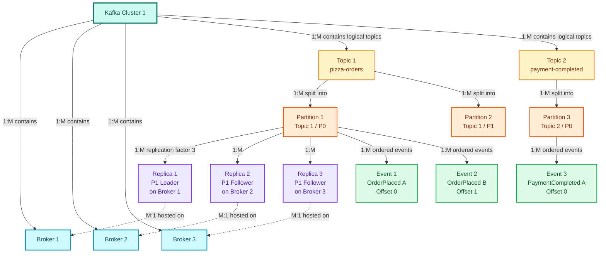
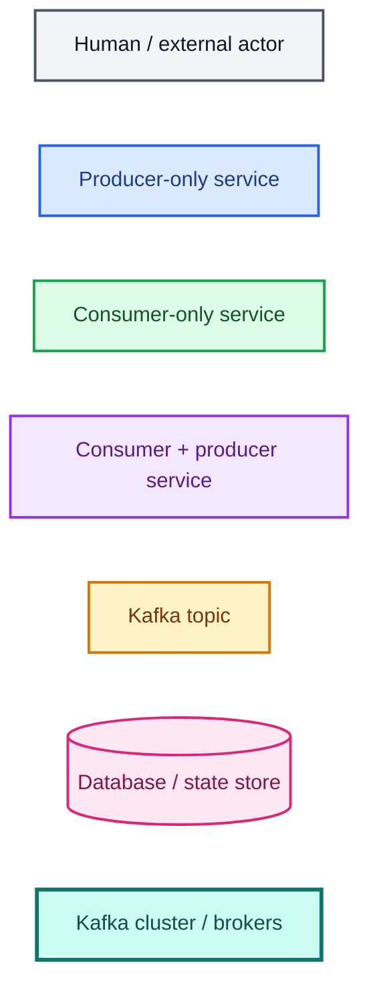
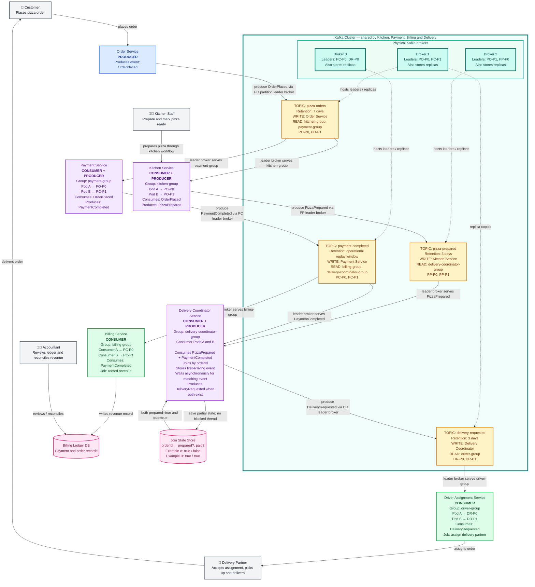
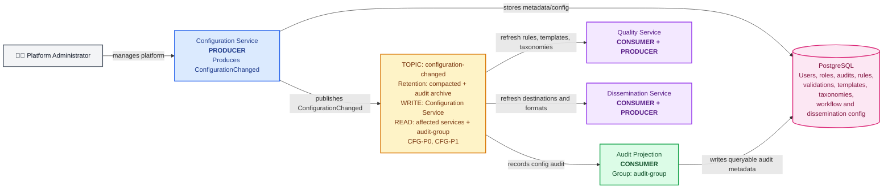
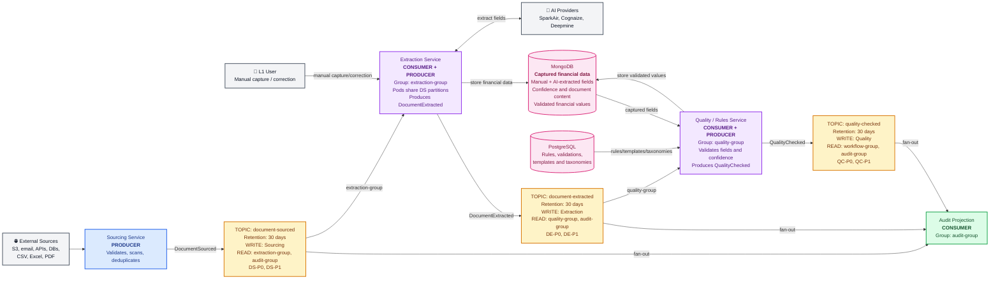

# Kafka Architect Interview Questions

This guide explains Kafka concepts in simple language and relates each concept to the Data Collection Platform (DCP).

DCP receives financial documents from S3, email, APIs and other sources. It extracts data using AI providers, validates the result, routes uncertain documents for L1/L2 review and disseminates approved data to downstream systems.

## Table of Contents

- [Start here: Kafka components working together](#start-here-how-do-kafka-producers-topics-partitions-and-consumers-work-together)
  - [General Kafka containment and cardinality](#general-kafka-containment-and-cardinality)
  - [Pizza-store example](#diagram-legend)
  - [DCP example](#the-same-kafka-concepts-applied-to-dcp)

1. [Why does DCP use Kafka?](#1-why-does-dcp-use-kafka)
2. [What are brokers, topics, partitions and records?](#2-what-are-brokers-topics-partitions-and-records)
3. [What does a Kafka producer do?](#3-what-does-a-kafka-producer-do)
4. [What does a Kafka consumer do?](#4-what-does-a-kafka-consumer-do)
5. [What is a consumer group?](#5-what-is-a-consumer-group)
6. [Why are partitions important?](#6-why-are-partitions-important)
7. [How does Kafka preserve ordering?](#7-how-does-kafka-preserve-ordering)
8. [How should DCP choose a partition key?](#8-how-should-dcp-choose-a-partition-key)
9. [How many partitions should a topic have?](#9-how-many-partitions-should-a-topic-have)
10. [What is an offset?](#10-what-is-an-offset)
11. [When should a consumer commit its offset?](#11-when-should-a-consumer-commit-its-offset)
12. [What are Kafka delivery guarantees?](#12-what-are-kafka-delivery-guarantees)
13. [What does Kafka exactly-once really mean?](#13-what-does-kafka-exactly-once-really-mean)
14. [How does DCP prevent duplicate processing?](#14-how-does-dcp-prevent-duplicate-processing)
15. [What is an idempotent producer?](#15-what-is-an-idempotent-producer)
16. [What do acknowledgements mean?](#16-what-do-acknowledgements-mean)
17. [What are replication, leader, follower and ISR?](#17-what-are-replication-leader-follower-and-isr)
18. [What happens when a Kafka broker fails?](#18-what-happens-when-a-kafka-broker-fails)
19. [What is consumer lag?](#19-what-is-consumer-lag)
20. [How does DCP handle backpressure and traffic spikes?](#20-how-does-dcp-handle-backpressure-and-traffic-spikes)
21. [What is a consumer rebalance?](#21-what-is-a-consumer-rebalance)
22. [How should Kafka retries be designed?](#22-how-should-kafka-retries-be-designed)
23. [What is a dead-letter topic?](#23-what-is-a-dead-letter-topic)
24. [What are retention and log compaction?](#24-what-are-retention-and-log-compaction)
25. [How should event schemas be versioned?](#25-how-should-event-schemas-be-versioned)
26. [What is the transactional outbox pattern?](#26-what-is-the-transactional-outbox-pattern)
27. [How does Kafka support choreography, Saga, CQRS and event sourcing?](#27-how-does-kafka-support-choreography-saga-cqrs-and-event-sourcing)
28. [What are Kafka Connect and Kafka Streams?](#28-what-are-kafka-connect-and-kafka-streams)
29. [How should Kafka be secured?](#29-how-should-kafka-be-secured)
30. [What should be monitored in production?](#30-what-should-be-monitored-in-production)
31. [How should Kafka disaster recovery be designed?](#31-how-should-kafka-disaster-recovery-be-designed)
32. [Kafka or RabbitMQ: how do you choose?](#32-kafka-or-rabbitmq-how-do-you-choose)
33. [Common Kafka failure scenarios in DCP](#33-common-kafka-failure-scenarios-in-dcp)
34. [Architect-level DCP Kafka design](#34-architect-level-dcp-kafka-design)
35. [Why are ordering and durability crucial in DCP?](#35-why-are-ordering-and-durability-crucial-in-dcp)
36. [Architect interview summary](#36-architect-interview-summary)

---

## Start here: How do Kafka producers, topics, partitions and consumers work together?

### General Kafka containment and cardinality

#### What has what?



#### Relationship summary

| From | To | Relationship | Meaning |
|---|---|---:|---|
| Cluster | Broker | **1:M** | One cluster contains many brokers |
| Broker | Cluster | **M:1** | Many brokers belong to one cluster |
| Cluster | Topic | **1:M** | One cluster hosts many logical topics |
| Topic | Partition | **1:M** | One topic is divided into many partitions |
| Partition | Topic | **M:1** | Many partitions belong to one topic |
| Partition | Replica | **1:M** | One partition has multiple replicas according to its replication factor |
| Replica | Partition | **M:1** | Every replica is a copy of one partition |
| Broker | Replica | **1:M** | One broker stores many replicas from many topics |
| Replica | Broker | **M:1** | One replica is physically hosted on one broker |
| Topic | Broker | **M:M** | A topic spans many brokers, and a broker stores replicas from many topics |
| Partition | Event | **1:M** | One partition contains many ordered events |
| Event | Partition | **M:1** | Each logical event belongs to one partition |
| Event | Replica | **M:M** overall | Every event is copied into each replica of its partition; every replica stores many events |

#### Important 1:1 relationship

At a particular moment:

```text
One partition
→ exactly one leader replica

One leader replica
→ leads exactly one partition
```

The partition may also have multiple follower replicas:

```text
Partition 1
├── Replica 1 = Leader
├── Replica 2 = Follower
└── Replica 3 = Follower
```

If the leader broker fails, one in-sync follower is promoted. The 1:1 leader relationship remains, but the broker hosting the leader changes.

#### One logical event, multiple physical copies

`Event 1` logically belongs to only `Partition 1`:

```text
Event 1 → Partition 1
```

Because Partition 1 has three replicas, Kafka stores a physical copy of Event 1 in all three replica logs:

```text
Event 1
├── Replica 1 on Broker 1
├── Replica 2 on Broker 2
└── Replica 3 on Broker 3
```

Consumers still see one logical event. Replication does not mean the consumer processes three events.

#### Short mental model

```text
Cluster 1
├── Broker 1
├── Broker 2
└── Broker 3

Topic 1
├── Partition 1
│   ├── Event 1
│   ├── Event 2
│   └── Replicas 1, 2, 3 spread across Brokers 1, 2, 3
└── Partition 2

Topic 2
└── Partition 3
```

### Diagram legend





The actual network path is:

```text
Producer service
→ broker that leads the selected topic partition
→ partition stored and replicated in the Kafka cluster
→ consumer reads from Kafka through the partition's broker
```

For Kitchen Service:

```text
Consume:
PO-P0 leader is Broker 1
Broker 1 → Kitchen Pod A

Produce:
Kitchen Pod A → PizzaPrepared
PP-P0 leader is Broker 2
Kitchen Pod A → Broker 2 → PP-P0
```

Kitchen Service is not permanently attached to Broker 1 or Broker 2. Kafka clients discover the current partition leaders and connect to the appropriate broker automatically.

### The same Kafka concepts applied to DCP

The original single DCP diagram was too large to read comfortably on GitHub. It is split below into one compact overview and three detailed diagrams.

#### DCP end-to-end overview

```mermaid
flowchart LR
    SOURCES["🌐 Sources"]:::actor
    SOURCE["Sourcing<br/><b>PRODUCER</b>"]:::producer
    T1["document-sourced"]:::topic
    EXTRACT["Extraction<br/><b>CONSUMER + PRODUCER</b>"]:::both
    T2["document-extracted"]:::topic
    QUALITY["Quality<br/><b>CONSUMER + PRODUCER</b>"]:::both
    T3["quality-checked"]:::topic
    REVIEW["Workflow / Approval<br/><b>CONSUMER + PRODUCER</b>"]:::both
    T4["document-approved"]:::topic
    DISSEM["Dissemination<br/><b>CONSUMER + PRODUCER</b>"]:::both
    T5["document-published"]:::topic
    TARGETS["🏢 Downstream"]:::actor
    KAFKA["DCP Kafka Cluster<br/><b>3 Brokers across failure zones</b><br/>Broker 1, Broker 2, Broker 3<br/>Partitions distributed + replicated"]:::cluster

    SOURCES --> SOURCE --> T1 --> EXTRACT --> T2 --> QUALITY --> T3 --> REVIEW --> T4 --> DISSEM --> T5
    DISSEM --> TARGETS
    KAFKA -.->|"stores all DCP topic partitions"| T1
    KAFKA -.-> T2
    KAFKA -.-> T3
    KAFKA -.-> T4
    KAFKA -.-> T5

    classDef actor fill:#F3F4F6,stroke:#4B5563,color:#111827,stroke-width:2px;
    classDef producer fill:#DBEAFE,stroke:#2563EB,color:#1E3A8A,stroke-width:2px;
    classDef consumer fill:#DCFCE7,stroke:#16A34A,color:#14532D,stroke-width:2px;
    classDef both fill:#F3E8FF,stroke:#9333EA,color:#581C87,stroke-width:2px;
    classDef topic fill:#FEF3C7,stroke:#D97706,color:#78350F,stroke-width:2px;
    classDef store fill:#FCE7F3,stroke:#DB2777,color:#831843,stroke-width:2px;
    classDef cluster fill:#CCFBF1,stroke:#0F766E,color:#134E4A,stroke-width:3px;
```



The yellow topic boxes are logical event streams. The blue cluster box is the physical Kafka infrastructure:

```text
Kafka cluster
├── Broker 1
├── Broker 2
└── Broker 3

Topic partitions
→ distributed across brokers
→ replicated for broker-failure recovery
```

For example, a replication factor of 3 could place copies like this:

```text
DS-P0 leader  → Broker 1
DS-P0 replica → Broker 2
DS-P0 replica → Broker 3

DS-P1 leader  → Broker 2
DS-P1 replica → Broker 3
DS-P1 replica → Broker 1
```

#### DCP diagram 1: Configuration and platform metadata



#### DCP diagram 2: Sourcing, extraction and quality



#### DCP diagram 3: Review, approval, dissemination and audit

```mermaid
flowchart LR
    L1["👤 L1 User<br/>Review and correction"]:::actor
    L2["👤 L2 User<br/>Approve, reject, rework"]:::actor
    TARGET["🏢 Downstream Consumers<br/>APIs, Kafka, S3, reports, email"]:::actor

    QC["TOPIC: quality-checked<br/>QC-P0, QC-P1"]:::topic
    REVIEW["Workflow / Approval Service<br/><b>CONSUMER + PRODUCER</b><br/>Group: workflow-group<br/>Tasks, timers, escalation, rework<br/>Produces DocumentApproved"]:::both
    PG[("PostgreSQL<br/>Users, roles, assignments,<br/>workflow state, decisions,<br/>audit metadata and delivery config")]:::store
    MONGO[("MongoDB<br/>Captured, corrected,<br/>validated and approved<br/>financial data")]:::store
    APPROVED["TOPIC: document-approved<br/>Retention: operational replay window, e.g. 30–90 days<br/>WRITE: Approval<br/>READ: dissemination-group, audit-group<br/>DA-P0, DA-P1"]:::topic
    DISSEM["Dissemination Service<br/><b>CONSUMER + PRODUCER</b><br/>Group: dissemination-group<br/>Produces DocumentPublished"]:::both
    PUBLISHED["TOPIC: document-published<br/>Retention: operational replay window, e.g. 30–90 days<br/>WRITE: Dissemination<br/>READ: audit-group, monitoring<br/>DP-P0, DP-P1"]:::topic
    AUDIT["Audit Projection Service<br/><b>CONSUMER</b><br/>Group: audit-group<br/>Consumes lifecycle events"]:::consumer
    SEARCH[("Search / Reporting Projection<br/>Fast audit and document queries")]:::store
    ARCHIVE[("Immutable Compliance Archive<br/>Optional WORM / Object Lock storage<br/>Long-term tamper-resistant evidence")]:::store

    QC -->|"workflow-group"| REVIEW
    L1 -->|"review/correct/submit"| REVIEW
    L2 -->|"approve/reject/rework"| REVIEW
    PG -->|"users, roles, workflow config"| REVIEW
    REVIEW -->|"workflow state + decision metadata"| PG
    REVIEW -->|"approved/corrected financial values"| MONGO
    REVIEW -->|"DocumentApproved"| APPROVED
    APPROVED -->|"dissemination-group"| DISSEM
    APPROVED -->|"fan-out"| AUDIT
    PG -->|"destination/schedule/format config"| DISSEM
    MONGO -->|"approved financial data"| DISSEM
    DISSEM -->|"deliver data"| TARGET
    DISSEM -->|"DocumentPublished"| PUBLISHED
    PUBLISHED -->|"audit-group"| AUDIT
    AUDIT -->|"audit metadata + lineage"| PG
    AUDIT -->|"fast query projection"| SEARCH
    AUDIT -->|"archive-outbox → immutable copy"| ARCHIVE

    classDef actor fill:#F3F4F6,stroke:#4B5563,color:#111827,stroke-width:2px;
    classDef producer fill:#DBEAFE,stroke:#2563EB,color:#1E3A8A,stroke-width:2px;
    classDef consumer fill:#DCFCE7,stroke:#16A34A,color:#14532D,stroke-width:2px;
    classDef both fill:#F3E8FF,stroke:#9333EA,color:#581C87,stroke-width:2px;
    classDef topic fill:#FEF3C7,stroke:#D97706,color:#78350F,stroke-width:2px;
    classDef store fill:#FCE7F3,stroke:#DB2777,color:#831843,stroke-width:2px;
```



#### DCP storage responsibility

| Store | What belongs there |
|---|---|
| **MongoDB** | All captured financial data from documents, whether manually entered, corrected by users or extracted by AI; confidence scores; semi-structured content; validated and approved financial values |
| **PostgreSQL** | System and platform metadata: users, roles, assignments, workflow state, audit metadata, rules, validations, templates, taxonomies, mappings, schedules and downstream dissemination configurations |

The two databases solve different problems:

```text
MongoDB
→ What financial data was captured from the document?

PostgreSQL
→ How is the platform configured, governed and operated?
```

Audit lifecycle events still travel through Kafka. The Audit Projection Service consumes them and writes queryable audit metadata and lineage into PostgreSQL.

The diagram demonstrates:

- A service may be a producer, consumer, or both.
- A topic represents a business event stream and owns its retention and permissions.
- Every topic has independent partitions and offsets.
- Different consumer groups receive the same event independently.
- Consumers inside one group divide the topic partitions.
- The Delivery Coordinator performs a stateful asynchronous join instead of blocking a thread.

---

## 1. Why does DCP use Kafka?

Without Kafka, Sourcing Service may call Extraction Service directly:

```text
Upload document
      ↓
Sourcing Service → Extraction Service
```

If Extraction Service is slow or unavailable, the upload may also become slow or fail.

With Kafka:

```text
Upload document
      ↓
Sourcing Service → Kafka → Extraction workers
```

Sourcing records the work in Kafka and returns. Extraction workers process it when capacity is available.

Kafka helps DCP with:

- **Decoupling:** Sourcing does not need Extraction to be available at that moment.
- **Buffering:** Kafka absorbs a large document spike.
- **Parallel processing:** Many extraction workers process different partitions.
- **Replay:** Events can be read again to rebuild a read model or reprocess data.
- **Fan-out:** Quality, audit and analytics consumers can read the same event independently.
- **Ordering:** Events for one document can remain ordered.
- **Durability:** Events are replicated across brokers.

Kafka does not make the business logic simpler automatically. DCP must still design idempotency, retries, schemas, monitoring and failure handling.

### Fan-out, ordering and durability in simple terms

#### Fan-out

Fan-out means one event can be used by several independent business jobs.

```text
DocumentExtracted
      ├── Quality group   → Validate the data
      ├── Audit group     → Record the history
      └── Analytics group → Calculate metrics
```

DCP publishes `DocumentExtracted` once. Kafka allows every interested consumer group to read it independently.

This is Kafka's pub/sub behavior:

```text
Across different consumer groups → fan-out
Within the same consumer group   → work sharing
```

It is broadcast-like across groups, but Kafka does not send the event to every consumer instance inside one group. The consumers in that group divide the work.

#### Ordering

Ordering means events inside one partition are read in the sequence in which Kafka stored them.

```text
DOC-123:
DocumentSourced
→ DocumentExtracted
→ QualityChecked
→ DocumentApproved
```

DCP uses `documentId` as the key so events for the same document go to the same partition.

Kafka does not guarantee a single order across all partitions. DCP normally needs per-document order, not an order between unrelated documents.

#### Durability

Durability means Kafka keeps an accepted event safely while consumers are unavailable or one broker fails.

```text
Sourcing publishes DocumentSourced
        ↓
Extraction Service is unavailable
        ↓
Kafka retains the event
        ↓
Extraction restarts and continues
```

Replication stores partition copies on multiple brokers. For important DCP events, durable producer acknowledgements and healthy in-sync replicas are also required.

```text
Fan-out   → One event, many independent business jobs
Ordering  → Events for one key remain in sequence
Durability → Events survive temporary failures
```

---

## 2. What are brokers, topics, partitions and records?

Use this simple mental model:

```text
Record    = One package
Topic     = Package category
Partition = Ordered shelf inside that category
Broker    = Warehouse building that stores shelves
Cluster   = Group of warehouse buildings working together
```

### Record: one event

A Kafka record is one message or event:

```json
{
  "eventId": "EV-1001",
  "documentId": "DOC-123",
  "eventType": "DocumentSourced",
  "timestamp": "2026-06-18T10:00:00Z"
}
```

In DCP, this record says:

```text
Document DOC-123 was accepted by Sourcing Service.
```

A record normally contains:

- **Key:** such as `documentId`
- **Value:** the event data
- **Timestamp**
- **Headers:** optional metadata such as correlation ID
- **Offset:** assigned after Kafka stores it in a partition

### Topic: a named event category

A topic is a named stream of related events:

```text
document-sourced
document-extracted
quality-checked
document-approved
document-published
```

For example:

```text
Topic: document-sourced
Contains: DocumentSourced events

Topic: document-approved
Contains: DocumentApproved events
```

A topic is a logical name. It is not one physical server or one file.

Different topics can have different:

- Retention periods
- Read/write permissions
- Partition counts
- Replication settings
- Business meanings

### Partition: an ordered lane inside a topic

A topic is divided into partitions:

```text
document-sourced
├── Partition 0
├── Partition 1
├── Partition 2
└── Partition 3
```

Each partition is an ordered log:

```text
document-sourced, Partition 0:

Offset 0 → DOC-100 sourced
Offset 1 → DOC-104 sourced
Offset 2 → DOC-108 sourced
```

Partitions provide:

- Parallel storage and processing
- Per-partition ordering
- Work distribution across consumers and brokers

The same topic's partitions may be stored on different brokers.

### Broker: one Kafka server

A broker is a running Kafka server.

Its main job is to store partition data and serve Kafka clients:

```text
Producer → Broker: “Store this event”
Consumer → Broker: “Give me records from this partition”
Broker   → Disk: Store the records durably
Broker   → Other brokers: Replicate partition data
```

A broker performs four important jobs.

#### 1. Store records

The broker stores partition records on disk:

```text
Broker 1
└── document-sourced Partition 0
    ├── Offset 0
    ├── Offset 1
    └── Offset 2
```

#### 2. Accept producer writes

The producer discovers which broker is the leader for the target partition and sends the event there:

```text
Sourcing Service
      ↓ DocumentSourced
Broker 1 — leader for DS-P0
```

The producer does not normally send one event to every broker.

#### 3. Serve consumer reads

Consumers fetch records from the broker serving the partition:

```text
Broker 1: DS-P0
      ↓
Extraction Consumer
```

The broker does not run the extraction business logic. It only stores and delivers the event.

#### 4. Replicate data for failure recovery

Kafka keeps copies of a partition on multiple brokers:

```text
DS-P0
├── Broker 1: Leader
├── Broker 2: Follower replica
└── Broker 3: Follower replica
```

The leader handles normal reads and writes. Followers copy its records.

If Broker 1 fails:

```text
Broker 2 becomes the new leader
→ Producers and consumers reconnect
→ Processing continues
```

### Kafka cluster: brokers working together

A Kafka cluster is a group of brokers:

```text
Kafka cluster
├── Broker 1
├── Broker 2
└── Broker 3
```

Kafka distributes partition leaders and replicas across the cluster:

```text
Broker 1:
  Leader:  DS-P0
  Replica: DS-P1

Broker 2:
  Leader:  DS-P1
  Replica: DS-P0

Broker 3:
  Replica: DS-P0
  Replica: DS-P1
```

This provides:

- **Scalability:** Data and traffic are spread across brokers.
- **Durability:** Partition copies survive a broker failure.
- **Availability:** Another replica can become leader.

### Complete simple flow

```text
1. Sourcing Service produces DocumentSourced(DOC-123)

2. Kafka uses the key DOC-123 to select:
   Topic: document-sourced
   Partition: DS-P0

3. Broker 1 is the leader for DS-P0
   → Broker 1 stores the record

4. Broker 2 and Broker 3 copy the record

5. Extraction Consumer reads DS-P0 from Kafka
   → It processes DOC-123
```

### Important distinction

```text
Topic     = Logical event stream
Partition = Ordered part of that stream
Broker    = Physical Kafka server storing partitions
Cluster   = Collection of brokers
Record    = One event stored in a partition
```

A broker does not represent a business job. It is infrastructure that safely stores and delivers events.

### DCP example

```text
Topic: document-sourced
├── DS-P0 leader on Broker 1
├── DS-P1 leader on Broker 2
└── Replicas spread across all three brokers

Extraction consumer group
├── Pod A reads DS-P0
└── Pod B reads DS-P1
```

If Broker 1 fails, a follower copy of `DS-P0` on another broker becomes the leader. The extraction pods can continue after a short recovery pause.

---

## 3. What does a Kafka producer do?

A producer publishes events to Kafka:

```text
Sourcing Service
      ↓
DocumentSourced event
      ↓
Kafka topic
```

The producer decides:

- Which topic receives the event
- What event key to use
- How long to wait for acknowledgement
- Whether to retry
- How records are batched and compressed

DCP example:

```text
Producer: Sourcing Service
Topic: document-sourced
Key: DOC-123
Value: DocumentSourced event
```

The key is important because it normally determines the partition.

---

## 4. What does a Kafka consumer do?

A consumer reads events and performs work:

```text
document-sourced topic
        ↓
Extraction Service consumer
        ↓
Call SparkAir
        ↓
Store extracted data
        ↓
Publish DocumentExtracted
```

The consumer tracks its progress using offsets.

Consumers should be:

- Idempotent
- Observable
- Safe to retry
- Careful about offset commits
- Able to distinguish temporary and permanent failures

---

## 5. What is a consumer group?

A consumer group is a team of consumers sharing work from a topic.

### Simple pizza-shop example

Think of a topic containing pizza orders:

```text
Topic: pizza-orders
```

The kitchen has several chefs doing the same job:

```text
Consumer group: kitchen-team
├── Chef A
├── Chef B
└── Chef C
```

Kafka divides the order partitions among the chefs. One order should be prepared by one chef, not by every chef.

Other departments perform different jobs:

```text
pizza-orders topic
├── kitchen-team  → Prepare pizza
├── billing-team  → Record revenue
└── delivery-team → Assign a driver
```

Every group receives all pizza-order events independently. Consumers inside one group divide those events.

### Relationship between partition, consumer group and consumer

Use this mental model:

```text
Partition      = Work lane
Consumer       = Worker
Consumer group = Team of workers doing the same job
```

Suppose the topic has four partitions and the kitchen group has two consumers:

```text
Kitchen Consumer A → Partition 0, Partition 1
Kitchen Consumer B → Partition 2, Partition 3
```

The main rule is:

> Within one consumer group, one partition is assigned to only one consumer at a time. One consumer may own several partitions.

Kafka enforces this because consumers in the same group represent the same business job. If two kitchen consumers processed the same partition simultaneously, they could prepare the same order twice and make ordered offset tracking unclear.

The same partition can be read by another consumer group:

```text
Partition 0
├── One consumer from kitchen-team
├── One consumer from billing-team
└── One consumer from delivery-team
```

This works because each group performs a different business job and stores its own offset.

### A partition is not a separate business job

All partitions in a topic contain the same kind of event:

```text
Topic: pizza-orders

Partition 0 → Order A, Order D
Partition 1 → Order B, Order E
Partition 2 → Order C, Order F
```

The partitions do not mean:

```text
Partition 0 = Cooking
Partition 1 = Billing
Partition 2 = Delivery
```

Business jobs are represented by consumer groups. Partitions are parallel lanes for those jobs.

### Relationship to Kubernetes pods

A common deployment is:

```text
Pod 1 → Consumer A
Pod 2 → Consumer B
Pod 3 → Consumer C
```

All application instances use the same Kafka `group.id`, so their consumers join the same group.

```text
Kubernetes Deployment: extraction-service

Pod 1 ─┐
Pod 2 ─┼→ Consumer group: extraction-workers
Pod 3 ─┘
```

A pod and a consumer are not the same concept. A pod is a Kubernetes runtime unit; a consumer is a Kafka client. One pod can technically run multiple consumer threads or listeners.

The simplest common design is one application instance per pod, contributing one consumer per listener to the group.

If a pod crashes, Kafka reassigns its partitions to healthy consumers. Kubernetes then starts a replacement pod, which joins the group and causes another assignment.

### DCP example

```text
Consumer group: extraction-workers

Partition 0 → Extraction Pod A
Partition 1 → Extraction Pod B
Partition 2 → Extraction Pod C
Partition 3 → Extraction Pod D
```

Within one consumer group, a partition is assigned to only one consumer at a time.

If DCP runs 20 extraction pods but the topic has only 10 partitions:

```text
10 pods process partitions
10 pods remain idle for this topic
```

Different consumer groups receive the same events independently:

```text
document-extracted topic
├── quality-engine group
├── audit-projection group
└── analytics group
```

Each group has its own offsets.

The complete color-coded component diagram is intentionally placed at the [top of this guide](#start-here-how-do-kafka-producers-topics-partitions-and-consumers-work-together) so it can be understood before the individual concepts below.

Yes, a service can act as both a consumer and a producer:

```text
Kitchen Service:
Consumes OrderPlaced event
→ Performs the kitchen business operation
→ Produces PizzaPrepared event

Payment Service:
Consumes OrderPlaced event
→ Performs the payment business operation
→ Produces PaymentCompleted event

Delivery Coordinator:
Consumes PizzaPrepared and PaymentCompleted events
→ Correlates them by orderId
→ Produces DeliveryRequested event
```

The terms describe the service's role for a particular interaction:

```text
Reads from a Kafka topic  → Consumer
Writes to a Kafka topic   → Producer
Does both                 → Consumer + Producer
```

### How does the Delivery Coordinator wait for two events?

`PizzaPrepared` and `PaymentCompleted` usually arrive at different times. The coordinator does not block a thread while waiting. It stores partial state by `orderId`.

#### Payment arrives first

```text
PaymentCompleted(orderId=A)
        ↓
Store:
A → PAID=true, PREPARED=false
        ↓
No output yet
```

Later:

```text
PizzaPrepared(orderId=A)
        ↓
Update:
A → PAID=true, PREPARED=true
        ↓
Both conditions satisfied
        ↓
Publish DeliveryRequested(orderId=A)
```

#### Pizza preparation arrives first

```text
PizzaPrepared(orderId=B)
        ↓
Store:
B → PAID=false, PREPARED=true
        ↓
No output yet

PaymentCompleted(orderId=B) arrives later
        ↓
B → PAID=true, PREPARED=true
        ↓
Publish DeliveryRequested(orderId=B)
```

This is a stateful event join, similar to a fork/join:

```text
OrderPlaced
   ├── Kitchen path → PizzaPrepared ───┐
   └── Payment path → PaymentCompleted ├── JOIN → DeliveryRequested
                                      ┘
```

It can be implemented with:

- Kafka Streams state stores and a stream/table join
- A coordinator service with PostgreSQL, Redis or another durable state store
- A workflow engine when the process also requires timers, cancellation and compensation

Production handling should also include:

- A unique `orderId` correlation key
- Idempotency so duplicate events do not trigger duplicate delivery
- A timeout, such as “payment completed but pizza not prepared within 30 minutes”
- Recovery or compensation, such as refunding a payment after permanent kitchen failure
- Cleanup of completed or expired join state

### Why does Billing Service have no outgoing Kafka event?

Billing's required business outcome in this example is to record revenue:

```text
PaymentCompleted event
        ↓
Billing Service
        ↓
Billing Ledger database
```

That can be a terminal consumer, so an outgoing Kafka event is not mandatory.

If another business process needs confirmation that the ledger was updated, Billing can also act as a producer:

```text
Billing Service
→ Write ledger database
→ Publish RevenueRecorded event
→ revenue-recorded topic
```

Do not publish an event merely to make every box symmetrical. Publish `RevenueRecorded` only when it is a meaningful fact required by another consumer, audit process or workflow.

The partition does not represent cooking, payment or delivery. Each topic still has partitions only for ordering and parallelism.

Every topic has its own independent partitions and offsets:

```text
PO-P0 = pizza-orders partition 0
PP-P0 = pizza-prepared partition 0
PC-P0 = payment-completed partition 0
DR-P0 = delivery-requested partition 0

PO-P0 offset 1
≠ PP-P0 offset 1
≠ PC-P0 offset 1
≠ DR-P0 offset 1
```

An offset is meaningful only with its topic and partition:

```text
Topic + Partition + Offset
```

Using the same `orderId` key can place an order in corresponding partitions when topics use the same partition count and partitioning strategy. This is useful for a Kafka Streams join. A normal multi-topic consumer group is not guaranteed to assign the same partition number from both topics to the same consumer, so its coordination state must be shared or partition-aware. Each topic is still an independent ordered log; Kafka does not provide cross-topic ordering.

```text
Topic          → Business event meaning and policy boundary
Partition      → Parallel ordered lane inside that topic
Consumer group → Business job that processes the topic
```

Create separate topics when events have different:

- **Business meanings:** `OrderPlaced`, `PaymentCompleted` and `DeliveryRequested`
- **Retention rules:** Temporary operational events versus seven-year financial records
- **Permissions:** Kitchen must not read restricted payment details
- **Processing flows:** Kitchen preparation, financial recording and driver assignment

Use multiple consumer groups on the same topic when several jobs need the same business event:

```text
payment-completed
├── billing-ledger group      → Record financial transaction
└── delivery-coordinator group → Confirm payment before delivery
```

```text
Producer       = Creates events
Topic          = Stores one kind of event stream
Partition      = Parallel ordered lane
Offset         = Record's position in that lane
Consumer       = Worker reading one or more lanes
Consumer group = Team performing the same business job
```

---

## 6. Why are partitions important?

Partitions provide three main benefits.

### Parallelism

Different partitions can be consumed at the same time:

```text
Partition 0 → Worker A
Partition 1 → Worker B
Partition 2 → Worker C
```

### Scalability

Kafka spreads partitions across brokers and consumers.

### Ordering

Kafka preserves order inside one partition.

The main trade-off is:

> More partitions provide more parallelism, but they also increase operational overhead and do not provide global ordering.

---

## 7. How does Kafka preserve ordering?

Kafka guarantees order only within a partition.

```text
Partition 2:
DocumentSourced
→ DocumentExtracted
→ QualityChecked
```

Kafka does not guarantee order across different partitions:

```text
Partition 1 event and Partition 2 event
→ No global ordering guarantee
```

For DCP, use `documentId` as the key when events for the same document must remain ordered:

```text
Key DOC-123 → always routed to the same partition
```

Then consumers see DOC-123 events in partition order.

This does not automatically prevent every business race. Producers must publish logically correct versions, and consumers should reject stale state transitions when necessary.

---

## 8. How should DCP choose a partition key?

A good key should:

- Preserve the required business ordering
- Distribute traffic reasonably evenly
- Remain stable over the event lifecycle

For document lifecycle events:

```text
Key = documentId
```

This keeps all events for `DOC-123` together.

Avoid a low-cardinality key such as:

```text
Key = documentType
```

If most documents are PDFs, one partition may receive nearly all traffic. This is called a hot partition.

### DCP choices

| Event stream | Possible key | Reason |
|---|---|---|
| Document lifecycle | `documentId` | Preserve per-document order |
| Tenant usage events | `tenantId` | Preserve tenant sequence, but watch for large tenants |
| Dissemination jobs | `destinationId` or `documentId` | Choose based on required ordering |
| Audit events | `documentId` | Reconstruct one document's history |

The architect must state what ordering is required before selecting the key.

---

## 9. How many partitions should a topic have?

There is no universal number.

Partition count depends on:

- Expected throughput
- Consumer processing speed
- Required parallelism
- Number of consumers
- Ordering requirements
- Future growth
- Broker capacity

A simple estimate:

```text
Required consumers
≈ Incoming events per second ÷ Events one consumer can process per second
```

Example:

```text
Incoming extraction jobs = 200/second
One worker handles       = 20/second

Minimum parallel workers = 10
```

The topic needs at least 10 partitions to keep 10 consumers active.

For DCP, AI extraction is slow, so the partition count may be driven more by concurrent extraction workers than by Kafka's raw throughput.

Important cautions:

- Increasing partitions later can change key-to-partition mapping.
- Too few partitions limit scaling.
- Too many partitions increase metadata, file handles, replication work and recovery time.
- A partition is the unit of consumer parallelism.

Choose with growth headroom, then validate using load tests.

### Relationship between partition and consumer counts

Partitions set the maximum active parallelism of one consumer group:

```text
Maximum active consumers in one group
= Number of partitions
```

#### More partitions than consumers

```text
12 partitions
4 consumers
```

Kafka assigns several partitions to each consumer:

```text
Consumer 1 → P0, P1, P2
Consumer 2 → P3, P4, P5
Consumer 3 → P6, P7, P8
Consumer 4 → P9, P10, P11
```

This is normal and leaves room to add consumers later.

#### Equal partitions and consumers

```text
12 partitions
12 consumers
```

Each consumer can own one partition. This is the maximum consumer parallelism for the group.

#### More consumers than partitions

```text
12 partitions
15 consumers
```

Only 12 consumers can actively consume:

```text
12 active consumers
3 idle consumers
```

Adding more consumers does not improve Kafka parallelism until the topic has more partitions.

### Practical sizing strategy

#### Step 1: Measure peak incoming rate

```text
Peak = 1,000 events/second
```

#### Step 2: Measure one real consumer

```text
One consumer = 100 events/second
```

Use load-test measurements rather than guesses.

#### Step 3: Calculate required consumers

```text
Required consumers
= Incoming rate ÷ Processing rate per consumer

= 1,000 ÷ 100
= 10 consumers
```

#### Step 4: Add growth and failure headroom

```text
10 required today
+ 20–30% headroom
= approximately 12–13 consumers
```

#### Step 5: Choose enough partitions

If the expected maximum is 20 active consumers:

```text
Partitions must be at least 20
```

It can be reasonable to start with 20–24 partitions while initially running fewer consumers.

#### Step 6: Check the real bottlenecks

More Kafka consumers do not help if another dependency is the limit:

```text
Kafka supports 100 consumers
SparkAir permits 50 concurrent calls
Database pool permits 40 writes
```

Useful concurrency may be capped at 40–50, not 100.

Check:

- External API concurrency and rate limits
- Database connections and write throughput
- CPU and memory
- Network bandwidth
- Object-storage limits
- Cost

#### Step 7: Check the business SLA

Suppose 10,000 documents arrive together and must finish within one hour:

```text
Required processing rate
= 10,000 ÷ 3,600
≈ 2.8 documents/second
```

If one extraction consumer handles one document every 10 seconds:

```text
One consumer = 0.1 documents/second
```

Required consumers:

```text
2.8 ÷ 0.1 = 28 consumers
```

The topic needs at least 28 partitions to keep all 28 consumers active.

#### Step 8: Validate key distribution

A poor key can create a hot partition:

```text
Key = documentType
80% of documents = PDF
→ One partition receives most traffic
```

For DCP, `documentId` usually distributes documents more evenly while preserving per-document ordering.

#### Step 9: Load-test and adjust

Measure:

- Per-partition lag
- Event processing rate
- Oldest-message age
- Rebalance frequency
- External-provider errors
- Database saturation

Do not create thousands of partitions “just in case.” Too many partitions increase broker metadata, open files, replication work, rebalance work and recovery time.

### DCP sizing example

```text
Peak incoming rate        = 100 documents/second
One extraction consumer   = 5 documents/second
Expected future growth    = 2×
```

Current requirement:

```text
100 ÷ 5 = 20 consumers
```

Future requirement:

```text
200 ÷ 5 = 40 consumers
```

Possible design:

```text
Partitions       = 48
Initial consumers = 20
Maximum useful active consumers = 48
```

Scale consumers based on lag and oldest-message age, but cap them according to SparkAir and database capacity.

### Autoscaling strategy

Do not scale only on CPU. A consumer may spend most of its time waiting for SparkAir while CPU remains low.

For DCP, evaluate:

```text
Consumer lag
Age of oldest pending document
Incoming event rate
Processing rate
CPU and memory
SparkAir concurrency
Database connection usage
```

A practical policy:

```text
Lag or oldest-message age rises
        ↓
Add extraction pods
        ↓
Stop scaling when reaching:
- Topic partition count
- SparkAir concurrency limit
- Database connection limit
```

Scale down only after lag remains low for a sustained period. Rapidly adding and removing pods causes repeated consumer-group rebalances and unstable throughput.

---

## 10. What is an offset?

An offset is a record's position inside a partition.

```text
Partition 0

Offset 100 → DOC-1
Offset 101 → DOC-2
Offset 102 → DOC-3
```

A consumer group stores the next position it should read.

```text
Committed offset = 102
```

This means the group has acknowledged processing through the previous position and will continue from its committed progress.

Offsets belong to a consumer group, not to an individual consumer instance.

### Every partition has its own offsets

```text
Partition 0:
Offset 0 → Order A
Offset 1 → Order B

Partition 1:
Offset 0 → Order C
Offset 1 → Order D
```

Therefore, an offset alone is not a complete address. A record is identified by:

```text
Topic + Partition + Offset
```

### Every consumer group has its own progress

Suppose three groups read Partition 0:

```text
Kitchen group  → next offset 4
Billing group  → next offset 2
Delivery group → next offset 3
```

Kitchen moving forward does not change Billing's or Delivery's position.

Kafka tracks progress per:

```text
Consumer group + Topic + Partition
→ Committed offset
```

### One group with multiple partitions and consumers

```text
Kitchen Consumer A → P0, P1
Kitchen Consumer B → P2, P3
```

The group still has a separate committed offset for every partition:

```text
Kitchen group:
P0 → 120
P1 → 87
P2 → 203
P3 → 51
```

There is no single offset for the whole topic or consumer group.

### What happens when a consumer fails?

Initially:

```text
Consumer A → P0
Consumer B → P1
```

If Consumer A fails, Kafka assigns P0 to Consumer B or another healthy consumer.

The new owner resumes P0 from the group's committed offset for P0. The offset follows the group and partition, not the old consumer instance.

### What happens when a new consumer group starts?

A new group has no committed offsets.

Its reset policy decides where to start:

```text
earliest → Read the oldest retained events
latest   → Read only new events from now onward
```

This setting is used when no valid committed offset exists.

### Offset and replay

An administrator can move a group's offset backward:

```text
Current offset = 1,000
Reset to       = 500
```

The group then processes offsets 500 onward again.

This is useful for:

- Rebuilding a CQRS read model
- Reprocessing after fixing a consumer bug
- Recalculating analytics

Consumers must be idempotent because replay intentionally repeats processing.

### Offset and retention

Suppose:

```text
Group wants offset       = 100
Oldest retained offset   = 500
```

Offsets 100–499 have already been deleted by topic retention. The group cannot read them from Kafka and needs a reset or an external archive.

### Complete simple example

```text
Topic: pizza-orders

Partition 0:
Offset 0 → Order A
Offset 1 → Order B
Offset 2 → Order C

Partition 1:
Offset 0 → Order D
Offset 1 → Order E

Kitchen group:
P0 next offset → 3
P1 next offset → 2

Billing group:
P0 next offset → 1
P1 next offset → 1
```

Interpretation:

- Kitchen has processed all listed orders.
- Billing has processed only offset 0 in each partition.
- Billing continues independently from its own offsets.

> An offset is a record's position in one partition. A committed offset records where one consumer group should continue reading that partition.

---

## 11. When should a consumer commit its offset?

### Commit before processing

```text
Commit offset
→ Process document
```

If the consumer crashes after committing but before processing, the event may be lost from that group's point of view.

This provides at-most-once processing.

### Commit after processing

```text
Process document
→ Commit offset
```

If the consumer completes the database update but crashes before committing, Kafka delivers the event again.

This provides at-least-once processing and requires idempotency.

For DCP, at-least-once is generally safer because losing a financial document is worse than receiving a duplicate that can be detected.

---

## 12. What are Kafka delivery guarantees?

### At-most-once

```text
The event may be processed zero or one time.
```

- Duplicates are avoided.
- Message loss is possible.

Possible DCP use: non-critical diagnostic metrics where occasional loss is acceptable.

### At-least-once

```text
The event is processed one or more times.
```

- Message loss is normally avoided.
- Duplicates are possible.

This is the common DCP choice. Consumers use an event ID or business key to avoid duplicate business effects.

### Exactly-once

For Kafka-to-Kafka processing, Kafka can atomically commit:

```text
Produced output records + consumed input offsets
```

Only one successful result becomes visible, even if the processing attempt is retried.

Exactly-once does not automatically include PostgreSQL, MongoDB, S3, email, SparkAir or another REST API.

---

## 13. What does Kafka exactly-once really mean?

Consider:

```text
Input topic → JVM 1 → Output topic → JVM 2 → Final topic
```

JVM 1 can perform:

```text
BEGIN KAFKA TRANSACTION

Read input event
Produce output event
Commit consumed input offset

COMMIT
```

If JVM 1 crashes before commit:

```text
Output visible? No
Offset committed? No
Input retried? Yes
```

If it commits:

```text
Output visible? Yes
Offset committed? Yes
```

JVM 2 performs its own separate Kafka transaction.

The code may execute more than once. Exactly-once means only one successful Kafka result becomes visible.

### DCP limitation

Suppose Extraction Service stores data in MongoDB:

```text
Store extraction result ✅
Crash before Kafka offset commit ❌
Kafka redelivers event
```

Kafka cannot roll back MongoDB. DCP still needs consumer idempotency or an inbox/outbox design.

---

## 14. How does DCP prevent duplicate processing?

Every event should contain a stable identifier:

```text
eventId = EV-1001
documentId = DOC-123
documentVersion = 7
```

The consumer stores the event ID with the business update in one local transaction:

```sql
BEGIN;

INSERT INTO processed_events(event_id)
VALUES ('EV-1001'); -- unique constraint

UPDATE document_state
SET status = 'EXTRACTED'
WHERE document_id = 'DOC-123';

COMMIT;
```

On redelivery, the unique constraint shows that the event was already processed.

DCP may also use natural uniqueness:

```text
Only one extraction result for documentId + version
Only one publication for documentId + destination + version
```

Avoid:

```text
Check key
→ Perform work
→ Save key
```

Two consumers could pass the check at the same time.

---

## 15. What is an idempotent producer?

A producer may retry because it did not receive an acknowledgement:

```text
Producer sends event
Broker stores event
Acknowledgement is lost
Producer retries
```

Without protection, the retry could create a duplicate record.

An idempotent producer uses producer identity and sequence information so the broker can reject duplicate retry attempts.

Typical intent:

```properties
enable.idempotence=true
acks=all
```

This protects against duplicates caused by producer retries.

It does not stop application code from intentionally calling `send()` twice with two separate logical sends.

---

## 16. What do acknowledgements mean?

The producer's `acks` setting controls when a send is considered successful.

### `acks=0`

The producer does not wait for broker confirmation.

```text
Fast, but data loss can go unnoticed.
```

Not appropriate for important DCP lifecycle events.

### `acks=1`

The partition leader confirms the write.

```text
Leader has the event, but followers may not have copied it yet.
```

If the leader fails immediately, the newest record may be lost.

### `acks=all`

The leader waits for the required in-sync replicas.

```text
Safer, with some additional latency.
```

For DCP's financial and audit events, durability is usually more important than the smallest possible latency, so `acks=all` is the natural choice.

Use it with appropriate replication and `min.insync.replicas`.

---

## 17. What are replication, leader, follower and ISR?

With replication factor 3:

```text
Partition 0
├── Leader copy on Broker 1
├── Follower copy on Broker 2
└── Follower copy on Broker 3
```

Producers and consumers normally interact with the leader.

Followers copy the leader's data.

ISR means **in-sync replicas**: replicas that are sufficiently caught up to be trusted for safe failover.

Example:

```text
ISR = Broker 1, Broker 2, Broker 3
```

If Broker 3 becomes too slow:

```text
ISR = Broker 1, Broker 2
```

`min.insync.replicas` defines the minimum number of in-sync replicas required for a successful durable write when using `acks=all`.

Example:

```text
Replication factor = 3
min.insync.replicas = 2
```

DCP can tolerate one unavailable replica while continuing safe writes. If too many replicas are unavailable, Kafka rejects writes rather than pretending they are safely replicated.

---

## 18. What happens when a Kafka broker fails?

Suppose Broker 1 is the leader for Partition 0.

```text
Broker 1 fails
      ↓
Kafka elects an in-sync follower as the new leader
      ↓
Producers and consumers refresh metadata
      ↓
Processing continues
```

Business impact:

- A short pause may occur.
- Properly replicated committed records remain available.
- Consumer lag may temporarily increase.

DCP should run a production cluster with replicated partitions distributed across failure domains.

Avoid unsafe leader election from an out-of-sync replica for critical data because it can trade availability for data loss.

---

## 19. What is consumer lag?

Consumer lag is the difference between:

```text
Latest available offset
-
Consumer group's committed offset
```

Example:

```text
Latest offset    = 50,000
Committed offset = 42,000
Lag              = 8,000 events
```

Lag means work is waiting. It does not always mean failure.

For DCP:

```text
High extraction lag
→ Documents wait longer for AI extraction
→ Reviewer queues receive work later
```

Lag should be evaluated with:

- Event arrival rate
- Processing rate
- Age of the oldest message
- Business SLA
- Error and retry rates

Eight thousand one-second jobs are very different from eight thousand ten-minute jobs.

---

## 20. How does DCP handle backpressure and traffic spikes?

Suppose 10,000 documents arrive in a short period.

Kafka acts as a buffer:

```text
Sourcing produces quickly
        ↓
Kafka stores pending extraction jobs
        ↓
Extraction workers process at sustainable speed
```

DCP can scale workers based on:

- Kafka lag
- Age of oldest pending event
- CPU and memory
- External AI provider capacity
- Database connection limits

```text
Lag rises
→ Scale extraction pods from 5 to 20
```

Do not scale only because lag is high. If SparkAir permits only 50 concurrent calls, adding 100 workers may increase failures rather than throughput.

Backpressure design may also include:

- Per-tenant rate limits
- Bounded worker concurrency
- Pausing consumers temporarily
- Retry topics
- Priority topics for high-value documents

---

## 21. What is a consumer rebalance?

A rebalance happens when Kafka changes partition ownership inside a consumer group.

Common triggers:

- A consumer starts
- A consumer stops or crashes
- The topic gains partitions
- Group membership changes

Example:

```text
Before:
Pod A → P0, P1
Pod B → P2, P3

Pod C joins

After rebalance:
Pod A → P0
Pod B → P1
Pod C → P2, P3
```

During reassignment, processing may pause briefly.

Frequent rebalances can cause:

- Higher lag
- Repeated work
- Slow recovery
- Unstable throughput

DCP should:

- Keep processing below the configured poll interval
- Move long work to controlled worker execution where appropriate
- Use graceful shutdown
- Avoid constant pod churn
- Use cooperative rebalancing or static membership where suitable

---

## 22. How should Kafka retries be designed?

First classify the error.

### Temporary error

Examples:

- Network timeout
- Temporary S3 failure
- SparkAir rate limit

Use limited retry with backoff and jitter:

```text
Attempt 1
→ Wait
Attempt 2
→ Wait longer
Attempt 3
```

### Permanent error

Examples:

- Corrupt PDF
- Unsupported file type
- Invalid schema
- Missing mandatory business data

Repeated retries will not repair these errors.

Route them to:

- Manual review
- Quarantine
- Dead-letter topic

Avoid blocking one partition for hours because one document keeps failing. Retry topics can delay the failed event while allowing later work to continue, but this may relax strict per-key ordering and must be designed consciously.

---

## 23. What is a dead-letter topic?

A dead-letter topic stores events that could not be processed after the allowed attempts.

```text
document-sourced
      ↓
Extraction fails repeatedly
      ↓
document-sourced-dlt
```

The dead-letter event should contain:

- Original event
- Topic, partition and offset
- Failure reason
- Stack trace or error code
- Retry count
- First and last failure time
- Correlation ID

DCP example:

```text
Corrupt PDF
→ DLT
→ Operations notified
→ File corrected or marked invalid
→ Event replayed if appropriate
```

A DLT is not a solution by itself. It requires:

- Monitoring
- Ownership
- A resolution SLA
- Replay tooling
- Protection against replay loops

---

## 24. What are retention and log compaction?

### Time or size retention

Kafka keeps events for a configured time or until size limits are reached:

```text
Keep document processing events for 30 days
```

Consumption does not immediately delete the event.

This enables:

- Replay
- New consumers
- Recovery after downtime

### Log compaction

Compaction keeps the latest value for each key over time:

```text
DOC-123 → SOURCED
DOC-123 → EXTRACTED
DOC-123 → APPROVED

Compacted view eventually retains:
DOC-123 → APPROVED
```

Compaction is useful for state-style topics, configuration and rebuilding a latest-state cache.

It is not a replacement for a complete immutable audit stream because older values may be removed.

DCP may use:

- Retention-based lifecycle topics for audit/replay
- Compacted topics for current template, rule or document-state snapshots
- External archive storage for multi-year regulatory retention

---

## 25. How should event schemas be versioned?

Events are contracts between teams.

Initial event:

```json
{
  "documentId": "DOC-123",
  "status": "EXTRACTED"
}
```

Later, a producer adds:

```json
{
  "documentId": "DOC-123",
  "status": "EXTRACTED",
  "confidenceScore": 0.92
}
```

This is usually safe if the new field is optional or has a default.

Risky changes include:

- Renaming or removing required fields
- Changing a field's meaning
- Changing a number to an incompatible string
- Reusing an event name for a different business fact

Use:

- Avro, Protobuf or JSON Schema
- A schema registry
- Compatibility rules
- Contract tests
- Clear event ownership

Prefer evolving compatible schemas over creating a new topic for every minor field addition. Use a new event or topic when the business meaning changes materially.

---

## 26. What is the transactional outbox pattern?

The dual-write problem:

```text
Save document metadata ✅
Publish DocumentSourced ❌
```

The document exists but extraction never starts.

Outbox solution:

```text
BEGIN DATABASE TRANSACTION

Insert document metadata
Insert DocumentSourced into outbox table

COMMIT
```

A separate publisher sends outbox rows to Kafka:

```text
Outbox table → Publisher or CDC connector → Kafka
```

The publisher may send an event more than once, so consumers still need idempotency.

For DCP, use outbox when losing the event would leave a document silently stuck outside the pipeline.

---

## 27. How does Kafka support choreography, Saga, CQRS and event sourcing?

### Choreography

```text
DocumentSourced
→ DocumentExtracted
→ QualityChecked
```

Services react to events without a central controller.

### Orchestrated Saga

An orchestrator may send commands and receive events through Kafka:

```text
Orchestrator → PublishDocument command
Dissemination → DocumentPublished event
```

Kafka does not decide the workflow. The orchestrator does.

### CQRS

Lifecycle events update a query-friendly read model:

```text
Kafka events → Projection consumer → DocumentSummary
```

### Event sourcing

Events are used to reconstruct state:

```text
SOURCED → EXTRACTED → APPROVED → PUBLISHED
```

Architectural caution:

Kafka can retain and replay events, but calling Kafka the permanent authoritative event store requires deliberate retention, archival, schema, governance and recovery design. A separate durable event store may still be appropriate.

---

## 28. What are Kafka Connect and Kafka Streams?

### Kafka Connect

Kafka Connect moves data between Kafka and external systems using connectors.

```text
PostgreSQL changes → Kafka
Kafka events → S3
Kafka events → Elasticsearch
```

DCP uses:

- CDC/outbox events from PostgreSQL to Kafka
- Approved data from Kafka to S3 or a warehouse
- Document summaries to Elasticsearch

Use Connect for standard integration rather than writing custom polling code.

### Kafka Streams

Kafka Streams is a library for Kafka-to-Kafka processing:

```text
Input topics
→ Filter, transform, join, aggregate or window
→ Output topics
```

DCP uses:

- Aggregate documents by status
- Build hourly extraction metrics
- Join quality and extraction events
- Detect processing SLA violations

Kafka Streams is not a replacement for every microservice. Use it when the core job is stream transformation or stateful stream processing.

---

## 29. How should Kafka be secured?

Kafka security has three parts.

### Encryption

Use TLS for:

- Client-to-broker traffic
- Broker-to-broker traffic

This protects financial event data in transit.

### Authentication

Verify the identity of producers, consumers and administrators using the organization's supported mechanism.

### Authorization

Use least-privilege access controls:

```text
Sourcing Service:
  Write document-sourced

Extraction Service:
  Read document-sourced
  Write document-extracted

Approval Service:
  Write document-approved
```

Also protect:

- Schema registry
- Kafka Connect
- Secrets and credentials
- Administrative APIs

Avoid placing unnecessary PII or full document content in event payloads. Prefer references to encrypted object storage where suitable.

---

## 30. What should be monitored in production?

### Broker health

- Broker availability
- Disk usage
- Under-replicated partitions
- Offline partitions
- ISR shrink and expansion
- Request latency
- Controller health

### Producer health

- Send error rate
- Retry rate
- Request latency
- Record size
- Throughput

### Consumer health

- Lag by group and partition
- Age of oldest pending event
- Processing rate
- Commit failures
- Rebalance frequency
- Error and retry rate

### Business health

- Documents waiting for extraction
- Documents stuck in one state
- Time from upload to extraction
- Time from approval to dissemination
- DLT count and age
- Duplicate suppression count

An architect should connect technical metrics to user impact:

```text
Extraction lag increased
→ Reviewers receive documents later
→ Approval SLA is at risk
```

---

## 31. How should Kafka disaster recovery be designed?

First define:

- **RPO:** How much event data can the business afford to lose?
- **RTO:** How long can Kafka remain unavailable?

Possible designs:

### Single-region, multi-zone

```text
Three brokers across availability zones
```

Protects against broker and zone failures.

### Cross-region replication

```text
Primary Kafka cluster
        ↓ replicate
Recovery Kafka cluster
```

Protects against a regional disaster.

Architectural decisions include:

- Active-passive or active-active
- Topic replication scope
- Consumer offset replication
- Failover DNS and application configuration
- Duplicate events after failover
- Data sovereignty
- Regular recovery testing

DCP consumers must remain idempotent because failover and replay can create duplicate delivery.

---

## 32. Kafka or RabbitMQ: how do you choose?

Kafka is strong when DCP needs:

- High-throughput event streams
- Retention and replay
- Multiple independent consumer groups
- Partition-based parallelism
- Event history for CQRS and auditing

RabbitMQ is often simpler when the main requirement is:

- Traditional task queues
- Flexible message routing
- Short-lived messages
- Per-message acknowledgement and queue semantics

For DCP:

```text
Document lifecycle events
Multiple downstream consumers
Replay and audit requirements
High-volume extraction pipeline
```

These requirements strongly support Kafka.

Trade-off:

```text
Kafka gives scalability and replay
but adds partition, offset, schema and cluster operational complexity.
```

The architect should choose from requirements, not popularity.

---

## 33. Common Kafka failure scenarios in DCP

### Producer times out

The event may have been stored even though the producer did not receive acknowledgement.

Response:

- Use idempotent producer
- Retry safely
- Track event ID

### Consumer crashes after database update

Kafka redelivers the event.

Response:

- Idempotent consumer
- Unique business constraint
- Inbox table

### One document is corrupt

Repeated processing blocks progress or wastes resources.

Response:

- Classify as permanent failure
- Move to DLT or manual handling
- Alert operations

### Extraction lag grows rapidly

Possible causes:

- Upload spike
- SparkAir slowdown
- Too few workers
- Hot partition
- Database bottleneck

Response:

- Inspect per-partition lag
- Scale within external dependency limits
- Apply backpressure
- Open circuit and use fallback when appropriate

### One broker fails

Response:

- Elect in-sync replica
- Monitor under-replicated partitions
- Restore replication health

### Schema-incompatible event is deployed

Consumers fail deserialization.

Response:

- Schema compatibility checks in CI
- Contract tests
- Controlled rollout
- DLT for unexpected records

### Consumer group keeps rebalancing

Response:

- Check long processing time
- Check pod instability
- Use graceful shutdown
- Tune group and poll settings

---

## 34. Architect-level DCP Kafka design

### Example topic flow

```text
document-sourced
      ↓
Extraction consumer group
      ↓
document-extracted
      ├── Quality consumer group
      ├── Audit projection group
      └── Analytics group
              ↓
quality-checked
      ↓
Workflow and approval
      ↓
document-approved
      ↓
Dissemination consumer group
      ↓
document-published
```

### Important design choices

| Concern | DCP choice | Reason |
|---|---|---|
| Ordering | Key lifecycle events by `documentId` | Preserve per-document order |
| Delivery | At-least-once | Avoid losing financial documents |
| Duplicate safety | Idempotent consumers | Kafka may redeliver |
| Producer durability | Idempotence, `acks=all`, replication | Protect critical events |
| Service/database consistency | Transactional outbox | Avoid lost events after database commit |
| Scaling | Partitioned topics and competing consumers | Parallel extraction |
| Autoscaling | Lag, oldest-event age, CPU and provider capacity | Scale based on business delay and real bottlenecks |
| Failure handling | Limited retry, fallback, manual queue and DLT | Different treatment for temporary and permanent failures |
| Contracts | Schema registry and compatibility checks | Allow independent service releases |
| Read performance | CQRS projections | Fast reviewer dashboard |
| Audit | Immutable lifecycle events plus archival | Regulatory lineage and replay |
| Security | TLS, authentication, ACLs and minimal payloads | Protect financial information |

### Trade-offs to state in an interview

- Kafka introduces eventual consistency.
- Ordering is per partition, not global.
- More partitions improve parallelism but add overhead.
- At-least-once requires idempotency.
- Exactly-once does not automatically include external databases and APIs.
- Long retention and replication increase storage cost.
- Kafka requires careful schema, offset, lag and rebalance management.
- Managed Kafka reduces operational burden but not application design responsibility.

---

## 35. Why are ordering and durability crucial in DCP?

### Ordering: keep one document's lifecycle valid

A financial document should move through a valid sequence:

```text
DocumentSourced
→ DocumentExtracted
→ QualityChecked
→ DocumentApproved
→ DocumentPublished
```

If events are applied in the wrong logical order, DCP could:

- Approve data before validation completes.
- Disseminate data before approval.
- Let an old extraction overwrite a reviewer correction.
- Show an older status after a newer status.
- Produce a confusing or incorrect audit history.

#### How DCP preserves order

DCP uses `documentId` as the Kafka record key:

```text
Key = DOC-123
```

Events with that key are routed to the same partition for a given topic:

```text
Partition:
Offset 100 → DOC-123 event
Offset 101 → DOC-123 next event
Offset 102 → DOC-123 next event
```

Kafka guarantees order inside one partition, not across the entire cluster.

DCP does not need global ordering between unrelated documents:

```text
DOC-123 may finish before or after DOC-456.
```

It needs valid ordering for each document.

#### Partition ordering is not enough

DCP lifecycle stages use multiple topics, and Kafka does not guarantee ordering across topics. Events should also contain:

```json
{
  "documentId": "DOC-123",
  "version": 7,
  "eventType": "DocumentApproved"
}
```

Consumers should combine:

```text
documentId partition key
+ event version
+ valid state-transition checks
+ idempotency
```

Example:

```text
Current document version = 7
Incoming event version   = 6
→ Ignore or reject the stale event
```

### Durability: accepted documents and decisions must not disappear

Suppose Sourcing publishes:

```text
DocumentSourced(DOC-123)
```

Extraction Service is temporarily unavailable:

```text
Sourcing → Kafka ✅
Extraction unavailable ❌
```

Kafka retains the event. When Extraction restarts, it continues processing.

Without durability, DCP could lose:

- An uploaded document
- An approval decision
- A reviewer correction
- A publication request
- Audit evidence
- Financial data expected by downstream products

#### Broker replication

A critical partition is copied across brokers:

```text
DS-P0
├── Broker 1: Leader
├── Broker 2: Follower replica
└── Broker 3: Follower replica
```

If Broker 1 fails, an in-sync follower can become leader.

A common DCP baseline is:

```text
Replication factor = 3
min.insync.replicas = 2
acks = all
```

Replication protects against broker failure. It does not solve every possible loss scenario.

#### Transactional outbox protects the database-to-Kafka boundary

This can still happen:

```text
Save document metadata in PostgreSQL ✅
Crash before publishing DocumentSourced ❌
```

Kafka cannot retain an event it never received.

Use one local database transaction:

```text
BEGIN

Save document metadata
Save DocumentSourced in outbox

COMMIT
```

An outbox publisher later sends the event to Kafka. Consumers remain idempotent because the publisher may retry.

### Is a broker the Kafka control plane?

No. A broker is primarily a data-plane server:

```text
Producer → Broker → Consumer
```

A broker:

- Stores partition records on disk.
- Accepts writes for partitions it leads.
- Serves consumer reads.
- Replicates records to other brokers.

Kafka's KRaft controllers provide the control plane:

- Track cluster metadata and broker membership.
- Decide partition leaders.
- Manage replica assignments.
- Elect a new leader after failure.

```text
Controllers decide:
“Broker 1 leads DS-P0.”

Brokers perform:
“Store and serve DS-P0 records.”
```

For local development, one process may perform both roles. Larger production deployments can use dedicated controller and broker processes.

### How many brokers should a cluster have?

There is no universal number.

#### Production starting point

A common baseline is three brokers across failure zones:

```text
Broker 1 → Zone A
Broker 2 → Zone B
Broker 3 → Zone C
```

This supports replication factor 3 and tolerance of one broker failure.

#### Storage sizing

Estimate:

```text
Incoming data per day
× Kafka retention days
× replication factor
+ free-space headroom
```

Example:

```text
100 GB/day × 7 days × replication factor 3
= 2.1 TB before operational headroom
```

#### Throughput and recovery sizing

Add brokers when measured capacity shows:

- Disk or network saturation
- High broker request latency
- Too many partitions per broker
- Insufficient retained storage
- Slow broker recovery
- Uneven partition-leader load

More consumers do not automatically require more brokers. Consumer parallelism is mainly controlled by topic partitions. Brokers provide storage, network capacity and availability.

For the stated DCP workload, start with three brokers and scale using measured storage, ingress, egress, partition density and recovery requirements.

### Does an application have only one Kafka cluster?

Not necessarily. A Kafka cluster is usually a platform resource, not one broker set per service.

At minimum, isolate environments:

```text
Development cluster
Test / UAT cluster
Production cluster
```

DCP may also have:

```text
Primary production cluster
→ replicated to a disaster-recovery cluster
```

A production cluster may be shared by applications or dedicated to DCP.

Use a dedicated DCP cluster when financial-data isolation, traffic, availability, retention, ownership or failure-blast-radius requirements justify the cost.

### Do Kitchen, Payment and Delivery need separate brokers?

No. The same cluster's brokers normally serve all business jobs:

```text
Kafka cluster
├── Broker 1
├── Broker 2
└── Broker 3

Topics:
├── pizza-orders
├── pizza-prepared
├── payment-completed
└── delivery-requested
```

Business isolation is provided by:

- Topics
- Consumer groups
- ACLs and service accounts
- Quotas
- Retention policies

Kitchen Service may consume one partition from Broker 1 and produce to another partition led by Broker 2:

```text
Consume PO-P0:
Broker 1 → Kitchen Pod A

Produce PP-P0:
Kitchen Pod A → Broker 2
```

Kafka clients discover the current leader broker automatically through cluster metadata.

Separate clusters—not dedicated individual brokers—are considered when strong security, compliance, workload or regional isolation is required.

### Kafka retention versus long-term audit storage

Kafka does not need to be DCP's long-term audit database.

The recommended responsibility split is:

```text
Lifecycle event
      ↓
Kafka
      ↓
Audit Service
      ├── PostgreSQL audit tables
      └── Optional immutable compliance archive
```

#### Kafka

Kafka provides:

- Event delivery
- Temporary buffering
- Operational replay
- Recovery after consumer downtime
- Rebuilding projections within the retained window

Kafka retention might be 30–90 days, based on operational recovery requirements.

#### PostgreSQL

The Audit Service writes searchable audit metadata:

```text
Who approved DOC-123?
When was it approved?
Which values changed?
Which event and correlation ID caused the change?
```

This matches DCP's data ownership:

```text
PostgreSQL
→ users, roles, workflow state, audit metadata,
  rules, validations, templates, taxonomies and configs
```

#### Optional immutable object storage

If compliance policy requires tamper-resistant multi-year evidence, the Audit Service can archive an immutable copy using WORM/Object Lock storage:

```text
Write once
→ Cannot be changed or deleted during the retention period
```

This proves that an audit record has not been altered after creation.

Long-term retention exists because of business, legal or regulatory requirements—not because Kafka requires it.

#### Reliable audit archive flow

Avoid two unrelated writes:

```text
Write PostgreSQL audit ✅
Crash before archive write ❌
```

A safer flow is:

```text
Audit Service consumes Kafka event
          ↓
One PostgreSQL transaction:
1. Insert searchable audit record
2. Insert archive-outbox record
          ↓
Archive Publisher retries until successful
          ↓
Immutable object storage
```

Kafka may delete the original lifecycle event after its operational replay period. PostgreSQL audit records and any required immutable archive remain according to business policy.

### Interview-ready answer

> Ordering is crucial in DCP because each document must move through sourcing, extraction, validation, approval and dissemination in a valid sequence. I combine a `documentId` partition key with versions, state-transition validation and idempotency. Durability is crucial because losing a document or approval event creates missing financial data and an incomplete audit trail. I use replicated brokers, durable acknowledgements and transactional outbox. Brokers are data-plane servers; KRaft controllers manage the control plane. I would start production with three brokers across failure zones and scale from measured storage and throughput. Business services share the broker cluster through separate topics and consumer groups. Kafka retains events for operational replay, while Audit Service writes searchable records to PostgreSQL and optionally archives immutable compliance copies when required.

---

## 36. Architect interview summary

> For DCP, Kafka decouples high-volume sourcing from slower AI extraction and provides a durable buffer during traffic spikes. I partition document lifecycle topics by `documentId` to preserve per-document ordering and scale extraction through competing consumers. I prefer at-least-once delivery with idempotent consumers because losing a financial document is worse than safely detecting a duplicate. Critical producers use durable acknowledgements and idempotence, while transactional outbox prevents database updates from being committed without their events. Consumer lag and oldest-message age drive operational alerts and controlled autoscaling. Temporary failures use bounded retry with backoff; permanent failures move to manual handling or a dead-letter topic. Schema compatibility, replication, security, replay and disaster recovery are treated as business reliability concerns, not only Kafka configuration.

## Quick revision table

| Interview question | Short answer |
|---|---|
| Why Kafka for DCP? | Decoupling, buffering, replay, fan-out, ordering and scalable processing |
| What controls parallelism? | Topic partitions and consumer group size |
| What ordering does Kafka provide? | Ordering within one partition |
| Best DCP key? | Usually `documentId` for lifecycle events |
| Why at-least-once? | Avoid message loss; handle duplicates with idempotency |
| Does exactly-once cover MongoDB or S3? | No; use application idempotency/outbox/inbox |
| What is lag? | Work waiting between latest and consumed offsets |
| Why use a DLT? | Isolate permanent failures without blocking healthy documents |
| Why use outbox? | Atomically save business state and intent to publish |
| Why schema registry? | Keep producer and consumer contracts compatible |
| Why replication factor 3? | Continue through a broker failure with multiple copies |
| What is the main Kafka trade-off? | Strong scalability and replay in exchange for operational and eventual-consistency complexity |

## References

- [Apache Kafka Introduction](https://kafka.apache.org/intro/)
- [Apache Kafka Documentation](https://kafka.apache.org/documentation/)
