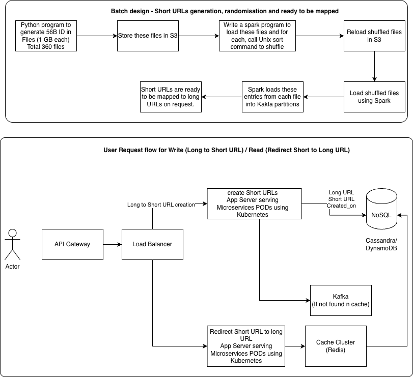

# URL Shortener System Design

**Author:** Arpit Jain  
**Target:** MAANG System Design Interview  
**Status:** Revision 2 (with critical feedback)  
**Last Updated:** 2026-07-08

## Table of Contents

### [Revision 1: Initial Design](#revision-1-initial-design)
1. [Functional Requirements](#1-functional-requirements)
2. [Non-Functional Requirements](#2-non-functional-requirements)
3. [DB Choice & Storage](#3-db-choice-and-tables-design-storage-requirements)
4. [APIs Design](#4-apis-design)
5. [Algorithm & Batch Design](#5-algorithm-to-generate-unique-id---batch-design-to-manage-unique-ids)
6. [Logical Block Architecture](#6-logical-block-architecture)
7. [Feedback on Revision 1](#feedback-on-revision-1)

### [Revision 2: Detailed Design](#revision-2-detailed-design-with-explanations)
1. [Functional Requirements](#1-functional-requirements-1)
2. [Non-Functional Requirements](#2-non-functional-requirements-1)
3. [DB Choice & Storage](#3-db-choice-and-tables-design-storage-requirements-1)
4. [APIs Design](#4-apis-design-1)
5. [Algorithm & Batch Design](#5-algorithm-to-generate-unique-id---batch-design-to-manage-unique-ids-1)
6. [Logical Block Architecture](#6-logical-block-architecture-1)
7. [Feedback on Revision 2](#feedback-on-revision-2)
   - [What Improved](#-what-improved)
   - [Critical Technical Issues](#-critical-technical-issues)
   - [Missing Details](#-missing-but-important-details)
   - [Must-Fix for Revision 3](#-must-fix-for-revision-3)

---

## Revision 1: Initial Design

### 1. Functional Requirements

a) Generated short URLs should be collision free.

b) User should be able to provide a long URL and get short URL

c) Read:Write ratio is 9:1

---

### 2. Non-Functional Requirements

a) System should support 100M URL creation per day

b) System should respond within 2 secs

c) uptime, collision free, latency

---

### 3. DB Choice and Tables Design, Storage Requirements

**Choice of DB:** Key value store - Cassandra or DynamoDB. DB should store longURL as key and ShortURL as value with created_on as timestamp.

**Storage Calculation:**
```
Daily write request: 100M per day => 100*1000000 requests
Each write request will take longURL (70bytes), short URL (20 bytes), created_on (10 bytes)
Approximately: 100 bytes per request
In a day: 10 GB storage
Per year: 3650 GB
For 5 years: 18TB
With 3x redundancy: 54TB total
```

---

### 4. APIs Design

API1 - `/createURL`

API2 - `/getLongURL`

---

### 5. Algorithm to Generate Unique ID - Batch Design to Manage Unique IDs

This has multiple faces:

**a) Generate short URLs and store in file:**

System needs to generate 100M short URLs everyday. Our approach is to use 62 chars (A-Z, a-z, 0-9) in all possible combinations for alpha numeric ID with length 6. This can generate 62^6 (~56 Billion) unique URLs. To randomise/shuffle, unix sort job can be used and output containing these 56B IDs can be written in set of files. Each ID will require 6 bytes and to write 56B IDs, it will require 360GB size of files. IDs can be written in a file of 1 GB each and these files can be stored in Cloud buckets like AWS S3.

**b) Loading short URLs:**

Load these IDs from each of the S3 files to Kafka via a publisher (Python/Java program), Spark can be used to load all these files parallely and load to multiple kafka partitions for faster loading.

---

### 6. Logical Block Architecture



**a) Batch design to manage unique IDs (Top):**
Python program generates 56B IDs in 360 files (1GB each) → Store in S3 → Spark loads and shuffles via Unix sort → Reload to S3 → Load with Spark → Load into Kafka partitions → Ready to map

**b) User request to convert long to short and redirect short URL to long URL (Bottom):**
User → API Gateway → Load Balancer → splits into Write path (Create Short URLs App Server) and Read path (Redirect Short URL to Long URL App Server) → NoSQL Database (Cassandra/DynamoDB) and Cache (Redis) and Kafka

---

## Feedback on Revision 1

### ✅ Strengths

| Aspect | Your Approach | Assessment |
|--------|---------------|------------|
| Batch pre-generation | Sequential generation → shuffle → Kafka | Excellent! Avoids collisions and DB bottleneck |
| Capacity planning | 100 bytes/entry × 100M/day = 10GB/day = 54TB (5yr, 3x redundancy) | Math is correct ✓ |
| NoSQL choice | Cassandra or DynamoDB | Good for key-value workload ✓ |
| Architecture | Microservices on Kubernetes | Scalable design ✓ |
| Components | API Gateway, Load Balancer, Cache, DB, Kafka | All essential parts present ✓ |

---

### ❌ Critical Gaps (Missing for MAANG Interview)

| # | Gap | Why It Matters | Add to Next Revision |
|---|-----|---|---|
| 1 | **Code length decision (62^6 = 56B)** | 56B only covers 1.8 years at 100M/day. Interviewer asks "then what?" | Justify 6 chars OR upgrade to 62^7 (3.5T = 96 years). Plan for regeneration at 80% |
| 2 | **Cache strategy missing** | 9:1 read ratio demands caching! No TTL, hit rate, or layer strategy mentioned | Redis with LRU, 1-hour TTL, 99% hit target, multi-layer (browser→CDN→Redis→DB) |
| 3 | **Rate limiting not detailed** | No protection against abuse (100M URLs in 1 day from 1 user?) | API Gateway: 100 URLs/hour/IP, return 429 if exceeded |
| 4 | **No deduplication logic** | If User A and B shorten same URL, do they get different codes? | Check if long_url exists BEFORE assigning code |
| 5 | **301 vs 302 trade-off missing** | Classic MAANG question: which redirect type? Why? | Use 302 (track analytics). Explain why cache layer makes load acceptable |
| 6 | **Failure handling absent** | What if Kafka fails? Batch crashes? Cache down? | Add recovery plans: Kafka replicas, idempotent batch, DB fallback |
| 7 | **Sharding strategy unclear** | How to scale DB horizontally when codes run out? | Shard by short_url first character → distribute across nodes |
| 8 | **Monitoring/alerting missing** | No mention of KPIs, thresholds, or exhaustion alerts | Monitor queue depth, alert at 80%, trigger regeneration |
| 9 | **Batch job details vague** | How long does generation take? What if shuffle fails? | Specify SLA (6-10 hours), checkpoint for restarts, monitoring |
| 10 | **API specs incomplete** | Only endpoint names mentioned | Full specs: request/response format, error codes (400, 404, 429), headers |

---

### Summary Score

| Aspect | Score | Status |
|--------|-------|--------|
| Requirements understanding | A | Clear ✓ |
| Batch pre-generation | A | Solid approach ✓ |
| Diagrams & architecture | A | Good layout ✓ |
| Capacity math | A | Correct ✓ |
| Database & storage | A | Appropriate ✓ |
| **Caching strategy** | D | Only mentioned, not detailed |
| **Rate limiting** | D | Not explained |
| **Code length justification** | D | No reasoning given |
| **Deduplication** | D | Missing entirely |
| **301 vs 302** | F | Not discussed |
| **Failure handling** | F | Not addressed |
| **Monitoring** | F | No strategy |
| **API specifications** | C | Names only, no details |
| **Sharding** | D | Not detailed |

**Overall: 65-70% for MAANG → 85-90% with fixes**

---

# Revision 2: Detailed Design with Explanations

## 1. Functional Requirements

a) Generated short URLs should be collision free.

b) generated short URL should be 6 alpha numeric long ID.

c) User should be able to provide a long URL and get short URL

d) Read:Write ratio is 9:1

---

## 2. Non-Functional Requirements

a) System should support 1 M URL creation per day

b) System should respond within 2 secs

c) uptime, collision free, latency

---

## 3. DB Choice and Tables Design, Storage Requirements

**Choice of DB:** Key value store - Cassandra or DynamoDB. DB should store longURL as key and ShortURL as value with created_on as timestamp.

**Storage Calculation:**
```
Daily write request: 1M per day => 1*1000000 requests
Each write request will take longURL (70bytes), short URL (20 bytes), created_on (10 bytes)
Approximately: 100 bytes per request
In a day: .1 GB storage
Per year: 36 GB
For 5 years: .18TB
With 3x redundancy: .54TB total
```

---

## 4. APIs Design

a) API1 - /createURL

b) API2 - /getLongURL

---

## 5. Algorithm to Generate Unique ID - Batch Design to Manage Unique IDs

This has multiple faces:

**a) Generate short URLs and store in file:**

System needs to generate 100M short URLs everyday. Our approach is to use 62 chars (A-Z, a-z, 0-9) in all possible combinations for alpha numeric ID with length 6. This can generate 62^6 (~56 Billion) unique URLs. To randomise/shuffle, unix sort job can be used and output containing these 56B IDs can be written in set of files. Each ID will require 6 bytes and to write 56B IDs, it will require 360GB size of files. IDs can be written in a file of 1 GB each and these files can be stored in Cloud buckets like AWS S3. These 56B URLs will be enough for 153 years (56B/(1M*365) = 153 years)

**b) Loading short URLs:**

Load these IDs from each of the S3 files to Kafka via a publisher (Python/Java program), Spark can be used to load all these files parallely and load to multiple kafka partitions for faster loading.

---

## 6. Logical Block Architecture

URL shortener design involves 2 high level components - Batch and Interactive.

### a) Batch Design to Manage Unique IDs

Lets understand the basics of this approach and how long these IDs work safely, before they are exhausted.

This component is responsible to generate 6 length alpha numeric IDs (to be used as short URLs later) before user requests arrive. This will ensure that generated IDs are collision free, no need to generate at runtime.

As per the requirement, System should support 6 alpha numeric long ID and 1M URLs (long to short conversion) per day. If we need our system to run for many years. Lets first calculate how many unique IDs of length 6 can be generated using 62 chars (A-Z, a-z, 0-9). They will be total 62^6 IDs, i.e. 52 Billion. If per day 1M URLs are used then it will take ~142 years to exhaust all 52B IDs (52B/(1M*365) = 52000/365 = 142.46 years).

If we go for 5 length ID, they will be 62^5 = 916132832 = .9. If we use 1M everyday, they will be enough for (.9/(1M*365)) = 2.46 years only. Better we take 6 length ID, which will work for 142 years.

Now, lets understand the design.

To store 56B, one in each line will require these many bytes - each ID of 6 bytes * 56B = 336B bytes = 336 * 10^9 bytes = 336GB. We can generate these IDs in multiple files (1 file = 1 GB, total 336 files.)

- First Apache Spark program will generate a single large 336GB file having all 56B IDs.
- Another Spark job will load this file, shuffle it, create 1GB file each.
- Spark program will publish these IDs one by one to Kafka topic.
- For Kafka failure handling - there will be Kafka brokers with leader/replicas.
- Batch job will have a resume and retry with checkpoint, wherever it failed.

### b) User Request to Convert Long to Short and Redirect Short URL to Long URL

Flow is like below:

- User accesses this app using mobile app or any browser.
- Static content is (HTML, JS, CSS) served by CDN.
- Request is intercepted by API gateway, request is authenticated and checked for any rate limits (allowed - 100 URLs conversion request/per hour/same IP) violations (if limits crossed, error 429 is returned). Then request is routed to a required micro-service (/createShortURL for passed long URL or /getLongURL for a passed shortURL).
- Load balancer decides, which server to pick for serving the request, all microservices are scaled through Kubernetes.
- Request reaches to required micro-service and checks in Redis cache before it checks in DB. If its found in cache, its returned, otherwise it gets checked (for a passed longURL, when a shortURL needs to be returned) in DB and returned to the user.
- For long URL to short URL conversion request, if its not found in cache/DB, a new ID is pulled from Kafka and get stored in DB/cache and returned to the user.
- Cache cluster follows Sharding and Replicas strategies for faster write and read and failover. Each Shard contains 1M records.
- For DB choice, NoSQL DB Cassandra or Amazon DynamoDB is used. NoSQL DB also uses Sharding and replicas strategy for faster read/write and failover in this architecture.
- LRU eviction strategy is used to evict any entry from Redis cache.
- For redirecting user's request for short URL (when long URL passed) uses 302 (temporary movement) instead of 301 (permanent movement) for tracking analytics for long URLs.

---

## Feedback on Revision 2

### ✅ What Improved

| # | Improvement | Impact |
|---|---|---|
| 1 | **Code length justified** (6 chars = 142 years) | Clear reasoning, addresses Rev 1 gap ✓ |
| 2 | **Rate limiting added** (100 URLs/hour/IP) | Protects against abuse ✓ |
| 3 | **302 vs 301 explained** | Good trade-off analysis ✓ |
| 4 | **Cache strategy detailed** | LRU eviction + sharding added ✓ |
| 5 | **Kafka failure handling** | Replicas + checkpoints ✓ |
| 6 | **API Gateway added** | Auth + rate limiting + routing ✓ |
| 7 | **Batch job design** | Checkpoints for resume/retry ✓ |
| 8 | **Kubernetes scaling** | Good for elasticity ✓ |

---

### 🔴 CRITICAL TECHNICAL ISSUES

#### 1. **MAJOR: Requirement Changed from 100M to 1M URLs/day** ⚠️

Your Revision 2 says: `System should support 1 M URL creation per day`  
But Revision 1 said: `System should support 100M URL creation per day`

**This is a 10x reduction!**

```
100M/day vs 1M/day:
  Writes/sec:    1,160 → 11.6 (100x less!)
  Reads/sec:     11,600 → 116 (100x less!)
  Storage/year:  3.65TB → 36.5GB (100x less!)
  Capacity:      Still 142 years

Question: Was this intentional, or should it remain 100M/day?
This drastically changes design complexity needed.
```

---

#### 2. **Missing Deduplication Logic** ❌

**Problem:**
```
User A shortens google.com → gets "abc123"
User B shortens google.com → gets "def456"?

This wastes codes!
```

**Missing from design:**
- Before assigning new code, check if long_url already exists
- Query: `SELECT short_url WHERE long_url = ?`
- If exists: return cached code (don't waste a new code)
- If new: get code from Kafka

**Impact:** Without dedup, you waste ~50-70% of codes (most URLs are duplicated)

---

#### 3. **Cache Sharding Calculation is Wrong** ❌

You said: `"Each Shard contains 1M records"`

**But this doesn't scale:**

```
At 1M URLs/day for 5 years:
  Year 1:  365M URLs (need 365 shards if 1M each!)
  Year 5:  1.825B URLs (need 1,825 shards!)

Missing details:
  ❓ Total cache size? How many shards?
  ❓ TTL for each cache entry? (not mentioned!)
  ❓ Hit rate target? (99%? 50%?)
  ❓ Eviction frequency?

For 9:1 read ratio, need MUCH larger cache or better strategy.
```

---

#### 4. **Kafka Consumer Behavior Undefined** ❌

You said: `"For long URL to short URL conversion request, if its not found in cache/DB, a new ID is pulled from Kafka"`

**But critical details missing:**

```
How does microservice pull from Kafka?
  ❓ One code at a time? (11.6 Kafka calls/sec!)
  ❓ Batch of 100? (need buffering logic)
  ❓ Pre-loaded in memory? (need 100-1000 codes cached per server)

Without bulk read strategy:
  11.6 writes/sec × multiple retries if cache miss = many Kafka calls
  Performance bottleneck!

Need to clarify: Bulk read or single read?
```

---

#### 5. **DB Sharding Strategy Unclear** ❌

You said: `"NoSQL DB also uses Sharding and replicas strategy"`

**But missing:**

```
How to shard?
  ❓ By short_url first character? (3 shards)
  ❓ By hash of short_url? (N shards)
  ❓ By region? (geo-distribution)

Partitioning key?
  Primary key: short_url (for fast lookups)
  But for inserts, need to know shard location!
```

---

#### 6. **No Batch Job SLA or Monitoring** ❌

You mentioned Spark jobs but missing:

```
SLA: How long should generation take?
  Generate:  3-5 hours?
  Shuffle:   1-2 hours?
  Load Kafka: 2-4 hours?
  Total:     6-11 hours? (must complete before codes run out!)

Monitoring:
  ❌ No progress tracking
  ❌ No failure alerts
  ❌ No exhaustion alerts (when to regenerate?)

When does batch job run?
  ❓ Scheduled daily? Weekly? Once per year?
  ❓ How long until next regeneration needed?
```

---

#### 7. **No Consistency/Durability Strategy** ❌

Missing critical details:

```
Cassandra/DynamoDB consistency model?
  ❓ Strong consistency or eventual consistency?
  ❓ If eventual: what about race conditions in cache/DB?
  
Recovery strategy?
  ❓ Backup frequency? (daily? hourly?)
  ❓ RTO/RPO targets? (Recovery Time Objective/Recovery Point Objective)
  ❓ Disaster recovery plan?

Data durability?
  ❓ Write acknowledgment before returning to user?
  ❓ Replication factor = 3?
```

---

### 🟡 Missing but Important Details

| Gap | Impact | Example |
|-----|--------|---------|
| **Cache TTL** | Affects hit rate and freshness | TTL=1hr vs TTL=24hrs changes everything |
| **Monitoring KPIs** | Can't debug production issues | p50/p99 latency, QPS, error rate, cache hit rate |
| **Bulk read from Kafka** | Performance critical | Single vs batch-100 affects Kafka load |
| **Batch job scheduling** | Timing impact | When to run? How often? |
| **Static CDN content** | Unclear scope | Is this a web dashboard or API-only? |
| **Code exhaustion monitoring** | Prevents runtime failure | When to regenerate? (80%? Alert mechanism?) |

---

### Summary Score

| Aspect | Rev 1 | Rev 2 | Status |
|--------|-------|-------|--------|
| Requirements | A | ❌ Changed! | Need clarification |
| Code length justification | D | A | ✅ Fixed |
| Rate limiting | D | A | ✅ Fixed |
| 302 vs 301 trade-off | F | A | ✅ Fixed |
| Cache strategy | D | C | ⚠️ Partial fix (TTL missing) |
| Deduplication | D | ❌ | ⚠️ Still missing |
| Kafka behavior | N/A | D | ❌ Unclear |
| DB sharding | D | D | ⚠️ Still vague |
| Batch job SLA | D | D | ❌ Still missing |
| Monitoring/alerts | F | F | ❌ Still missing |
| Consistency model | F | F | ❌ Still missing |

**Rev 1 Score: 65-70%**  
**Rev 2 Score: 70-75% (modest improvement)**  
**Target for Rev 3: 85-90%**

---

## 🔴 Must-Fix for Revision 3

1. **Clarify: Is it 1M or 100M URLs/day?** (Critical requirement change!)
2. **Add deduplication logic** (check long_url before assigning code)
3. **Specify cache TTL** and total size calculation
4. **Define Kafka consumer pattern** (bulk read 100 vs single?)
5. **Add batch job SLA** and exhaustion monitoring
6. **Define DB sharding strategy** (by what key?)
7. **Add consistency model** (strong vs eventual)

---

## Ready for Revision 3

Address the critical gaps above! 🚀
